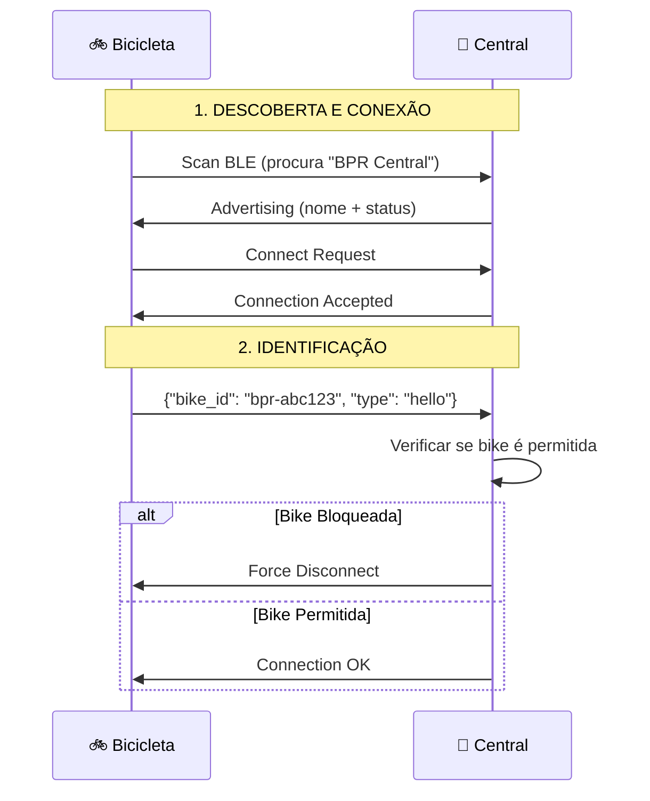
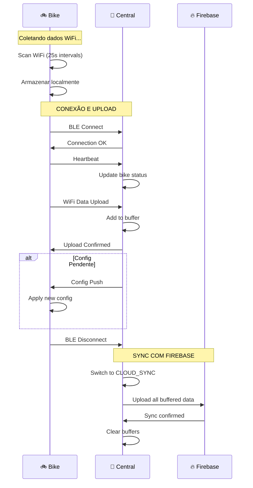

# 🚲↔️🏢 Protocolo de Comunicação Bike-Central

## 📡 **Camada Física: BLE (Bluetooth Low Energy)**

```
🚲 Bicicleta (ESP32)  ←→  🏢 Central (ESP32C3)
    Cliente BLE              Servidor BLE
```

### **Características BLE:**
- **Service UUID**: `12345678-1234-1234-1234-123456789abc`
- **Data Characteristic**: Para envio de dados (scans WiFi, heartbeat)
- **Config Characteristic**: Para recebimento de configurações

## 🤝 **Fluxo de Conexão**



## 💬 **Protocolo de Mensagens (JSON)**

### **1. Heartbeat com Last Update e Pending Data (Bike → Central)**
```json
{
  "bike_id": "bpr-abc123",
  "type": "heartbeat",
  "timestamp": 1733459200,
  "battery_percent": 85,
  "battery_voltage": 3.82,
  "heap": 45000,
  "last_update": 1733400000,
  "uptime_sec": 3600,
  "pending_data": {
    "sessions_count": 3,
    "total_bytes": 12450,
    "oldest_session_ts": 1733458000,
    "buffer_usage_percent": 68
  }
}
```

**Resposta Automática da Central (se config desatualizada):**
```json
{
  "type": "config_push",
  "bike_id": "bpr-abc123",
  "last_update": 1733459000,
  "config": {
    "scan_interval_sec": 30,
    "deep_sleep_sec": 3600,
    "battery_low_percent": 25,
    "last_update": 1733459000
  }
}
```

### **2. Upload de Dados WiFi (Bike → Central)**
```json
{
  "bike_id": "bpr-abc123",
  "type": "wifi_data",
  "timestamp": 1733459200,
  "session_id": "sess_001",
  "scans": [
    {
      "ts": 1733459205,
      "networks": [
        {"ssid": "NET_5G", "bssid": "AA:BB:CC:11:22:33", "rssi": -70, "ch": 6},
        {"ssid": "CLARO_WIFI", "bssid": "CC:DD:EE:44:55:66", "rssi": -82, "ch": 11}
      ]
    }
  ]
}
```

### **3. ~~Request de Configuração~~ (REMOVIDO)**
```json
// ❌ NÃO PRECISA MAIS - Config é detectada no heartbeat
```

### **4. ~~Resposta de Configuração~~ (AUTOMÁTICA)**
```json
// ✅ ENVIADA AUTOMATICAMENTE quando heartbeat detecta versão antiga
```

### **5. Confirmação de Upload (Central → Bike)**
```json
{
  "type": "upload_confirmed",
  "bike_id": "bpr-abc123",
  "can_clear_buffer": true,
  "next_checkin_sec": 300
}
```

### **6. Central Busy (Central → Bike)**
```json
{
  "type": "busy",
  "message": "Central busy - try again later",
  "retry_after_sec": 30
}
```

## 🔄 **Estados da Comunicação**

### **Bike States:**
```cpp
enum BikeState {
    BIKE_SCANNING,      // Coletando dados WiFi
    BIKE_SEEKING_BASE,  // Procurando central
    BIKE_CONNECTED,     // Conectada à central
    BIKE_UPLOADING,     // Enviando dados
    BIKE_SLEEPING       // Deep sleep
};
```

### **Central States:**
```cpp
enum PairingStatus {
    PAIRING_IDLE,           // Aguardando conexões
    PAIRING_RECEIVING_DATA, // Recebendo dados
    PAIRING_SENDING_CONFIG, // Enviando configuração
    PAIRING_BUSY           // Ocupada (sync WiFi)
};
```

## 📋 **Fluxo Completo de Sessão**



## ⚡ **Características do Protocolo**

### **🔒 Segurança:**
- **Whitelist de bikes**: Apenas bikes aprovadas podem enviar dados
- **Validação de formato**: bike_id deve seguir padrão `bpr-xxxxxx`
- **Timeout protection**: Conexões são limitadas por tempo

### **🚀 Performance:**
- **Fila sequencial**: Uma bike por vez evita conflitos
- **Buffer local**: Central armazena dados antes do sync
- **Busy status**: Rejeita conexões durante sync WiFi

### **🛡️ Robustez:**
- **Heartbeat**: Monitora saúde das bikes
- **Retry logic**: Bikes tentam reconectar automaticamente
- **Timeout handling**: Recuperação automática de falhas

### **📊 Eficiência:**
- **JSON compacto**: Mensagens otimizadas
- **Batch upload**: Múltiplos scans por mensagem
- **Compression**: Dados grandes são comprimidos

## 🎯 **Cenários de Conversas Completas**

### **📱 Cenário 1: Config Atualizada + Upload Normal**
```
🚲: "Oi central, heartbeat: bateria 85%, config last_update=1733459000"
🏢: "Heartbeat OK! Config está atualizada, tudo certo"

🚲: "Tenho 15 scans WiFi coletados nos últimos 10 minutos"
🏢: "Recebido e armazenado no buffer, pode limpar seu cache"

🚲: "Dados limpos, tchau!"
🏢: "Até a próxima, bom trabalho!"
```

### **⚙️ Cenário 2: Config Desatualizada + Upload**
```
🚲: "Oi central, heartbeat: bateria 85%, config last_update=1733400000"
🏢: "Heartbeat OK! Config desatualizada (central=1733459000), enviando nova"
🚲: "Config recebida e aplicada, obrigado!"

🚲: "Tenho 8 scans WiFi coletados"
🏢: "Recebido e armazenado, pode limpar seu buffer"

🚲: "Próximo heartbeat será com last_update=1733459000"
🏢: "Perfeito, até logo!"
```

### **🔋 Cenário 3: Bateria Baixa + Sem Dados**
```
🚲: "Oi central, heartbeat: bateria 15% (crítica!), config last_update=1733459000"
🏢: "⚠️ Bateria crítica detectada! Config atualizada, sem dados para enviar?"

🚲: "Não coletei dados suficientes, vou entrar em deep sleep"
🏢: "OK, durma bem e recarregue a bateria"

🚲: "Entrando em sleep mode..."
🏢: "Até você voltar! 💤"
```

### **📡 Cenário 4: Upload Incremental (1 scan)**
```
🚲: "Oi central, heartbeat: bateria 92%, config last_update=1733459000"
🏢: "Heartbeat OK! Config atualizada"

🚲: "Tenho apenas 1 scan WiFi novo para enviar"
🏢: "Recebido! 1 scan adicionado ao buffer da sessão atual"

🚲: "Vou continuar coletando, tchau!"
🏢: "Boa coleta, até breve!"
```

### **📊 Cenário 5: Upload em Lote (15 scans)**
```
🚲: "Oi central, heartbeat: bateria 78%, config last_update=1733459000"
🏢: "Heartbeat OK! Config atualizada"

🚲: "Buffer cheio! Enviando 15 scans WiFi coletados"
🏢: "Lote recebido! 15 scans processados e armazenados"

🚲: "Buffer limpo, voltando ao trabalho"
🏢: "Excelente coleta, continue assim!"
```

### **⚠️ Cenário 6: Central Busy (Sync WiFi)**
```
🚲: "Oi central, heartbeat: bateria 88%, tenho dados..."
🏢: "⚠️ Estou ocupada fazendo sync com Firebase, tente em 30s"

🚲: "OK, vou aguardar e tentar novamente"
🏢: "Obrigada pela paciência!"

[30 segundos depois]
🚲: "Tentando novamente... heartbeat: bateria 88%"
🏢: "Agora estou livre! Heartbeat OK, pode enviar dados"
```

### **🚫 Cenário 7: Bike Bloqueada**
```
🚲: "Oi central, sou bpr-xyz789, heartbeat: bateria 95%"
🏢: "❌ Bike não autorizada - desconectando"

[Conexão forçadamente encerrada]
🚲: "Conexão perdida... tentando novamente em 5 minutos"
```

### **📝 Cenário 8: Bike Pendente (Aguardando Aprovação)**
```
🚲: "Oi central, sou bpr-new001, heartbeat: bateria 100%"
🏢: "📝 Bike nova detectada, registrando como pendente"

🚲: "Tenho dados para enviar"
🏢: "Dados ignorados - aguardando aprovação do administrador"

🚲: "Entendi, vou tentar mais tarde"
🏢: "Assim que for aprovada, poderá enviar dados!"
```

### **🔄 Cenário 9: Reconexão Após Timeout**
```
🚲: "Oi central, heartbeat: bateria 82%, tenho dados grandes..."
🏢: "Heartbeat OK, pode enviar"

🚲: "Enviando 25 scans WiFi... [dados grandes]"
[Timeout de 30s - conexão perdida]

🚲: "Reconectando... heartbeat: bateria 82%"
🏢: "Bem-vinda de volta! Pode reenviar os dados"

🚲: "Reenviando os mesmos 25 scans..."
🏢: "Recebido com sucesso desta vez!"
```

### **🌐 Cenário 10: Primeira Conexão do Dia**
```
🚲: "Oi central, acordei! heartbeat: bateria 100%, config last_update=1733459000"
🏢: "Bom dia! Heartbeat OK, config atualizada"

🚲: "Coletei dados durante a madrugada - 45 scans WiFi!"
🏢: "Wow! Grande coleta noturna, processando todos os 45 scans"

🚲: "Dados enviados, começando nova sessão de coleta"
🏢: "Ótimo trabalho! Boa coleta hoje!"
```

## 🔧 **Implementação Técnica**

### **Central (BikePairing)**
```cpp
// Estados do protocolo
enum PairingStatus {
    PAIRING_IDLE,           // Aguardando conexões
    PAIRING_RECEIVING_DATA, // Recebendo dados
    PAIRING_SENDING_CONFIG, // Enviando configuração
    PAIRING_BUSY           // Ocupada (sync WiFi)
};

// Callbacks BLE
static void onBikeConnected(const String& bikeId);
static void onBikeDataReceived(const String& bikeId, const String& jsonData);
static void onConfigRequest(const String& bikeId, const String& request);
```

### **Validações de Segurança**
```cpp
// 1. Verificar se bike pode conectar
if (!BikeManager::canConnect(bikeId)) {
    BPRBLEServer::forceDisconnectBike(bikeId);
    return;
}

// 2. Verificar se central está busy
if (BPRBLEServer::isCentralBusy()) {
    // Enviar resposta "busy"
    return;
}

// 3. Verificar se bike é permitida para dados
if (!BikeManager::isAllowed(bikeId)) {
    BikeManager::recordPendingVisit(bikeId);
    return;
}
```

### **Sistema de Fila Sequencial**
```cpp
// Processar uma bike por vez
if (pairingState.currentBike.isEmpty()) {
    processDataFromBike(bikeId, jsonData);  // Processar imediatamente
} else if (pairingState.currentBike == bikeId) {
    processDataFromBike(bikeId, jsonData);  // Bike atual continua
} else {
    enqueueBike(bikeId, jsonData);          // Enfileirar outras
}
```

## 📊 **Métricas e Monitoramento**

### **Timeouts Configuráveis:**
- **Pairing Busy**: 10s (configurável via `timeouts.pairing_busy_ms`)
- **Bike Data**: 30s (timeout por bike para upload)
- **BLE Connection**: Gerenciado pelo stack BLE

### **Eventos Monitorados:**
- `BIKE_ARRIVED`: Bike conectou
- `BIKE_LEFT`: Bike desconectou  
- `BIKE_COUNT_CHANGED`: Mudança no número de bikes

### **Logs de Debug:**
```
🚲 Bike bpr-abc123 connected
💓 Heartbeat updated: bpr-abc123 (bat:85%, heap:45000)
💾 Data processed from bpr-abc123
📋 Bike bpr-def456 enqueued (queue size: 2)
⚙️ Config sent to bpr-abc123 on connection
```

Este protocolo garante comunicação **eficiente**, **segura** e **robusta** entre as bikes e a central! 🎯

## 📊 **Sistema de Coleta e Upload de Dados**

### **📈 Como Funciona a Coleta:**

**1. Coleta Contínua:**
- Bike faz scan WiFi a cada 25s (configurável)
- Cada scan é armazenado localmente com timestamp
- Buffer local pode armazenar até 50 scans

**2. Estratégias de Upload:**

**📅 Upload Incremental (1-5 scans):**
```json
{
  "type": "wifi_data",
  "scans": [
    {"ts": 1733459205, "networks": [{"ssid": "NET_5G", "rssi": -70}]}
  ]
}
```

**📊 Upload em Lote (6-15 scans):**
```json
{
  "type": "wifi_data", 
  "scans": [
    {"ts": 1733459205, "networks": [...] },
    {"ts": 1733459230, "networks": [...] }
  ]
}
```

**📦 Upload Completo (16+ scans):**
```json
{
  "type": "wifi_data",
  "session_complete": true,
  "scans": [
    // Todos os scans da sessão
  ]
}
```

### **📝 Como a Central Anota:**

**1. Recebimento Individual:**
- Cada scan é adicionado ao buffer da sessão ativa
- Central mantém sessão aberta por bike
- Timestamp usado para ordenar cronologicamente

**2. Estrutura no Buffer:**
```json
{
  "bike_id": "bpr-abc123",
  "session_id": "sess_20231206_001", 
  "scans_received": 23,
  "last_scan_ts": 1733459800,
  "data": [
    // Todos os scans recebidos
  ]
}
```

**3. Confirmação por Upload:**
- Central confirma CADA upload recebido
- Bike só limpa buffer após confirmação
- Se falhar, bike reenvia os mesmos dados