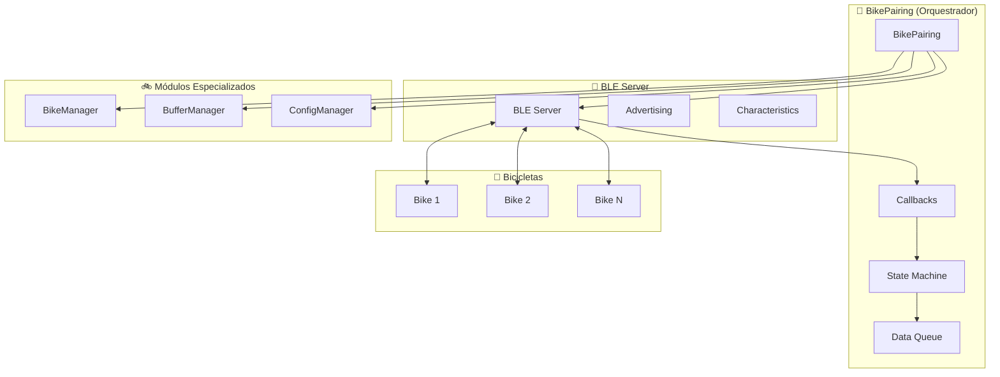
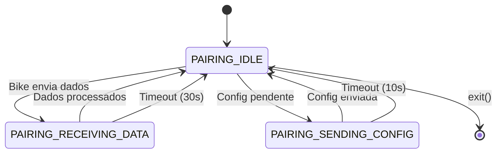
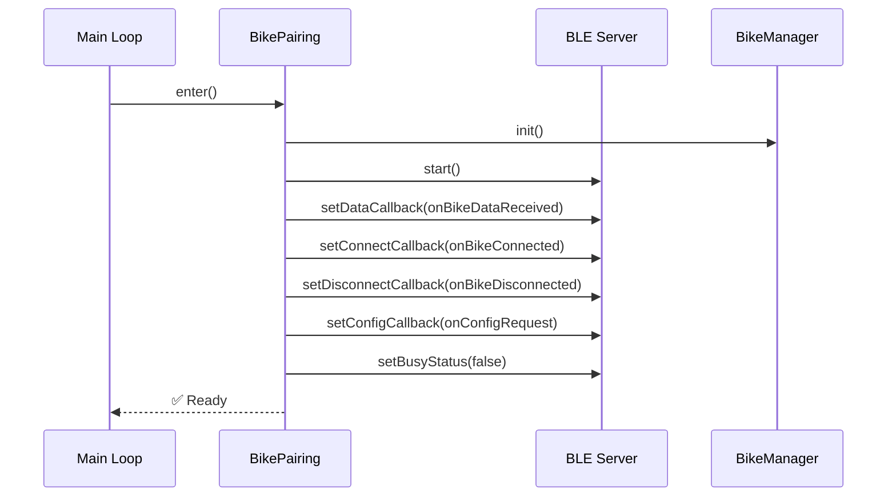
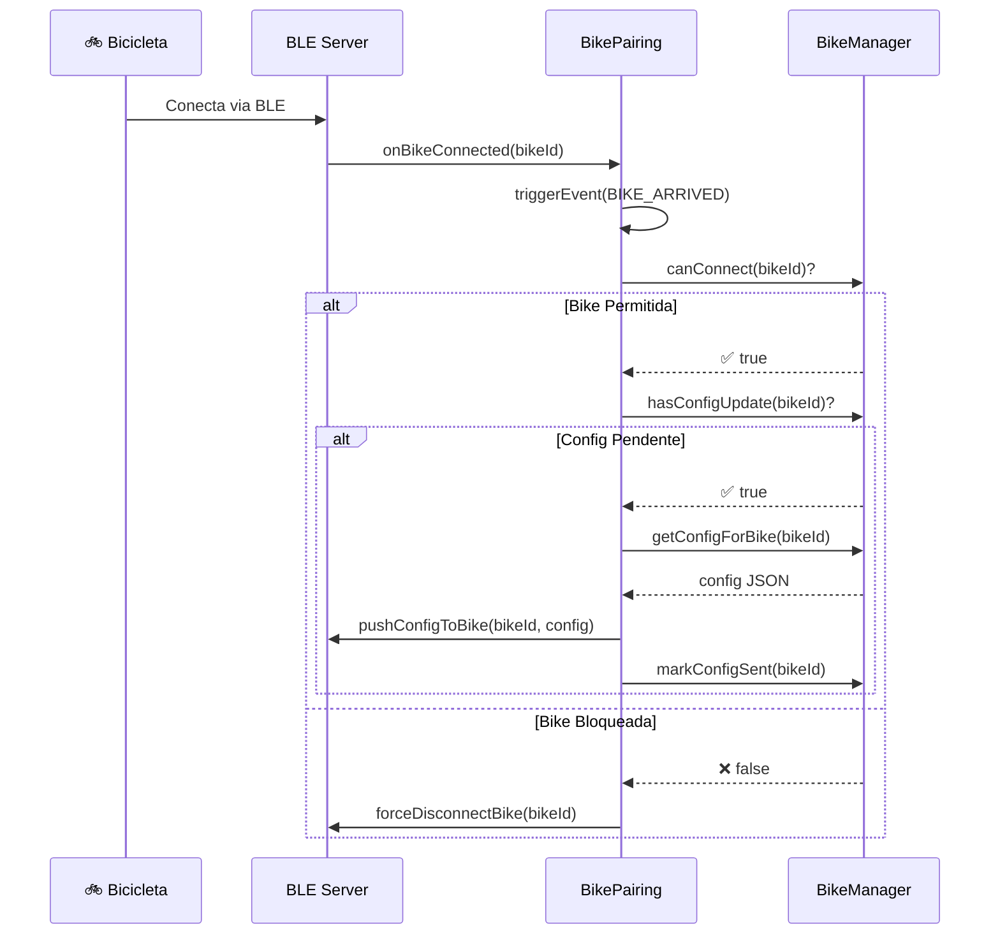
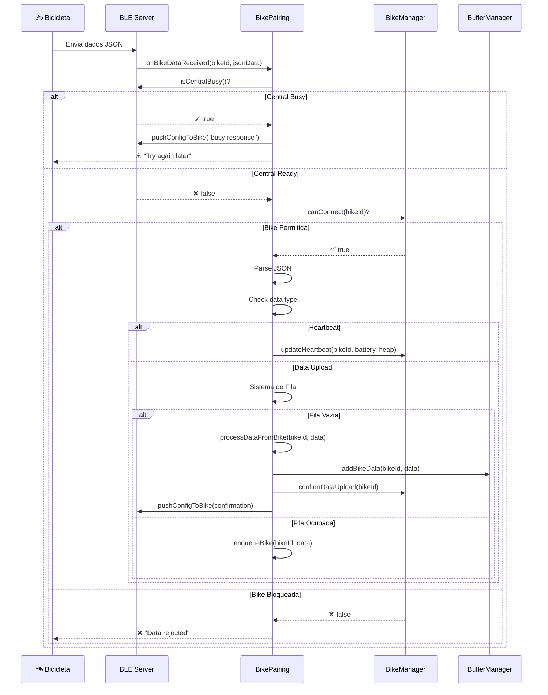
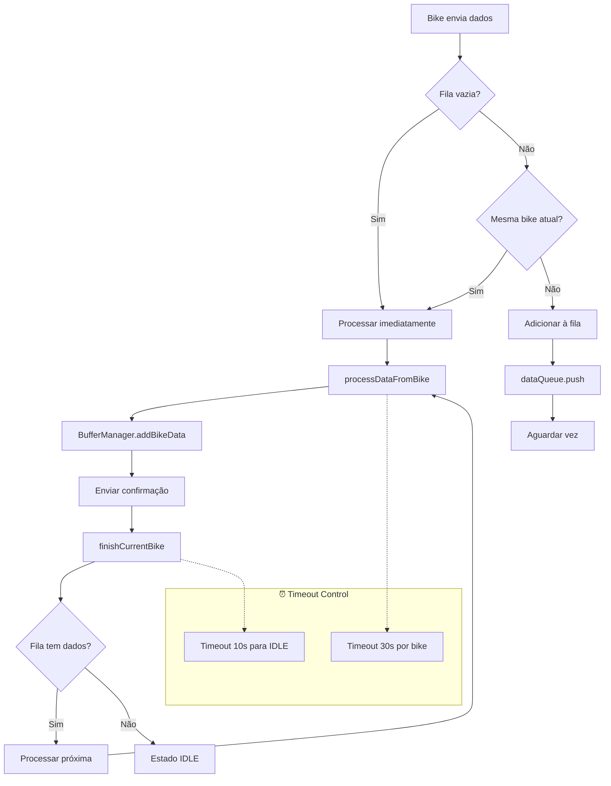
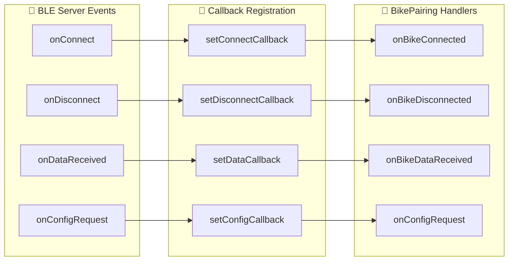
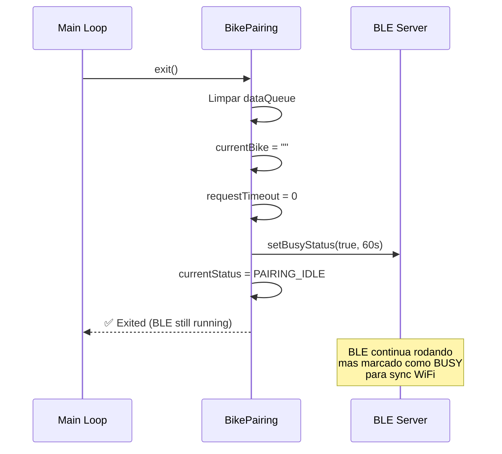

# BikePairing - Diagrama de Funcionamento

## 🎯 Visão Geral

O **BikePairing** é o orquestrador central que gerencia a comunicação BLE entre a central e as bicicletas, implementando um sistema de callbacks desacoplado e processamento sequencial de dados.

## 🏗️ Arquitetura do Sistema



## 🔄 Máquina de Estados



## 📋 Fluxo de Inicialização



## 🚲 Fluxo de Conexão de Bike



## 📊 Fluxo de Processamento de Dados



## 🔄 Sistema de Fila Sequencial



## 🎭 Sistema de Callbacks



## 📈 Loop Principal (update)

```mermaid
flowchart TD
    A["update() chamado"] --> B["BLE.updateAdvertisingStatus()"]
    B --> C["processDataQueue()"]
    C --> D{"Timeout bike atual?"}
    D -->|Sim| E["finishCurrentBike()"]
    D -->|Não| F{"Fila tem dados?"}
    F -->|Sim| G["Processar próxima bike"]
    F -->|Não| H["Event Timer Check"]
    
    E --> F
    G --> I["Parse JSON da fila"]
    I --> J["processDataFromBike()"]
    J --> H
    
    H --> K{"30s passaram?"}
    K -->|Sim| L["triggerEvent(BIKE_COUNT_CHANGED)"]
    K -->|Não| M["Fim do update"]
    L --> M
    
    Note right of L: "Main loop recebe evento<br/>e gerencia LED"
```

## 🚪 Fluxo de Saída (exit)



## 🔧 Integração com Módulos

| **Módulo** | **Responsabilidade** | **Interface** |
|------------|---------------------|---------------|
| **BikeManager** | Estado das bikes, heartbeat, configs | `canConnect()`, `isAllowed()`, `updateHeartbeat()` |
| **BufferManager** | Armazenamento de dados | `addBikeData()` |
| **BLE Server** | Comunicação BLE | Callbacks registrados |
| **ConfigManager** | Configurações da central | `getConfig()` |

## ⚡ Características Principais

- **🔄 Desacoplado**: Sistema de callbacks elimina dependências diretas
- **📋 Sequencial**: Processa uma bike por vez evitando conflitos
- **⏰ Timeout**: Evita travamentos com timeouts automáticos
- **🎭 Event-Driven**: Sistema de eventos para LED e outros módulos
- **🛡️ Robusto**: Validações e tratamento de erros em cada etapa
- **🔧 Modular**: Delega responsabilidades para módulos especializados