# 📊 Diagrama de Blocos de Chamadas de Funções - Hub Firmware

## 🔄 Fluxo Principal

### 🚀 Setup Phase
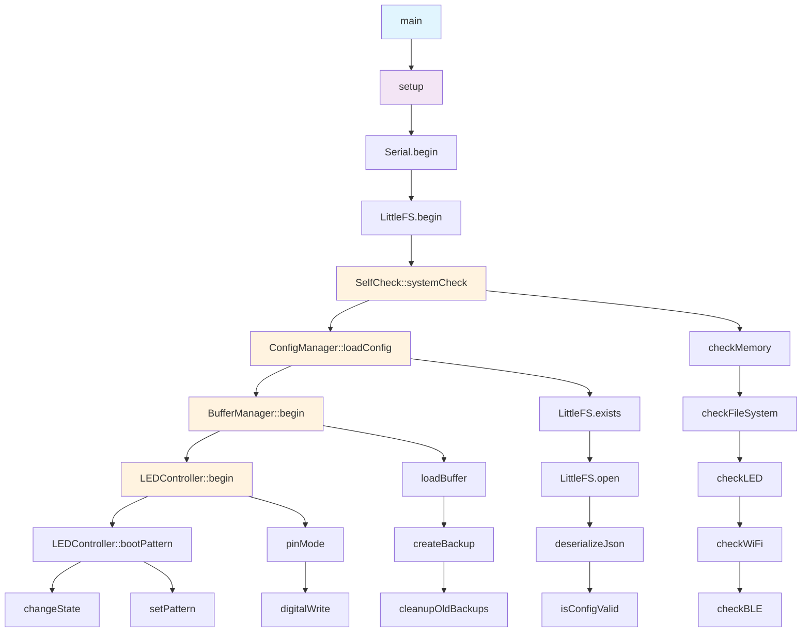

### 🔄 Loop Phase
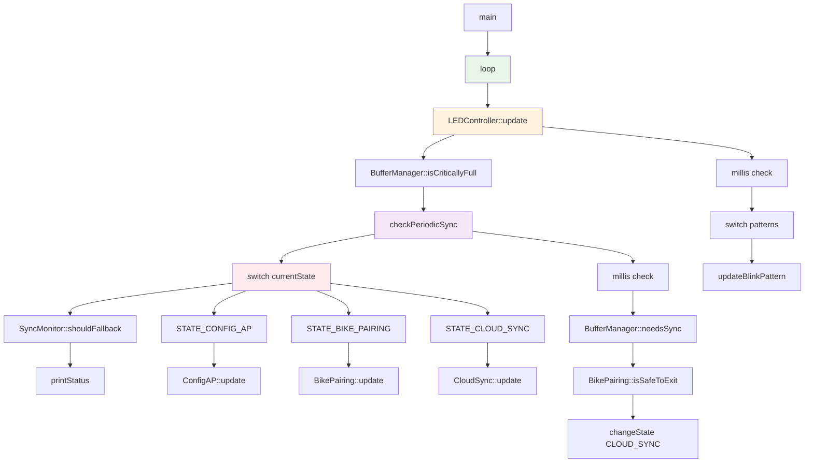

### 💡 LED Patterns
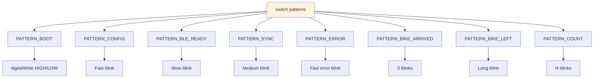

## 🏛️ Estados - changeState()

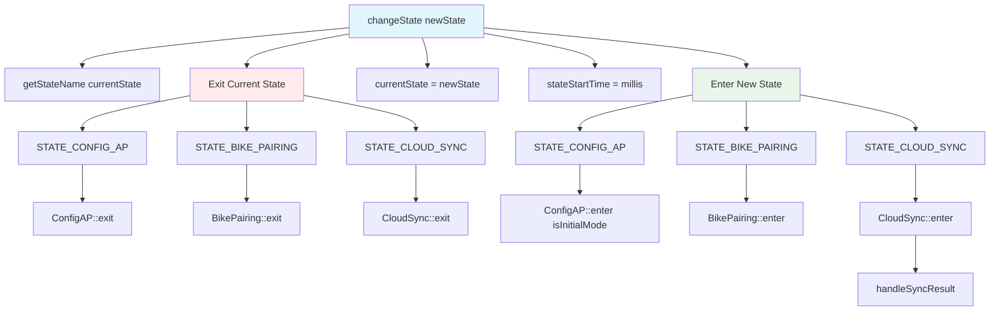

## 🔧 Estado CONFIG_AP

### 🚀 ConfigAP::enter
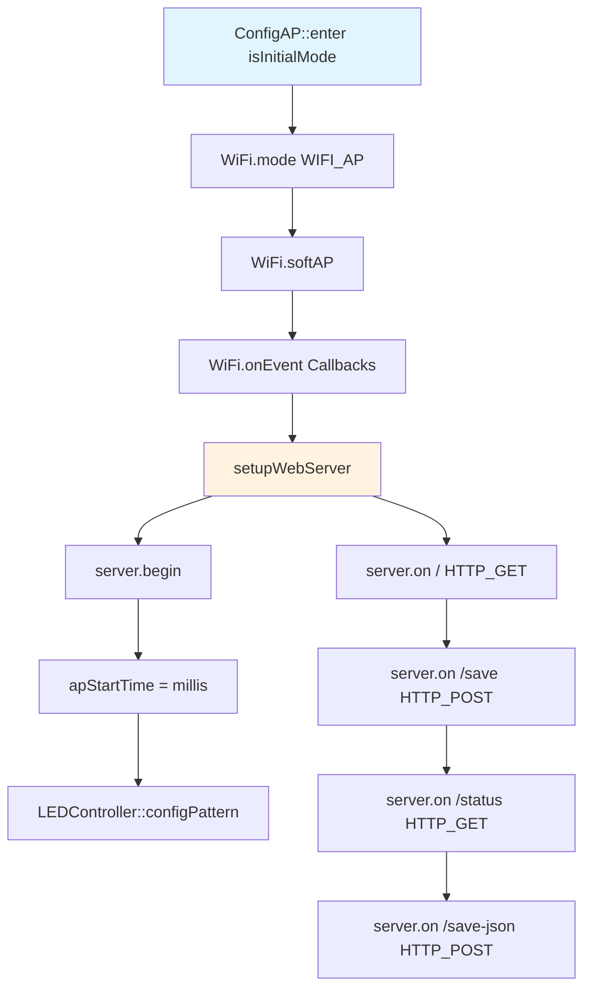

### 💾 Save Handler
```mermaid
flowchart TD
    A[/save HTTP_POST] --> B[ConfigManager::getConfig]
    B --> C[strcpy múltiplas]
    C --> D[ConfigManager::saveConfig]
    D --> E[tryUpdateWiFiInFirebase]
    E --> F[ESP.restart]
    
    E --> E1[WiFi.begin]
    E1 --> E2[HTTPClient::begin]
    E2 --> E3[HTTPClient::PUT]
    E3 --> E4[WiFi.softAP volta AP]
    
    style A fill:#f3e5f5
    style E fill:#fff3e0
```

### 🔄 ConfigAP::update & exit
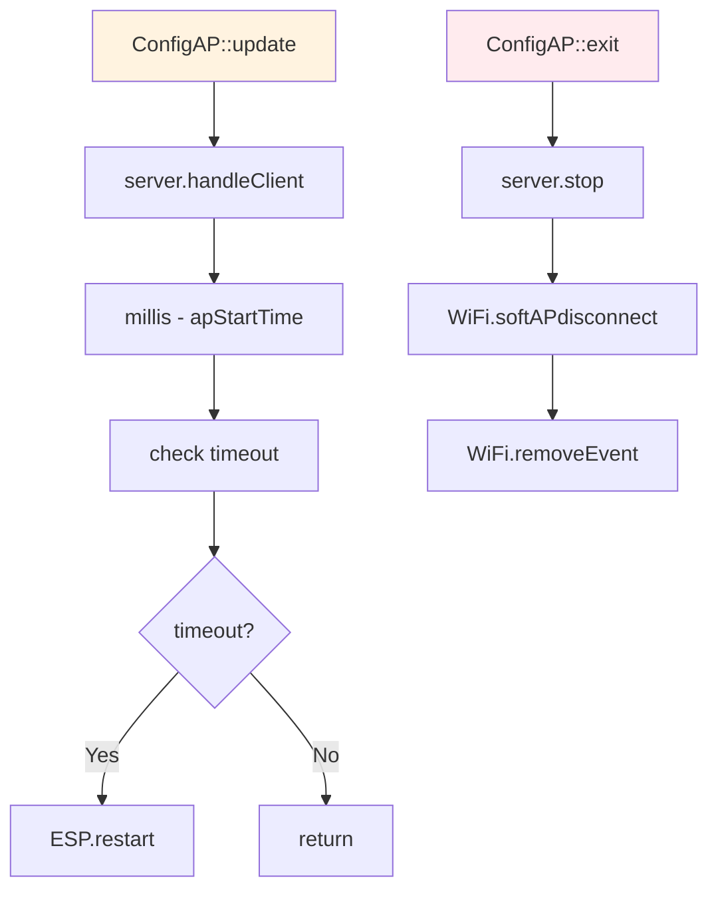

## 🚲 Estado BIKE_PAIRING

### 🚀 BikePairing::enter
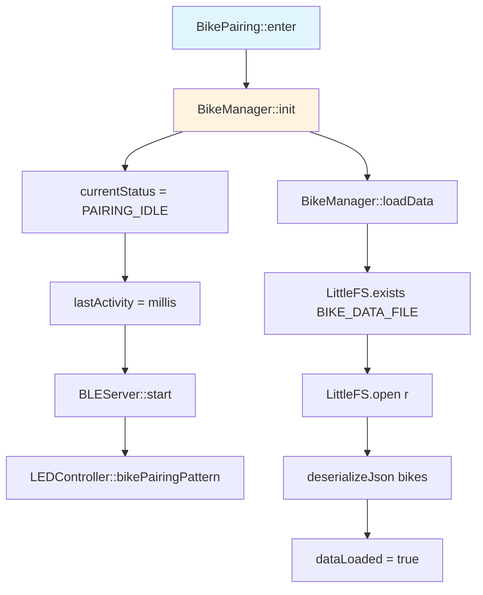

### 📡 BLE Server Setup
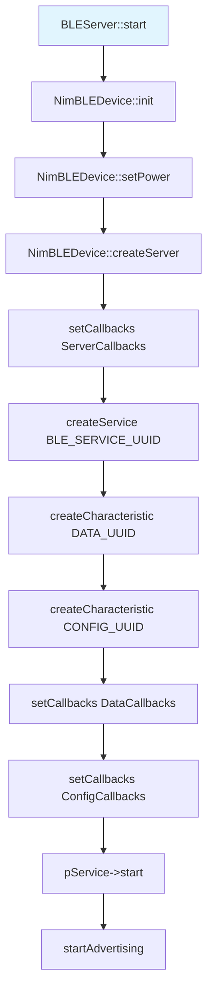

### 🔄 BikePairing::update
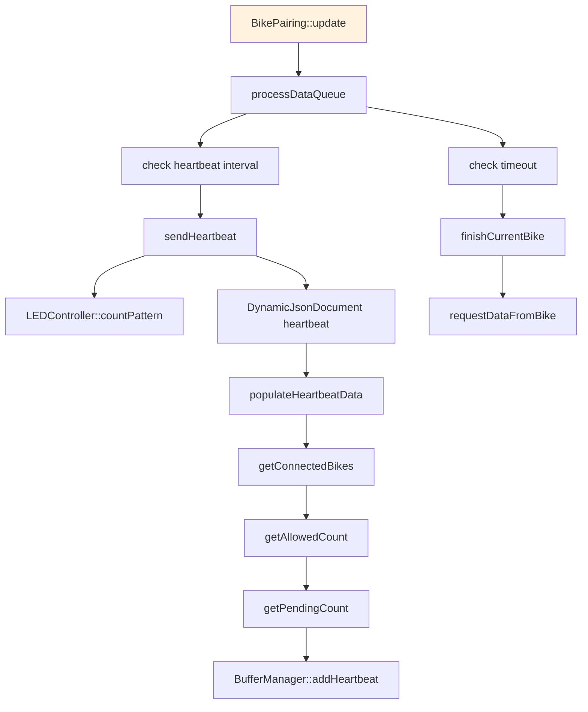

### 🚪 BikePairing::exit
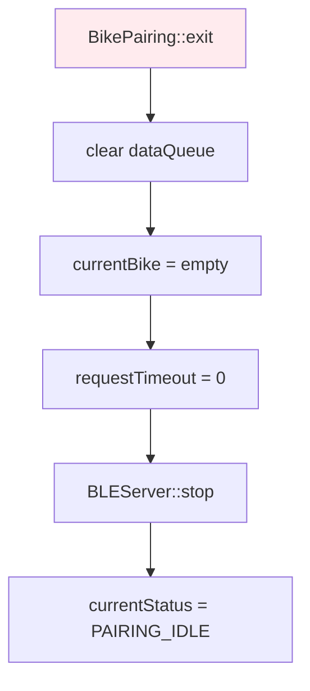

## 📡 Callbacks BLE

### 🔌 onBikeConnected
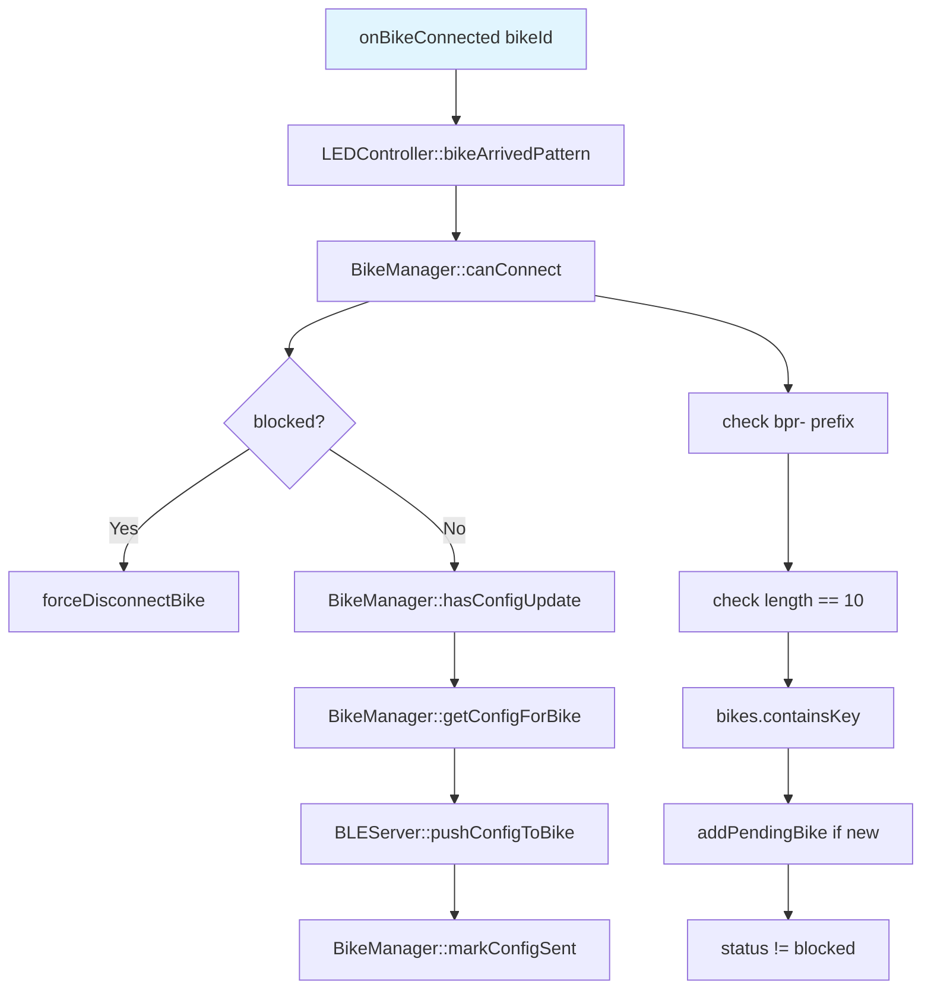

### 📤 Config Generation
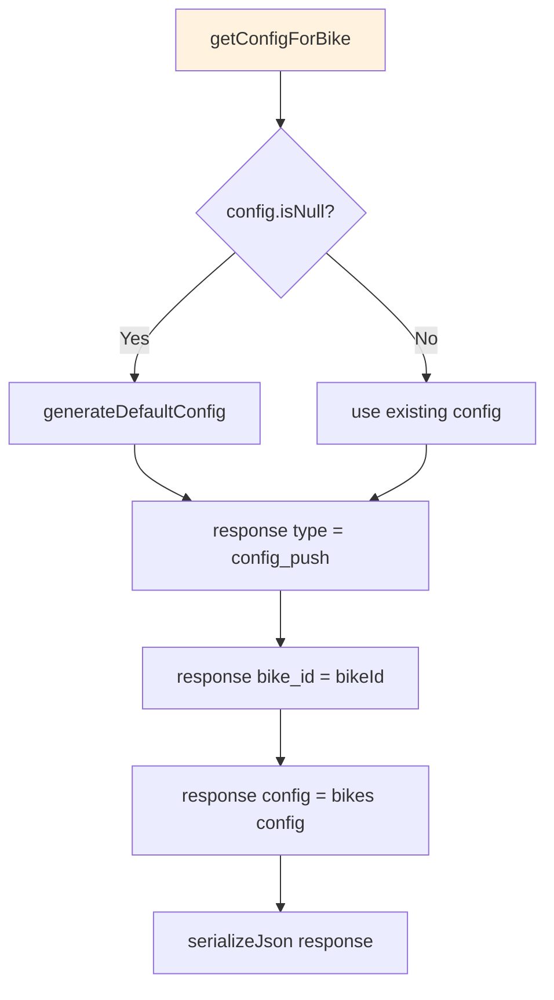

### 🔌 onBikeDisconnected
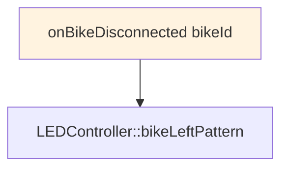

### 📥 onBikeDataReceived - Validation
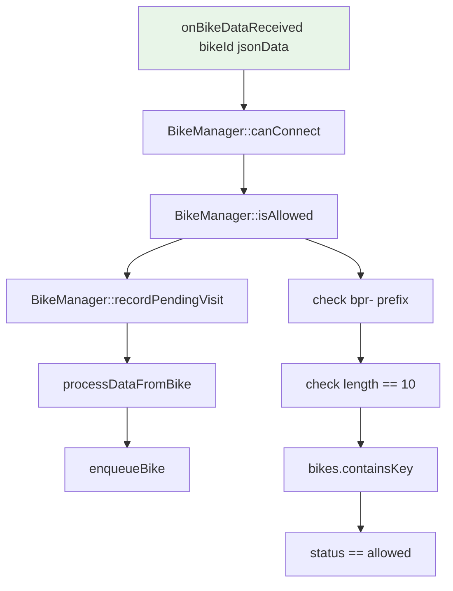

### 💾 Data Processing
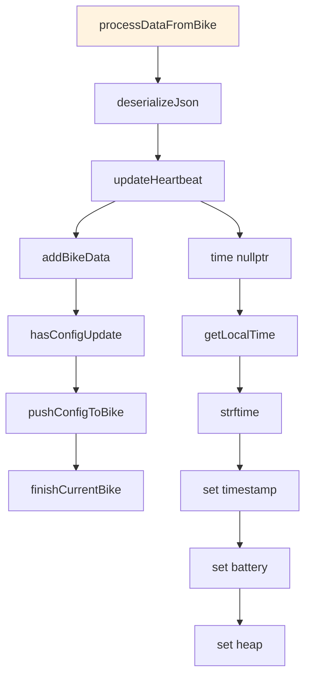

### 🗄️ Buffer Management
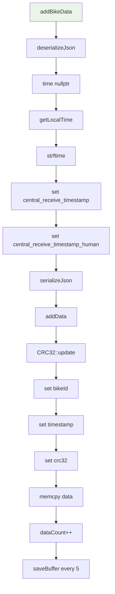

### ⚙️ onConfigRequest
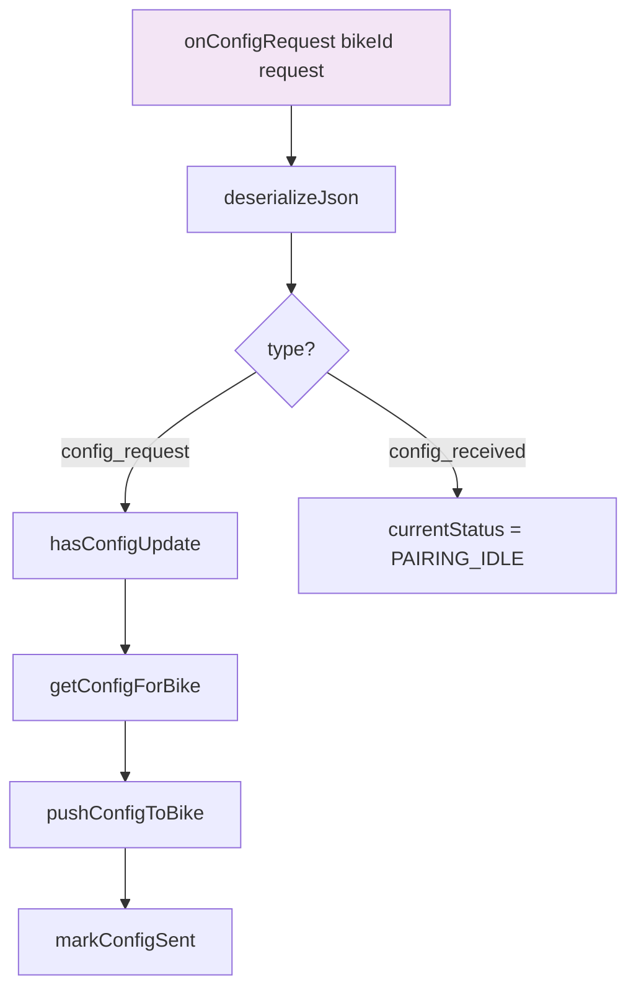

## ☁️ Estado CLOUD_SYNC

### 🚀 CloudSync::enter - Initialization
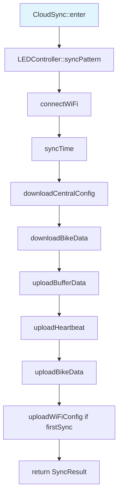

### 📶 WiFi Connection
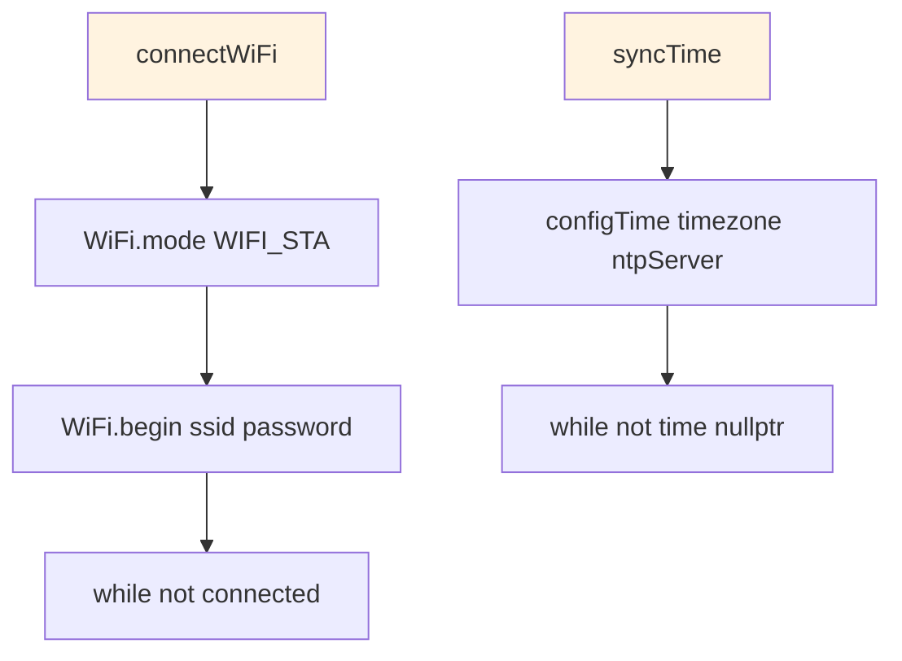

### ⬇️ Download Config
```mermaid
flowchart TD
    A[downloadCentralConfig] --> B[HTTPClient::begin configUrl]
    B --> C[HTTPClient::GET]
    C --> D[updateFromJson payload]
    D --> E[isValidFirebaseConfig]
    
    D --> D1[múltiplas atribuições Firebase]
    D1 --> D2[saveConfig]
    D2 --> D3[Serial.printf logs]
    
    D2 --> D2A[DynamicJsonDocument doc]
    D2A --> D2B[múltiplas atribuições doc]
    D2B --> D2C[LittleFS.open w]
    D2C --> D2D[serializeJson doc file]
    
    style A fill:#e8f5e8
```

### 🚲 Download Bike Data
```mermaid
flowchart TD
    A[downloadBikeData] --> B[downloadFromFirebase]
    B --> C[HTTPClient::begin bike_configs_url]
    C --> D[HTTPClient::GET]
    D --> E[deserializeJson newConfigs]
    E --> F[bikes bikeId config = bike.value]
    F --> G[configChanged bikeId = true if version changed]
    G --> H[saveData]
    
    style A fill:#e8f5e8
```

### ⬆️ Upload Buffer Data
```mermaid
flowchart TD
    A[uploadBufferData] --> B[getDataForUpload doc]
    B --> C[HTTPClient::begin dataUrl]
    C --> D[HTTPClient::POST jsonString]
    D --> E{success?}
    
    B --> B1[JsonArray items = createNestedArray]
    B1 --> B2[for i = 0 to dataCount]
    B2 --> B3[JsonObject item = createNestedObject]
    B3 --> B4[serialização todos itens]
    
    E -->|Yes| F[markAsConfirmed]
    E -->|No| G[rollbackUpload]
    
    F --> F1[createBackup]
    F1 --> F2[dataCount = 0]
    F2 --> F3[lastSync = millis]
    F3 --> F4[saveBuffer]
    
    style A fill:#f3e5f5
```

### 💓 Upload Heartbeat
```mermaid
flowchart TD
    A[uploadHeartbeat] --> B[DynamicJsonDocument heartbeat]
    B --> C[HTTPClient::begin heartbeatUrl]
    C --> D[HTTPClient::PUT jsonString]
    
    style A fill:#f3e5f5
```

### 🔄 CloudSync::update & exit
```mermaid
flowchart TD
    A[CloudSync::update] --> B[check timeout]
    B --> C{timeout?}
    C -->|Yes| D[handleSyncResult FAILURE]
    
    E[CloudSync::exit] --> F[WiFi.disconnect true]
    F --> G[WiFi.mode WIFI_OFF]
    
    style A fill:#fff3e0
    style E fill:#ffebee
```

## 🔍 Funções Auxiliares

```mermaid
flowchart TD
    subgraph "handleSyncResult"
        A[handleSyncResult result] --> B{switch result}
        
        B -->|SUCCESS| C[firstSync = false]
        B -->|SUCCESS| D[changeState BIKE_PAIRING]
        
        B -->|FAILURE| E{firstSync?}
        E -->|Yes| F[changeState CONFIG_AP]
        E -->|No| G[changeState BIKE_PAIRING]
    end
    
    subgraph "printStatus"
        H[printStatus] --> I[get base_id]
        H --> J[getStateName currentState]
        H --> K[millis / 1000 uptime]
        H --> L{STATE_CONFIG_AP?}
        
        L -->|Yes| M[Serial.println AP info]
        L -->|No| N[getConnectedBikes]
        L -->|No| O[ESP.getFreeHeap]
        L -->|No| P[get sync_interval_ms]
        L -->|No| Q[millis - stateStartTime / 1000]
        L -->|No| R[Serial.printf status completo]
    end
    
    subgraph "checkPeriodicSync"
        S[checkPeriodicSync] --> T{currentState == BIKE_PAIRING?}
        T -->|No| U[return]
        
        T -->|Yes| V{millis - lastSyncCheck <= sync_interval?}
        V -->|Yes| W[return]
        
        V -->|No| X[lastSyncCheck = millis]
        X --> Y[needsSync]
        X --> Z[isSafeToExit]
        X --> AA[changeState CLOUD_SYNC]
        
        Y --> Y1[dataCount > 0]
        Y --> Y2[dataCount * 100 / maxSize >= syncThreshold]
        Y --> Y3[millis - lastSync > autoSaveInterval]
        
        Z --> Z1[getStatus == PAIRING_IDLE]
        Z --> Z2[millis - lastActivity > busyTimeout]
    end
    
    style A fill:#e1f5fe
    style H fill:#fff3e0
    style S fill:#e8f5e8
```

## 📊 Resumo de Conexões por Arquivo

```mermaid
flowchart TD
    subgraph "Core"
        MAIN[main.cpp]
    end
    
    subgraph "System Modules"
        SC[SelfCheck]
        CM[ConfigManager]
        BM[BufferManager]
        LED[LEDController]
    end
    
    subgraph "State Handlers"
        CAP[ConfigAP]
        BP[BikePairing]
        CS[CloudSync]
    end
    
    subgraph "Managers"
        BIKE[BikeManager]
        BLE[BLEServer]
    end
    
    subgraph "External APIs"
        FS[LittleFS]
        JSON[ArduinoJson]
        WIFI[WiFi]
        HTTP[HTTPClient]
        CRC[CRC32]
        TIME[time/millis]
        GPIO[digitalWrite/pinMode]
    end
    
    MAIN --> SC
    MAIN --> CM
    MAIN --> BM
    MAIN --> LED
    MAIN --> CAP
    MAIN --> BP
    MAIN --> CS
    
    CM --> FS
    CM --> JSON
    
    BM --> FS
    BM --> JSON
    BM --> CRC
    
    BP --> BIKE
    BP --> BLE
    BP --> BM
    BP --> LED
    
    CS --> WIFI
    CS --> HTTP
    CS --> CM
    CS --> BIKE
    CS --> BM
    CS --> LED
    
    LED --> GPIO
    LED --> TIME
    
    BIKE --> FS
    BIKE --> JSON
    BIKE --> HTTP
    BIKE --> TIME
    
    CAP --> WIFI
    CAP --> HTTP
    CAP --> CM
    CAP --> LED
    
    style MAIN fill:#e1f5fe
    style SC fill:#fff3e0
    style CM fill:#fff3e0
    style BM fill:#fff3e0
    style LED fill:#fff3e0
    style CAP fill:#f3e5f5
    style BP fill:#f3e5f5
    style CS fill:#f3e5f5
    style BIKE fill:#e8f5e8
    style BLE fill:#e8f5e8
```

### 📋 Detalhamento das Conexões

**main.cpp** → Orquestrador principal:
- SelfCheck (systemCheck)
- ConfigManager (loadConfig)
- BufferManager (begin, isCriticallyFull, needsSync)
- LEDController (begin, bootPattern, update)
- ConfigAP (enter, update, exit)
- BikePairing (enter, update, exit, isSafeToExit)
- CloudSync (enter, update, exit)

**config_manager.cpp** → Gerenciamento de configurações:
- LittleFS (exists, open)
- ArduinoJson (deserializeJson, serializeJson)

**buffer_manager.cpp** → Cache local de dados:
- LittleFS (exists, open)
- ArduinoJson (deserializeJson, serializeJson)
- CRC32 (update)

**bike_pairing.cpp** → Comunicação BLE:
- BikeManager (init, canConnect, isAllowed, updateHeartbeat, hasConfigUpdate, getConfigForBike)
- BLEServer (start, stop, getConnectedBikes, pushConfigToBike)
- BufferManager (addBikeData, addHeartbeat)
- LEDController (bikePairingPattern, bikeArrivedPattern, bikeLeftPattern, countPattern)

**cloud_sync.cpp** → Sincronização com Firebase:
- WiFi (mode, begin, status, disconnect)
- HTTPClient (begin, GET, POST, PUT)
- ConfigManager (updateFromJson, isValidFirebaseConfig)
- BikeManager (downloadFromFirebase)
- BufferManager (getDataForUpload, markAsConfirmed, rollbackUpload)
- LEDController (syncPattern)

**led_controller.cpp** → Controle visual:
- digitalWrite, pinMode
- millis()

**bike_manager.cpp** → Gerenciamento de bicicletas:
- LittleFS (exists, open)
- ArduinoJson (deserializeJson, serializeJson)
- HTTPClient (begin, GET)
- time(), getLocalTime()

Este diagrama de blocos mostra todas as conexões entre arquivos e funções, facilitando a visualização do fluxo completo de execução do firmware.