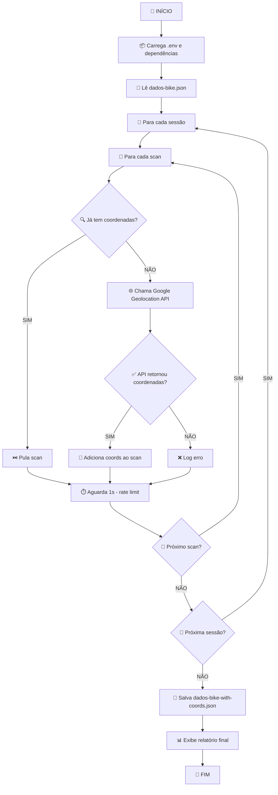

# 🔄 Fluxo de Funcionamento - add-coordinates.js

## 📋 Visão Geral
Script para adicionar coordenadas geográficas aos dados de scan WiFi das bicicletas usando a Google Geolocation API.

## 🚀 Fluxo Principal



## 🔧 Componentes Principais

### 1. **getCoordinates(networks)**
```javascript
// Converte dados WiFi em coordenadas geográficas
Input:  Array de redes WiFi (BSSID, RSSI, channel)
Output: { lat, lng, accuracy } ou null
```

### 2. **main()**
```javascript
// Função principal que processa o arquivo
- Lê dados-bike.json
- Processa cada sessão e scan
- Adiciona coordenadas quando possível
- Salva resultado em dados-bike-with-coords.json
```

## 📊 Estrutura de Dados

### Input (dados-bike.json)
```json
{
  "sessions": {
    "sessionId": {
      "scans": [
        {
          "networks": [
            {
              "bssid": "AA:BB:CC:DD:EE:FF",
              "rssi": -45,
              "channel": 6
            }
          ]
        }
      ]
    }
  }
}
```

### Output (dados-bike-with-coords.json)
```json
{
  "sessions": {
    "sessionId": {
      "scans": [
        {
          "networks": [...],
          "coordinates": {
            "lat": -22.123456,
            "lng": -43.654321,
            "accuracy": 50
          }
        }
      ]
    }
  }
}
```

## ⚡ Características Técnicas

- **Rate Limiting**: 1 segundo entre chamadas API
- **Error Handling**: Continua processamento mesmo com erros
- **Idempotência**: Pula scans que já têm coordenadas
- **Logging**: Feedback detalhado do progresso
- **Backup**: Mantém arquivo original intacto

## 📈 Métricas de Saída

- Total de scans processados
- Número de sucessos na geolocalização
- Nome do arquivo de saída gerado