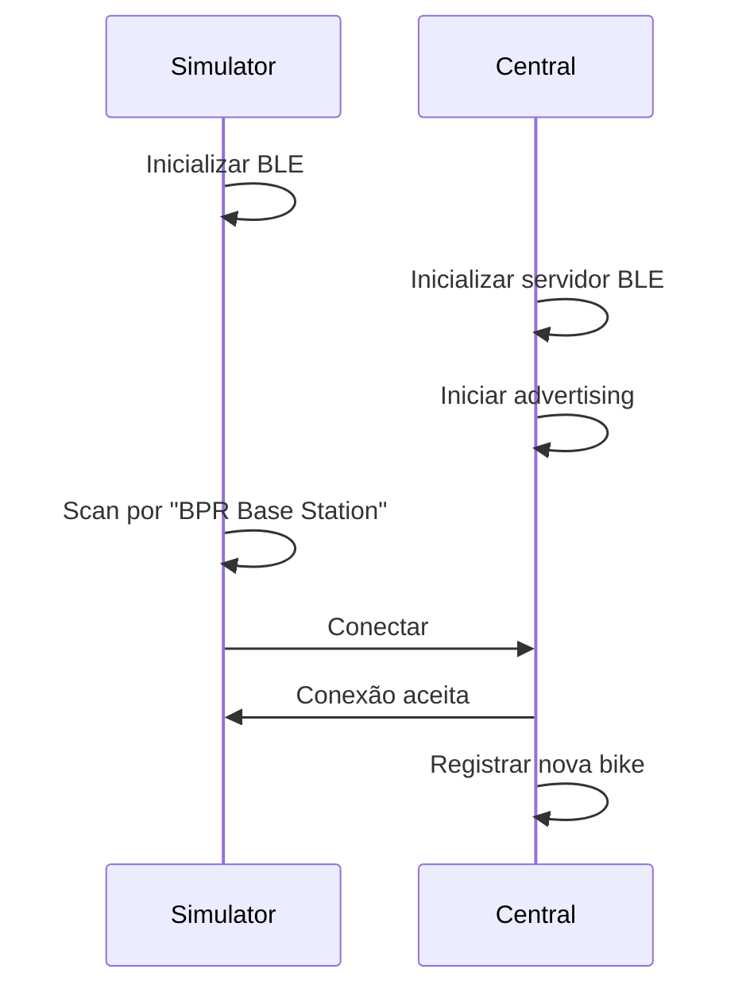
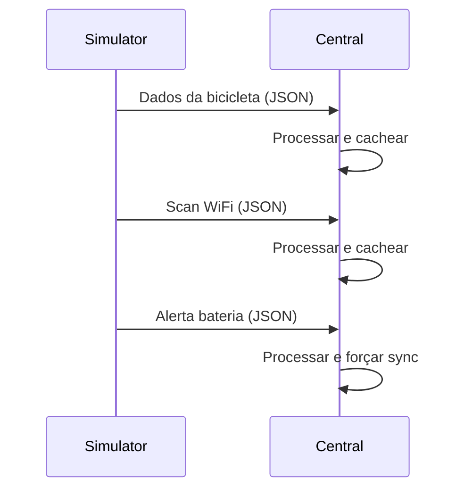
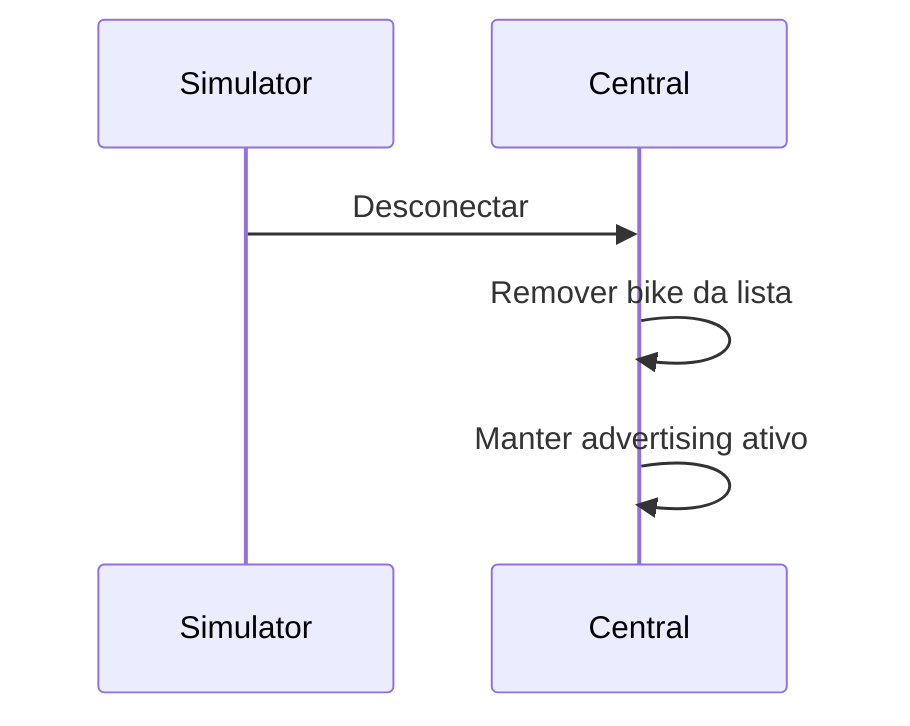

# Conexão Simulator ↔ Central - Documentação Técnica

## 📋 Visão Geral

O sistema de conexão entre o **Simulator** (bicicleta simulada) e a **Central** (hub inteligente) utiliza **Bluetooth Low Energy (BLE)** como protocolo principal de comunicação. Esta documentação detalha o funcionamento completo desta conexão.

## 🔧 Arquitetura da Conexão

### Componentes Principais

1. **Simulator** (`firmware/simulator/`) - Simula uma bicicleta BPR
2. **Central** (`firmware/central/`) - Hub que coleta dados das bicicletas

### Protocolo de Comunicação

- **Tecnologia**: Bluetooth Low Energy (BLE) via NimBLE
- **Topologia**: Cliente-Servidor (Simulator = Cliente, Central = Servidor)
- **Alcance**: ~10-50 metros (dependendo do ambiente)
- **Frequência**: 2.4 GHz ISM

## 🚲 Simulator (Cliente BLE)

### Inicialização

```cpp
// Configuração inicial do simulator
NimBLEDevice::init("BPR_Bike_" + bikeId);
pClient = NimBLEDevice::createClient();
pClient->setClientCallbacks(new ClientCallbacks());
```

### Processo de Descoberta

1. **Scan Ativo**: Procura por dispositivos BLE próximos
2. **Filtro por Nome**: Busca especificamente por `"BPR Base Station"`
3. **Conexão**: Estabelece conexão com a central encontrada

```cpp
// Algoritmo de descoberta
NimBLEScan* pScan = NimBLEDevice::getScan();
pScan->setActiveScan(true);
pScan->setInterval(100);
pScan->setWindow(99);

NimBLEScanResults results = pScan->start(5, false);

for (int i = 0; i < results.getCount(); i++) {
    NimBLEAdvertisedDevice device = results.getDevice(i);
    if (device.getName() == "BPR Base Station") {
        // Central encontrada - conectar
        pClient->connect(&device);
    }
}
```

### Dados Transmitidos

#### 1. Dados da Bicicleta
```json
{
  "uid": "bike_sim_01",
  "base_id": "base01", 
  "battery_voltage": 3.8,
  "status": "active",
  "last_ble_contact": 1733459190,
  "last_wifi_scan": 1733459205,
  "last_position": {
    "lat": -8.064,
    "lng": -34.882,
    "source": "wifi"
  }
}
```

#### 2. Scan WiFi Simulado
```json
{
  "networks": [
    {
      "ssid": "NET_5G_CASA",
      "bssid": "AA:BB:CC:11:22:33", 
      "rssi": -65
    },
    {
      "ssid": "CLARO_WIFI",
      "bssid": "CC:DD:EE:44:55:66",
      "rssi": -78
    }
  ],
  "timestamp": 1733459205,
  "bike_id": "bike_sim_01"
}
```

#### 3. Alertas de Bateria
```json
{
  "type": "battery_alert",
  "bike_id": "bike_sim_01",
  "battery_voltage": 3.2,
  "timestamp": 1733459301,
  "critical": true
}
```

## 🏢 Central (Servidor BLE)

### Inicialização do Servidor

```cpp
// Setup do servidor BLE
NimBLEDevice::init("BPR Base Station");
pServer = NimBLEDevice::createServer();
pServer->setCallbacks(new ServerCallbacks());

// Criar serviço principal
NimBLEService* pService = pServer->createService("BAAD");
```

### Características BLE

| UUID | Nome | Função | Permissões |
|------|------|--------|------------|
| `BAAD` | Serviço Principal | Container das características | - |
| `F00D` | Bike Data | Recebe dados da bicicleta | READ/WRITE |
| `BEEF` | WiFi/Battery | Recebe scans WiFi e alertas | READ/WRITE/NOTIFY |

### Processamento de Dados

#### 1. Callback de Conexão
```cpp
void onConnect(NimBLEServer* pServer, ble_gap_conn_desc* desc) {
    uint16_t connHandle = desc->conn_handle;
    Serial.printf("🔵 Nova conexão BLE (handle: %d)\n", connHandle);
    
    // Registrar bike conectada
    onBLEConnect(connHandle);
    
    // Manter advertising ativo para outras bikes
    NimBLEDevice::startAdvertising();
}
```

#### 2. Callback de Dados Recebidos
```cpp
void onWrite(NimBLECharacteristic* pChar) {
    std::string value = pChar->getValue();
    
    // Parse JSON recebido
    DynamicJsonDocument doc(2048);
    deserializeJson(doc, value.c_str());
    
    // Processar baseado no tipo de dados
    if (doc.containsKey("uid")) {
        // Dados da bicicleta
        processarDadosBicicleta(doc);
    } else if (doc.containsKey("networks")) {
        // Scan WiFi
        processarScanWiFi(doc);
    } else if (doc["type"] == "battery_alert") {
        // Alerta de bateria
        processarAlertaBateria(doc);
    }
}
```

### Sistema de Cache

A central mantém dados em cache até a próxima sincronização WiFi:

```cpp
// Adicionar aos dados pendentes
extern String pendingData;
if (pendingData.length() > 0) pendingData += ",";
pendingData += "{\"type\":\"bike\",\"data\":" + jsonData + "}";
```

## 🔄 Fluxo de Comunicação

### 1. Estabelecimento da Conexão



### 2. Troca de Dados



### 3. Desconexão



## 📊 Monitoramento da Conexão

### Qualidade do Sinal (RSSI)

O simulator monitora a qualidade da conexão:

```cpp
int8_t rssi = pClient->getRssi();

// Interpretação do sinal
if (rssi >= -50) {
    quality = "Excelente";
    status = "Muito Perto";
} else if (rssi >= -60) {
    quality = "Muito Bom"; 
    status = "Perto";
} else if (rssi >= -70) {
    quality = "Bom";
    status = "Distância OK";
} else if (rssi >= -80) {
    quality = "Regular";
    status = "Longe";
} else if (rssi >= -90) {
    quality = "Fraco";
    status = "Muito Longe";
} else {
    quality = "Crítico";
    status = "Limite";
}
```

### Detecção de Desconexão

```cpp
if (!bike.isConnected()) {
    Serial.println("❌ Conexão perdida! Distância máxima atingida");
    Serial.println("🔄 Tentando reconectar...");
    if (bike.connectToCentral()) {
        Serial.println("✅ Reconectado com sucesso!");
    }
}
```

## 🧪 Modos de Teste do Simulator

### 1. Teste de Conexão BLE
- **Comando**: `1`
- **Duração**: 30 segundos
- **Função**: Testa estabelecimento e manutenção da conexão

### 2. Teste de Bateria Baixa
- **Comando**: `2`
- **Duração**: 20 segundos
- **Função**: Simula alerta de bateria crítica (3.2V)

### 3. Teste Multi-bicicleta
- **Comando**: `3`
- **Função**: Instrui uso de múltiplos ESP32s

### 4. Teste de Intensidade do Sinal
- **Comando**: `4`
- **Duração**: 60 segundos
- **Função**: Monitora RSSI e testa alcance máximo

## 🔧 Correção Temporal (NTP)

### Problema
Bicicletas podem ter timestamps incorretos devido à falta de sincronização NTP.

### Solução
A central corrige timestamps automaticamente:

```cpp
unsigned long correctTimestamp(unsigned long bikeTimestamp, unsigned long bikeMillis) {
    // Se bike tem NTP válido
    if (bikeTimestamp > config.min_valid_timestamp) {
        return bikeTimestamp;
    }
    
    // Se central tem NTP, corrigir
    if (ntpSynced && ntpEpoch > 0) {
        unsigned long correctedTime = ntpEpoch + ((millis() - ntpMillisBase) / 1000);
        Serial.printf("🔧 Corrigindo timestamp: %lu -> %lu\n", bikeTimestamp, correctedTime);
        return correctedTime;
    }
    
    // Fallback: usar original
    return bikeTimestamp;
}
```

## 🚨 Sistema de Alertas

### Bateria Crítica
Quando a bateria está abaixo de 3.45V:

1. **Simulator** envia alerta imediato
2. **Central** processa e força sincronização WiFi
3. **Firebase** recebe alerta em tempo real
4. **Bot Telegram** notifica usuários

### Desconexão Inesperada
- **Central** detecta desconexão
- **LED** indica bike saiu (1 piscada longa)
- **Cache** mantém último estado conhecido

## 📈 Otimizações de Performance

### Configurações BLE Otimizadas

```cpp
// Simulator (Cliente)
pScan->setInterval(100);    // 100ms entre scans
pScan->setWindow(99);       // 99ms de janela ativa

// Central (Servidor)  
NimBLEDevice::setPower(ESP_PWR_LVL_P3); // 3dBm (baixo consumo)
pScan->setActiveScan(false);            // Scan passivo
pScan->setInterval(1349);               // Intervalo otimizado
pScan->setWindow(449);                  // Janela otimizada
```

### Gerenciamento de Memória

```cpp
// Documentos JSON com tamanho fixo
DynamicJsonDocument bikeDoc(1024);   // Dados da bike
DynamicJsonDocument wifiDoc(1024);   // Scan WiFi
DynamicJsonDocument alertDoc(512);   // Alertas
```

## 🔍 Troubleshooting

### Problemas Comuns

1. **Central não encontrada**
   - Verificar se central está em modo BLE
   - Verificar alcance (máximo ~50m)
   - Verificar interferências 2.4GHz

2. **Conexão instável**
   - Verificar qualidade do sinal (RSSI)
   - Reduzir distância
   - Verificar obstáculos físicos

3. **Dados não chegam**
   - Verificar UUIDs das características
   - Verificar formato JSON
   - Verificar callbacks registrados

### Logs de Debug

```cpp
// Simulator
Serial.printf("🔍 Procurando Central BPR...\n");
Serial.printf("✅ Central encontrada: %s\n", device.getAddress().toString().c_str());
Serial.printf("📝 Dados da bike enviados: %s\n", bikeJson.c_str());

// Central  
Serial.printf("🔵 Nova conexão BLE (handle: %d)\n", connHandle);
Serial.printf("📝 ✅ DADOS RECEBIDOS! UUID: %s\n", uuid.c_str());
Serial.printf("🆔 Identificação recebida: %s\n", bikeIdentification.c_str());
```

## 📚 Referências Técnicas

- **NimBLE**: Biblioteca BLE otimizada para ESP32
- **ArduinoJson**: Processamento de dados JSON
- **ESP32**: Microcontrolador com BLE integrado
- **Firebase**: Banco de dados em tempo real para sincronização

---

*Esta documentação cobre o funcionamento detalhado da conexão BLE entre simulator e central no sistema BPR.*