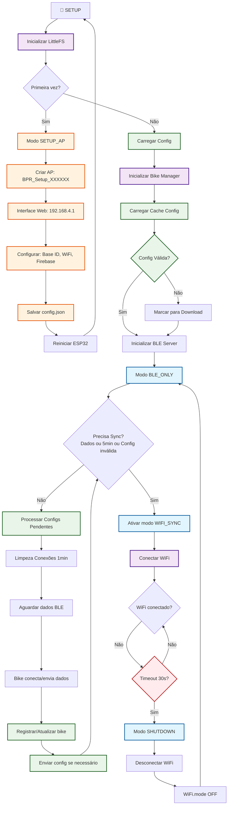
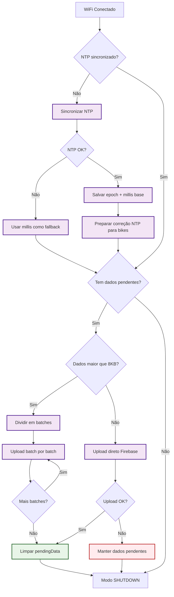
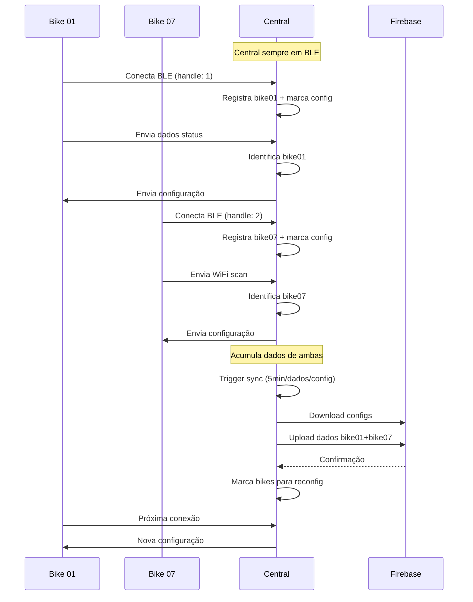
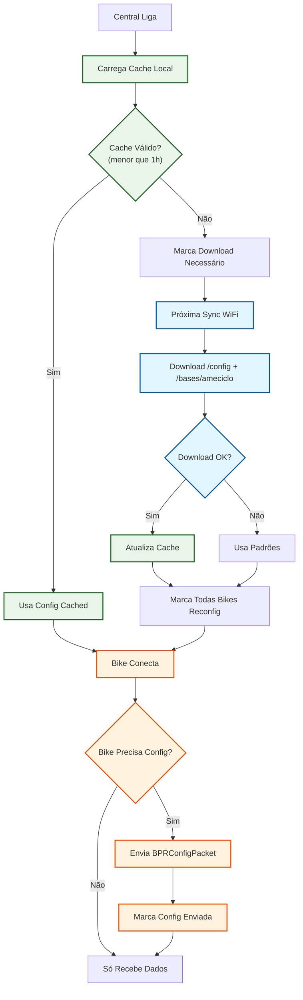
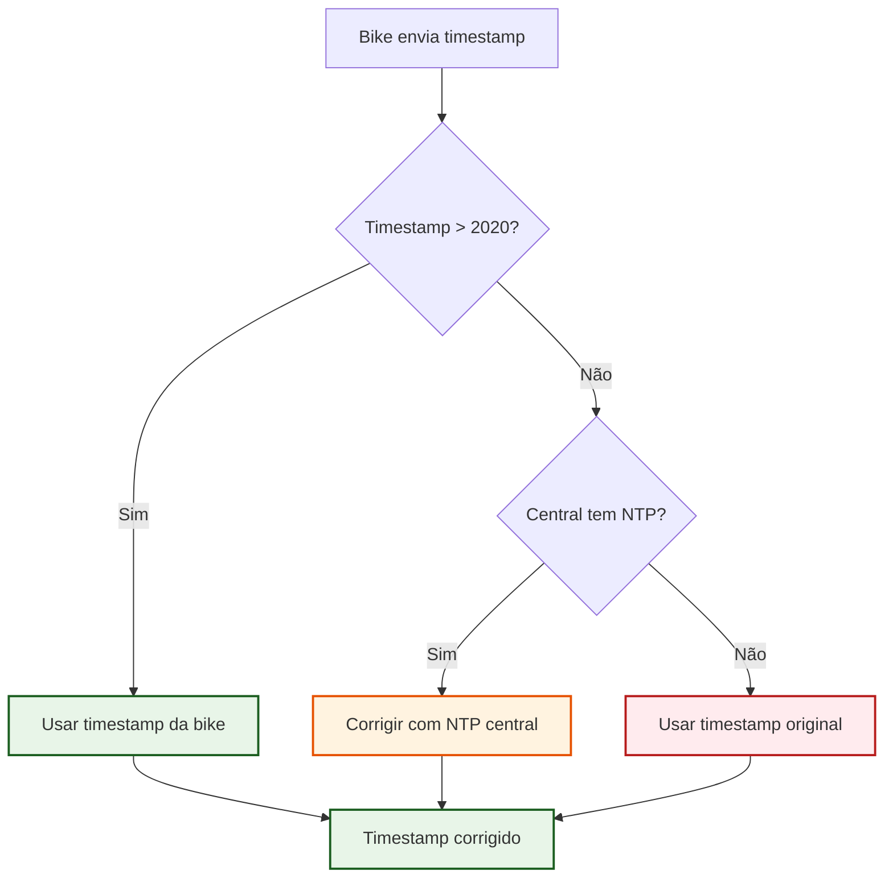
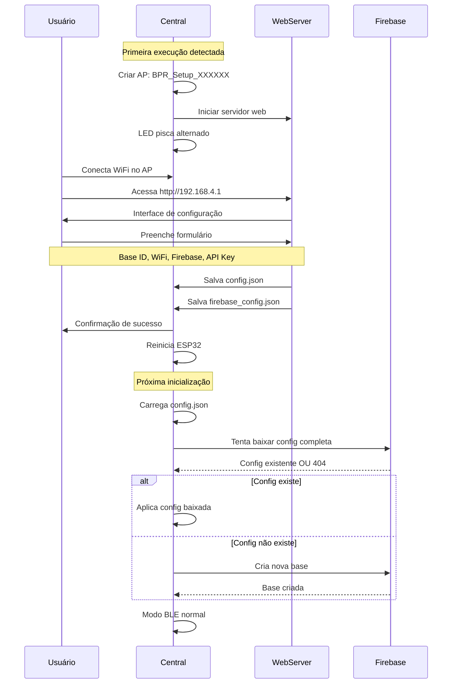

# Central Firmware - Fluxo Completo

Este documento descreve o funcionamento completo do firmware da central BPR como **Hub Inteligente**, incluindo gerenciamento de múltiplas bicicletas e sistema de configuração bidirecional.

## 1. 🔄 Fluxo Principal dos Modos (Atualizado)



## 2. 🔄 Sincronização Completa (NTP + Config + Upload)



## 3. 🚲 Gerenciamento de Múltiplas Bikes



## 4. ⚙️ Sistema de Configuração Bidirecional



## 5. 🕰️ Correção de Timestamps



## 6. 🔧 Modo Setup AP (Novo)



## 7. 📊 Estados e Configurações (Atualizados)

### Estados Globais
```cpp
// Modos de operação
currentMode: SETUP_AP | BLE_ONLY | WIFI_SYNC | SHUTDOWN

// Variáveis do modo setup
WebServer setupServer(80);
bool setupComplete = false;

// Dados e sincronização
pendingData: String com JSONs acumulados
lastSync: timestamp do último sync

// NTP e correção temporal
ntpSynced: bool se NTP está válido
ntpEpoch: timestamp NTP de referência
ntpMillisBase: millis() de referência

// Gerenciamento de bikes
std::vector<ConnectedBike> connectedBikes
ConfigCache configCache (global + base)
```

### Estruturas de Dados
```cpp
struct ConnectedBike {
    char bikeId[8];
    uint16_t connHandle;
    bool configSent;
    bool needsConfig;
    uint32_t lastSeen;
    float lastBattery;
};

struct ConfigCache {
    GlobalConfig global;
    BaseConfig base;
    uint32_t lastUpdate;
    bool valid; // Válido por 1h
};
```

### Configurações Firebase
```json
// GET /config.json
{
  "version": 3,
  "wifi_scan_interval_sec": 25,
  "wifi_scan_interval_low_batt_sec": 60,
  "deep_sleep_after_sec": 300,
  "ble_ping_interval_sec": 5,
  "min_battery_voltage": 3.45,
  "update_timestamp": 1764782576
}

// GET /bases/ameciclo.json
{
  "name": "Ameciclo",
  "max_bikes": 10,
  "wifi_ssid": "BPR_Base",
  "wifi_password": "botaprarodar6",
  "location": {"lat": -8.062, "lng": -34.881},
  "last_sync": 1764782576
}
```

### Estrutura Firebase Upload
```json
// PUT /central_data/{timestamp}.json
{
  "timestamp": 1764782576,
  "data": [
    {"type": "bike", "data": {...}},
    {"type": "wifi", "data": {...}},
    {"type": "alert", "data": {...}},
    {"type": "ntp_sync", "epoch": 1764782576, "millis": 123456}
  ]
}
```

## 📋 Resumo do Funcionamento

### 🔄 Ciclo Principal
1. **Modo SETUP_AP** (primeira vez): Interface web para configuração inicial
2. **Modo BLE_ONLY** (padrão): Recebe dados das bicicletas via BLE
3. **Modo WIFI_SYNC** (temporário): Conecta WiFi e sincroniza com Firebase
4. **Modo SHUTDOWN**: Desliga WiFi e volta ao BLE

### 🔧 Setup Inicial
- Detecta primeira execução (sem config.json)
- Cria AP com interface web para configuração
- Baixa ou cria configuração completa no Firebase
- LED indica visualmente cada estado

### 🕰️ Sincronização Temporal
- Central sincroniza NTP quando conecta WiFi
- Corrige timestamps das bicicletas que não têm NTP válido
- Envia correção temporal para bicicletas via BLE

### 📦 Gestão de Dados
- Acumula dados das bicicletas em `pendingData`
- Divide uploads grandes (>8KB) em batches
- Upload direto HTTPS para Firebase (sem bibliotecas extras)

### 🔋 Eficiência Energética
- WiFi fica desligado na maior parte do tempo
- Ativa WiFi apenas para sincronização (a cada 5min ou quando há dados)
- Timeout de 30s para conexões WiFi

### 🛡️ Robustez
- Fallbacks para timestamps sem NTP
- Retry automático em caso de falha de upload
- Logs detalhados para debugging
- Gestão de memória com monitoramento de heap