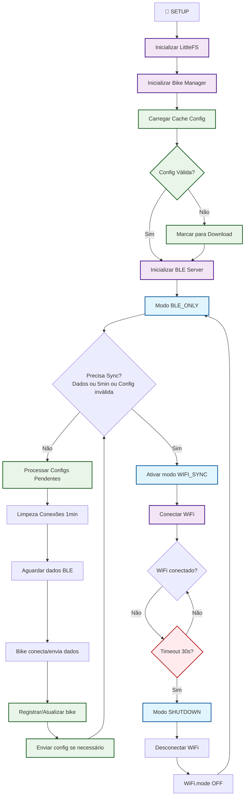
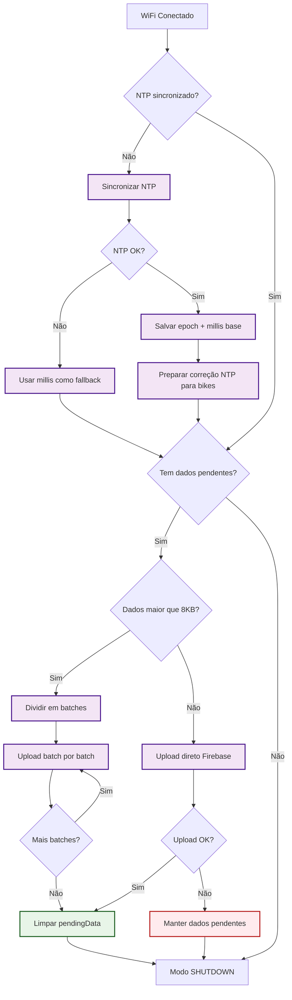
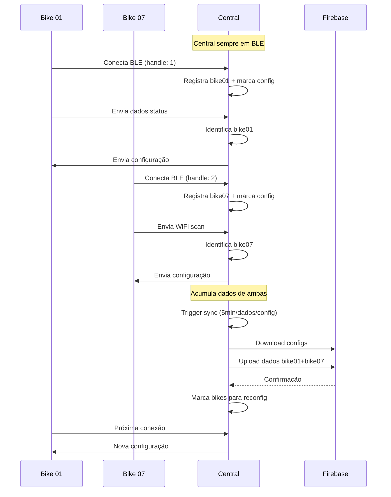
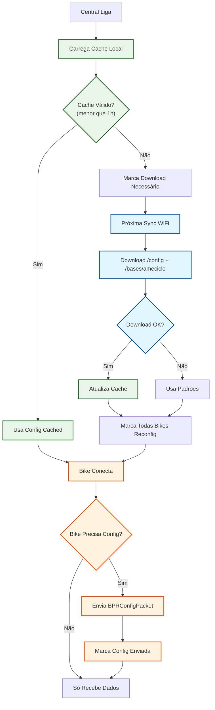
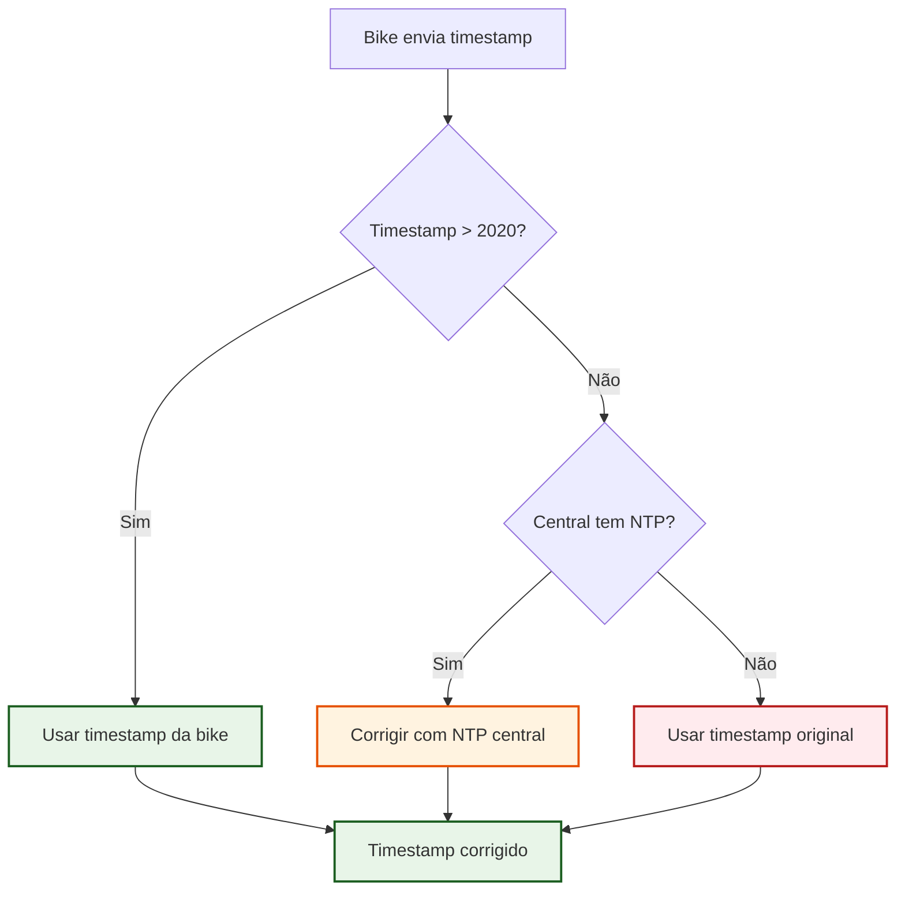

# Central Firmware - Fluxo Completo

Este documento descreve o funcionamento completo do firmware da central BPR como **Hub Inteligente**, incluindo gerenciamento de múltiplas bicicletas e sistema de configuração bidirecional.

## 1. 🔄 Fluxo Principal dos Modos (Atualizado)


```mermaid
graph TD
    A[🚀 SETUP] --> B[Inicializar LittleFS]
    B --> C[Inicializar Bike Manager]
    C --> D[Carregar Cache Config]
    D --> E{Config Válida?}
    E -->|Não| F[Marcar para Download]
    E -->|Sim| G[Inicializar BLE Server]
    F --> G
    G --> H[Modo BLE_ONLY]
    
    H --> I{"Precisa Sync?<br/>Dados ou 5min ou Config inválida"}
    I -->|Não| J[Processar Configs Pendentes]
    J --> K[Limpeza Conexões 1min]
    K --> L[Aguardar dados BLE]
    L --> M[Bike conecta/envia dados]
    M --> N[Registrar/Atualizar bike]
    N --> O[Enviar config se necessário]
    O --> I
    I -->|Sim| P[Ativar modo WIFI_SYNC]
    
    P --> Q[Conectar WiFi]
    Q --> R{WiFi conectado?}
    R -->|Não| S{Timeout 30s?}
    S -->|Não| R
    S -->|Sim| T[Modo SHUTDOWN]
    
    T --> U[Desconectar WiFi]
    U --> V[WiFi.mode OFF]
    V --> H
    
    classDef modeClass fill:#e1f5fe,stroke:#01579b,stroke-width:2px
    classDef processClass fill:#f3e5f5,stroke:#4a148c,stroke-width:2px
    classDef configClass fill:#e8f5e8,stroke:#1b5e20,stroke-width:2px
    classDef errorClass fill:#ffebee,stroke:#b71c1c,stroke-width:2px
    
    class H,P,T modeClass
    class B,C,G,Q processClass
    class D,E,F,J,N,O configClass
    class S errorClass
```

## 2. 🔄 Sincronização Completa (NTP + Config + Upload)


```mermaid
graph TD
    A[WiFi Conectado] --> B{NTP sincronizado?}
    B -->|Não| C[Sincronizar NTP]
    C --> D{NTP OK?}
    D -->|Sim| E[Salvar epoch + millis base]
    D -->|Não| F[Usar millis como fallback]
    E --> G[Preparar correção NTP para bikes]
    F --> H{Tem dados pendentes?}
    G --> H
    B -->|Sim| H
    
    H -->|Sim| I{"Dados maior que 8KB?"}
    I -->|Não| J[Upload direto Firebase]
    I -->|Sim| K[Dividir em batches]
    K --> L[Upload batch por batch]
    L --> M{Mais batches?}
    M -->|Sim| L
    M -->|Não| N[Limpar pendingData]
    J --> O{Upload OK?}
    O -->|Sim| N
    O -->|Não| P[Manter dados pendentes]
    N --> Q[Modo SHUTDOWN]
    P --> Q
    H -->|Não| Q
    
    classDef processClass fill:#f3e5f5,stroke:#4a148c,stroke-width:2px
    classDef dataClass fill:#e8f5e8,stroke:#1b5e20,stroke-width:2px
    classDef errorClass fill:#ffebee,stroke:#b71c1c,stroke-width:2px
    
    class C,E,F,G,J,K,L processClass
    class N dataClass
    class P errorClass
```

## 3. 🚲 Gerenciamento de Múltiplas Bikes


```mermaid
sequenceDiagram
    participant B1 as Bike 01
    participant B2 as Bike 07
    participant C as Central
    participant F as Firebase
    
    Note over C: Central sempre em BLE
    
    B1->>C: Conecta BLE (handle: 1)
    C->>C: Registra bike01 + marca config
    B1->>C: Envia dados status
    C->>C: Identifica bike01
    C->>B1: Envia configuração
    
    B2->>C: Conecta BLE (handle: 2)
    C->>C: Registra bike07 + marca config
    B2->>C: Envia WiFi scan
    C->>C: Identifica bike07
    C->>B2: Envia configuração
    
    Note over C: Acumula dados de ambas
    
    C->>C: Trigger sync (5min/dados/config)
    C->>F: Download configs
    C->>F: Upload dados bike01+bike07
    F-->>C: Confirmação
    C->>C: Marca bikes para reconfig
    
    B1->>C: Próxima conexão
    C->>B1: Nova configuração
```

## 4. ⚙️ Sistema de Configuração Bidirecional


```mermaid
graph TD
    A[Central Liga] --> B[Carrega Cache Local]
    B --> C{"Cache Válido?<br/>(menor que 1h)"}
    C -->|Sim| D[Usa Config Cached]
    C -->|Não| E[Marca Download Necessário]
    
    E --> F[Próxima Sync WiFi]
    F --> G[Download /config + /bases/ameciclo]
    G --> H{Download OK?}
    H -->|Sim| I[Atualiza Cache]
    H -->|Não| J[Usa Padrões]
    I --> K[Marca Todas Bikes Reconfig]
    J --> K
    
    D --> L[Bike Conecta]
    K --> L
    L --> M{Bike Precisa Config?}
    M -->|Sim| N[Envia BPRConfigPacket]
    M -->|Não| O[Só Recebe Dados]
    N --> P[Marca Config Enviada]
    P --> O
    
    classDef cacheClass fill:#e8f5e8,stroke:#1b5e20,stroke-width:2px
    classDef downloadClass fill:#e1f5fe,stroke:#01579b,stroke-width:2px
    classDef configClass fill:#fff3e0,stroke:#e65100,stroke-width:2px
    
    class B,C,D,I cacheClass
    class F,G,H downloadClass
    class L,M,N,P configClass
```

## 5. 🕰️ Correção de Timestamps


```mermaid
graph TD
    A[Bike envia timestamp] --> B{Timestamp > 2020?}
    B -->|Sim| C[Usar timestamp da bike]
    B -->|Não| D{Central tem NTP?}
    D -->|Sim| E[Corrigir com NTP central]
    D -->|Não| F[Usar timestamp original]
    E --> G[Timestamp corrigido]
    C --> G
    F --> G
    
    classDef validClass fill:#e8f5e8,stroke:#1b5e20,stroke-width:2px
    classDef correctionClass fill:#fff3e0,stroke:#e65100,stroke-width:2px
    classDef fallbackClass fill:#ffebee,stroke:#b71c1c,stroke-width:2px
    
    class C,G validClass
    class E correctionClass
    class F fallbackClass
```

## 6. 📊 Estados e Configurações (Atualizados)

### Estados Globais
```cpp
// Modos de operação
currentMode: BLE_ONLY | WIFI_SYNC | SHUTDOWN

// Dados e sincronização
pendingData: String com JSONs acumulados
lastSync: timestamp do último sync

// NTP e correção temporal
ntpSynced: bool se NTP está válido
ntpEpoch: timestamp NTP de referência
ntpMillisBase: millis() de referência

// Gerenciamento de bikes
std::vector<ConnectedBike> connectedBikes
ConfigCache configCache (global + base)
```

### Estruturas de Dados
```cpp
struct ConnectedBike {
    char bikeId[8];
    uint16_t connHandle;
    bool configSent;
    bool needsConfig;
    uint32_t lastSeen;
    float lastBattery;
};

struct ConfigCache {
    GlobalConfig global;
    BaseConfig base;
    uint32_t lastUpdate;
    bool valid; // Válido por 1h
};
```

### Configurações Firebase
```json
// GET /config.json
{
  "version": 3,
  "wifi_scan_interval_sec": 25,
  "wifi_scan_interval_low_batt_sec": 60,
  "deep_sleep_after_sec": 300,
  "ble_ping_interval_sec": 5,
  "min_battery_voltage": 3.45,
  "update_timestamp": 1764782576
}

// GET /bases/ameciclo.json
{
  "name": "Ameciclo",
  "max_bikes": 10,
  "wifi_ssid": "BPR_Base",
  "wifi_password": "bpr123456",
  "location": {"lat": -8.062, "lng": -34.881},
  "last_sync": 1764782576
}
```

### Estrutura Firebase Upload
```json
// PUT /central_data/{timestamp}.json
{
  "timestamp": 1764782576,
  "data": [
    {"type": "bike", "data": {...}},
    {"type": "wifi", "data": {...}},
    {"type": "alert", "data": {...}},
    {"type": "ntp_sync", "epoch": 1764782576, "millis": 123456}
  ]
}
```

## 📋 Resumo do Funcionamento

### 🔄 Ciclo Principal
1. **Modo BLE_ONLY** (padrão): Recebe dados das bicicletas via BLE
2. **Modo WIFI_SYNC** (temporário): Conecta WiFi e sincroniza com Firebase
3. **Modo SHUTDOWN**: Desliga WiFi e volta ao BLE

### 🕰️ Sincronização Temporal
- Central sincroniza NTP quando conecta WiFi
- Corrige timestamps das bicicletas que não têm NTP válido
- Envia correção temporal para bicicletas via BLE

### 📦 Gestão de Dados
- Acumula dados das bicicletas em `pendingData`
- Divide uploads grandes (>8KB) em batches
- Upload direto HTTPS para Firebase (sem bibliotecas extras)

### 🔋 Eficiência Energética
- WiFi fica desligado na maior parte do tempo
- Ativa WiFi apenas para sincronização (a cada 5min ou quando há dados)
- Timeout de 30s para conexões WiFi

### 🛡️ Robustez
- Fallbacks para timestamps sem NTP
- Retry automático em caso de falha de upload
- Logs detalhados para debugging
- Gestão de memória com monitoramento de heap