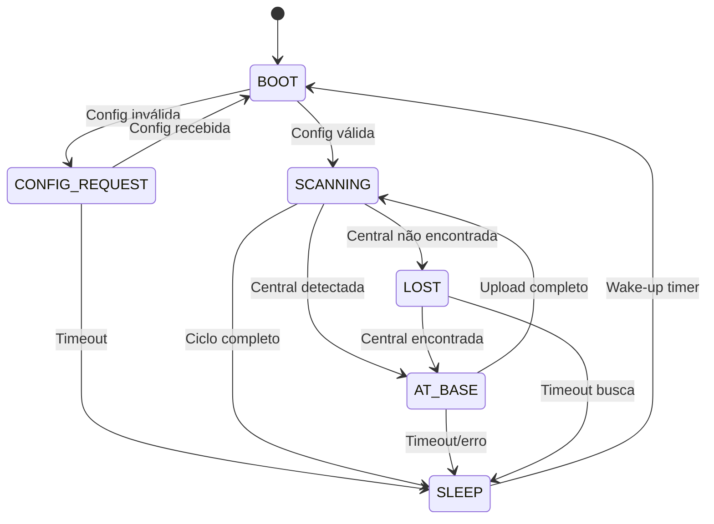

# 🚲 Firmware Bicicleta v2.0 - BPR Sistema

Firmware otimizado para ESP32 que implementa scanner WiFi automático com comunicação BLE para o sistema BPR (Bota Pra Rodar).

## 📋 Visão Geral

Este firmware implementa uma **máquina de estados robusta** que coleta dados de redes WiFi e se comunica com uma central via BLE. Projetado para **máxima economia de energia** e **confiabilidade** em campo.

### 🎯 Características Principais

- ✅ **Scanner WiFi automático** com intervalos configuráveis
- ✅ **Cliente BLE** para comunicação com central
- ✅ **Armazenamento binário** otimizado (3-5x menor que JSON)
- ✅ **Deep sleep inteligente** para autonomia de 30+ dias
- ✅ **Configuração dinâmica** via BLE
- ✅ **Buffer persistente** com recuperação automática
- ✅ **Monitor de bateria** com alertas críticos

## 🏗️ Arquitetura

### 📊 Máquina de Estados (FSD Compliant)



### 🗂️ Estrutura de Arquivos

```
firmware/bici/
├── src/
│   ├── main.cpp              # 🚀 Máquina de estados principal
│   ├── config_manager.cpp    # ⚙️ Configuração binária
│   ├── buffer_manager.cpp    # 📦 Buffer persistente otimizado
│   ├── power_manager.cpp     # ⚡ Gerenciamento de energia
│   ├── at_base.cpp          # 🔵 Cliente BLE
│   ├── scanning.cpp         # 📡 Scanner WiFi
│   ├── lost.cpp             # 🔍 Busca por central
│   └── utils.cpp            # 🛠️ Utilitários
├── include/
│   ├── constants.h          # 📋 Estruturas binárias FSD
│   ├── config_manager.h     # ⚙️ Configuração
│   ├── buffer_manager.h     # 📦 Buffer
│   ├── power_manager.h      # ⚡ Energia
│   ├── at_base.h           # 🔵 BLE
│   ├── scanning.h          # 📡 WiFi
│   └── lost.h              # 🔍 Busca
├── data/
│   └── config.json         # 📄 Config inicial (removido - agora binário)
├── FSD.md                  # 📚 Especificação funcional
├── README.md              # 📖 Este arquivo
└── platformio.ini         # 🔧 Configuração build
```

## 🔧 Configuração e Build

### Pré-requisitos

- **PlatformIO** 6.0+
- **ESP32** genérico (240MHz, 520KB RAM, 4MB Flash)
- **Bateria** 18650 Li-ion (3.7V, 2500mAh+)

### Build e Upload

```bash
# Clone e navegue
cd firmware/bici

# Build
pio run

# Upload firmware
pio run --target upload

# Monitor serial
pio device monitor
```

### Configuração Hardware

```cpp
// Pinos definidos em constants.h
#define LED_PIN 8        // LED de status
#define BUTTON_PIN 9     // Botão de configuração
#define BATTERY_PIN A0   // Monitor de bateria
```

## 📡 Protocolo de Comunicação

### BLE Configuration

```cpp
// UUIDs conforme FSD
#define BLE_SERVICE_UUID     "12345678-1234-1234-1234-123456789abc"
#define BLE_CHAR_DATA_UUID   "12345678-1234-1234-1234-123456789abd"
#define BLE_CHAR_CONFIG_UUID "12345678-1234-1234-1234-123456789abe"
```

### Estruturas de Dados

#### 🔄 Armazenamento Local (Binário)

```cpp
// Configuração da bike (96 bytes)
struct BikeConfig {
    uint32_t version;
    char bike_id[16];           // "bpr-123456"
    char bike_name[32];
    bool dev_mode;
    
    struct {
        uint16_t scan_interval_sec;    // 300s padrão
        uint16_t scan_timeout_ms;      // 5000ms padrão
        uint8_t max_networks;          // 20 padrão
        int8_t rssi_threshold;         // -90dBm padrão
    } wifi;
    
    struct {
        char base_name[32];            // "BPR Central"
        uint16_t scan_time_sec;        // 5s padrão
        uint16_t connection_timeout_ms; // 10000ms padrão
    } ble;
    
    struct {
        uint32_t deep_sleep_duration_sec; // 3600s padrão
        uint16_t radio_coordination_delay_ms; // 300ms padrão
    } power;
    
    struct {
        float critical_voltage;        // 3.2V padrão
        float low_voltage;            // 3.45V padrão
    } battery;
    
    uint32_t timestamp;
} __attribute__((packed));
```

#### 📊 Sessão de Dados (Até 50 scans)

```cpp
// Dados de uma sessão completa
struct SessionData {
    char bike_id[16];
    uint32_t session_start_millis;
    uint16_t scan_count;
    uint16_t battery_count;
    ScanData scans[MAX_SCANS];        // 50 scans máximo
    BatteryData battery[MAX_BATTERY]; // 10 leituras máximo
} __attribute__((packed));

// Dados de um scan WiFi
struct ScanData {
    uint32_t timestamp_millis;
    uint8_t network_count;
    NetworkData networks[MAX_NETWORKS_PER_SCAN]; // 20 redes máximo
} __attribute__((packed));

// Dados de uma rede WiFi
struct NetworkData {
    char ssid[33];
    char bssid[18];      // "AA:BB:CC:DD:EE:FF"
    int16_t rssi;
    uint8_t channel;
} __attribute__((packed));
```

#### 📤 Comunicação BLE (JSON)

**Upload de Dados**:
```json
{
  "bike_id": "bpr-123456",
  "type": "data",
  "session_start_millis": 45000,
  "scans": [
    [47000, [["NET_5G", "AA:BB:CC:11:22:33", -70, 6]]],
    [52000, [["CLARO_WIFI", "CC:DD:EE:44:55:66", -82, 11]]]
  ],
  "battery": [[47000, 85], [52000, 84]]
}
```

**Heartbeat**:
```json
{
  "bike_id": "bpr-123456",
  "type": "heartbeat",
  "battery_percent": 85,
  "heap": 45000,
  "last_update": 1234567890
}
```

## ⚡ Gerenciamento de Energia

### Estados de Bateria

| Tensão | Estado | Comportamento |
|--------|--------|---------------|
| > 3.45V | Normal | Operação padrão |
| 3.2-3.45V | Baixa | Intervalos reduzidos |
| < 3.2V | Crítica | Deep sleep prolongado |

### Consumo Estimado

| Estado | Consumo | Duração |
|--------|---------|---------|
| Deep Sleep | < 10µA | 3600s |
| WiFi Scan | < 200mA | 5s |
| BLE Upload | < 50mA | 10s |
| **Autonomia** | **~35 dias** | **Bateria 2500mAh** |

## 🔄 Fluxos Operacionais

### 1. Inicialização

```cpp
void setup() {
    // 1. Hardware init
    Serial.begin(115200);
    LittleFS.begin(true);
    
    // 2. Generate unique ID
    configManager.generateUniqueId();
    
    // 3. Load config
    if (!configManager.load()) {
        currentState = STATE_CONFIG_REQUEST;
    } else {
        currentState = STATE_BOOT;
    }
    
    // 4. Initialize BLE
    NimBLEDevice::init(config.bike_id);
}
```

### 2. Coleta de Dados

```cpp
// Scanner WiFi otimizado
void performWiFiScan() {
    WiFi.scanNetworks(true);  // Async scan
    
    // Wait for completion
    int networks = WiFi.scanComplete();
    
    // Process and store
    for (int i = 0; i < min(networks, MAX_NETWORKS_PER_SCAN); i++) {
        if (WiFi.RSSI(i) >= config.wifi.rssi_threshold) {
            // Add to buffer
            bufferManager.addScan(millis(), networkData, count);
        }
    }
    
    WiFi.scanDelete();
}
```

### 3. Upload via BLE

```cpp
// Upload para central
bool uploadData() {
    if (!connectToCentral()) return false;
    
    // Send heartbeat
    String heartbeat = powerManager.getBatteryReport(config);
    sendBLE(heartbeat);
    
    // Send data
    String jsonData = bufferManager.toJson();
    sendBLE(jsonData);
    
    // Wait confirmation
    if (waitForConfirmation()) {
        bufferManager.clear();
        return true;
    }
    
    return false;
}
```

## 🛠️ Configuração Dinâmica

### Recebimento via BLE

```cpp
bool ConfigManager::processUpdate(const String& configJson) {
    DynamicJsonDocument doc(1024);
    deserializeJson(doc, configJson);
    
    // Update WiFi settings
    if (doc["wifi"]["scan_interval_sec"]) {
        config.wifi.scan_interval_sec = doc["wifi"]["scan_interval_sec"];
    }
    
    // Update BLE settings
    if (doc["ble"]["scan_time_sec"]) {
        config.ble.scan_time_sec = doc["ble"]["scan_time_sec"];
    }
    
    // Save binary config
    save();
    return true;
}
```

### Persistência Binária

```cpp
void ConfigManager::save() {
    config.timestamp = millis() / 1000;
    
    File file = LittleFS.open("/config.bin", "w");
    file.write((uint8_t*)&config, sizeof(BikeConfig));
    file.close();
    
    Serial.printf("✅ Config saved (%d bytes)\n", sizeof(BikeConfig));
}
```

## 🔍 Debugging e Monitoramento

### Logs Estruturados

```cpp
// Battery status
🔋 Battery: 85% (3.82V) ⚡CHARGING

// State transitions
🔄 State transition: 0 → 2 (BOOT → SCANNING)

// WiFi scans
📡 Added scan 1 with 12 networks

// BLE operations
🔵 Connected to BPR Central
📤 Data uploaded successfully
```

### Monitor Serial

```bash
# Conectar ao monitor
pio device monitor

# Logs típicos
🚲 BPR Bici Modular v2.0
🆔 Generated bike ID: bpr-123456
📂 Loading binary config...
✅ Binary config loaded: bpr-123456 v2
🔋 Battery: 85% (3.82V)
🔄 State transition: 0 → 2
📡 WiFi scan started...
📡 Added scan 1 with 12 networks
🔵 Searching for BPR Central...
✅ Connected to central
📤 Uploading session data...
✅ Data confirmed by central
💤 Entering deep sleep for 3600s
```

## 🧪 Testes e Validação

### Testes Unitários

```bash
# Executar testes (quando implementados)
pio test

# Testes específicos
pio test -f test_config_manager
pio test -f test_buffer_manager
pio test -f test_power_manager
```

### Testes de Campo

| Teste | Critério | Status |
|-------|----------|--------|
| Autonomia | > 30 dias | ⏳ Pendente |
| Alcance BLE | > 10 metros | ⏳ Pendente |
| Taxa de scan | > 95% sucesso | ⏳ Pendente |
| Upload BLE | > 90% sucesso | ⏳ Pendente |

## 🚨 Tratamento de Erros

### Recuperação Automática

```cpp
// WiFi scan failures
if (consecutiveFailures > 5) {
    WiFi.disconnect();
    WiFi.begin();
    consecutiveFailures = 0;
}

// BLE connection failures
if (!connectToCentral()) {
    retryCount++;
    if (retryCount >= 3) {
        currentState = STATE_LOST;
    }
}

// Buffer overflow
if (bufferManager.isFull()) {
    // Keep most recent data
    bufferManager.removeOldest();
}
```

### Estados de Erro

| Erro | Ação | Recovery |
|------|------|----------|
| Config corrompida | Usar padrão | Solicitar nova |
| Buffer cheio | Remover antigas | Continuar coleta |
| BLE timeout | Estado LOST | Busca ativa |
| Bateria crítica | Deep sleep | Wake em 24h |

## 📈 Performance e Otimizações

### Economia de Memória

- **Estruturas binárias**: 3-5x menor que JSON
- **Buffer fixo**: Sem fragmentação de heap
- **Strings otimizadas**: bike_id de 16 bytes vs 32

### Economia de Energia

- **Deep sleep**: < 10µA entre ciclos
- **Coordenação de rádios**: WiFi e BLE nunca simultâneos
- **Scan otimizado**: Timeout configurável por rede

### Benchmarks

```cpp
// Tamanhos de estruturas
sizeof(BikeConfig)    = 96 bytes   (vs ~400 bytes JSON)
sizeof(SessionData)   = ~52KB      (50 scans completos)
sizeof(NetworkData)   = 55 bytes   (vs ~150 bytes JSON)

// Performance
WiFi scan time:       < 5 segundos
BLE connection:       < 3 segundos  
Config save:          < 100ms
Buffer save:          < 500ms
```

## 🔮 Roadmap

### v2.1 (Próxima Release)
- [ ] OTA updates via BLE
- [ ] Compressão de dados
- [ ] Métricas de qualidade de sinal
- [ ] Cache inteligente de configurações

### v2.2 (Futuro)
- [ ] Mesh networking entre bikes
- [ ] Edge analytics local
- [ ] Machine learning para otimização
- [ ] Integração com sensores externos

## 📄 Licença

**AGPL-3.0 License** - veja [LICENSE](../../../LICENSE) para detalhes.

## 🤝 Contribuição

1. Fork o projeto
2. Crie uma branch: `git checkout -b feature/nova-funcionalidade`
3. Commit: `git commit -m "feat: adiciona nova funcionalidade"`
4. Push: `git push origin feature/nova-funcionalidade`
5. Abra um Pull Request

## 📞 Suporte

- **Issues**: [GitHub Issues](https://github.com/bpr-sistema/issues)
- **Documentação**: [FSD.md](FSD.md)
- **Email**: firmware@prarodar.org

---

**Desenvolvido com ❤️ pela equipe BPR Sistema**