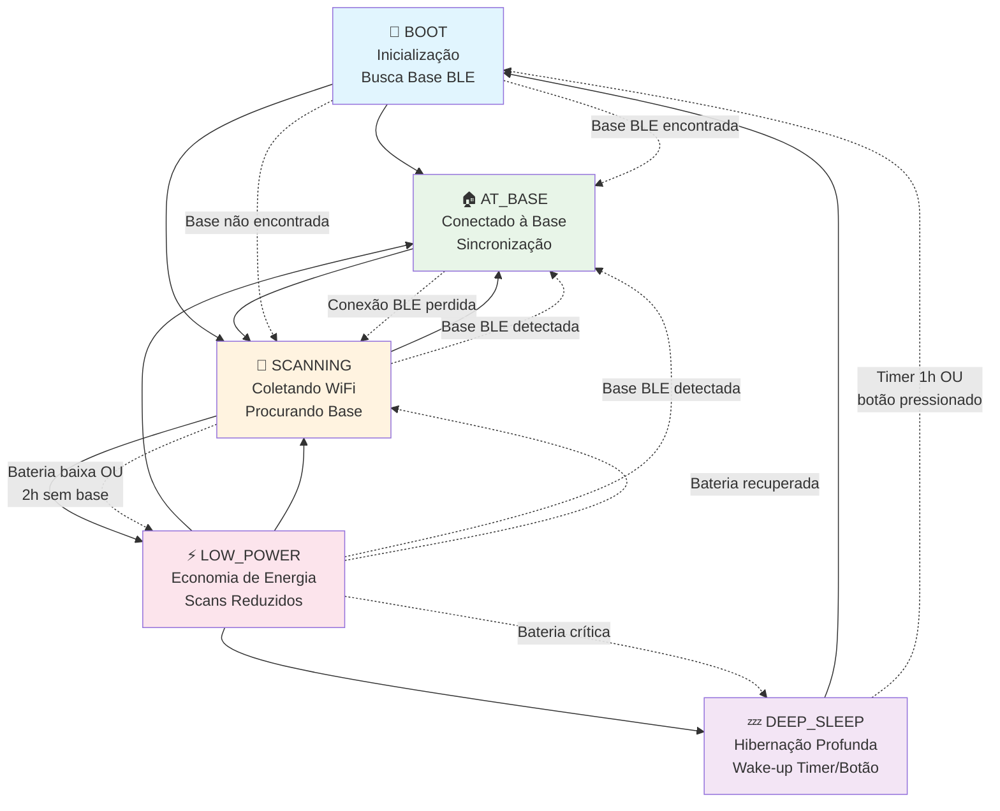
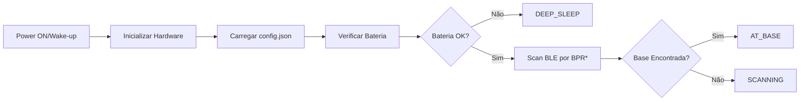
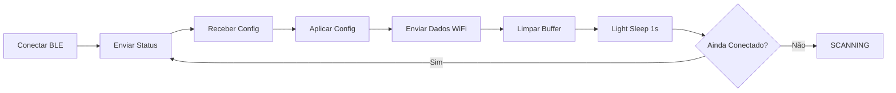
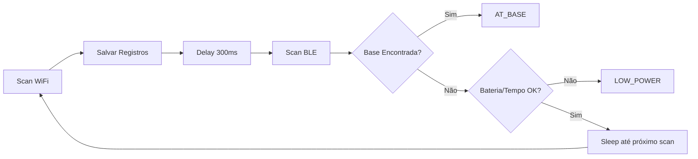
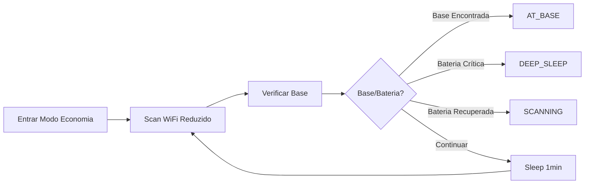
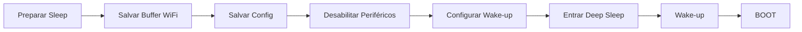
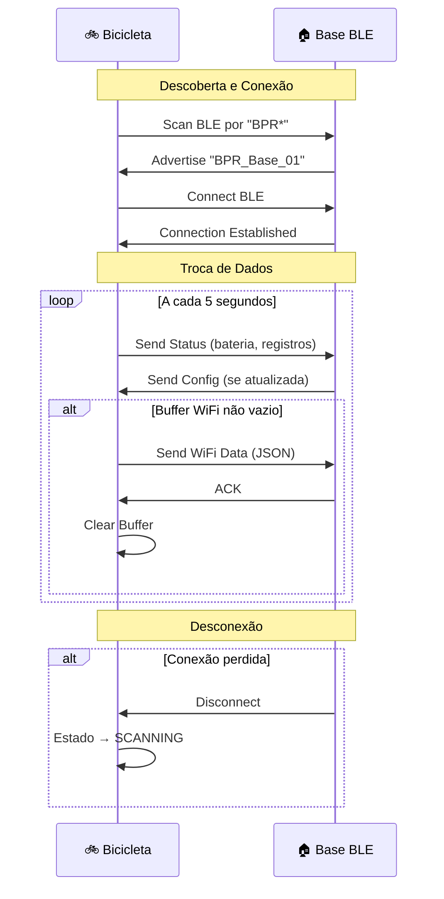
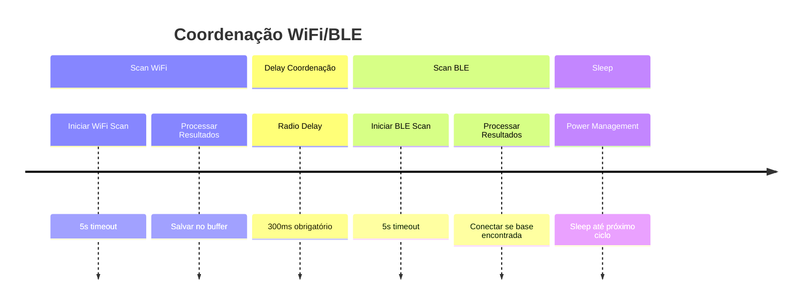
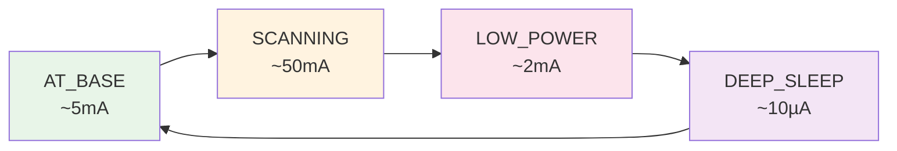
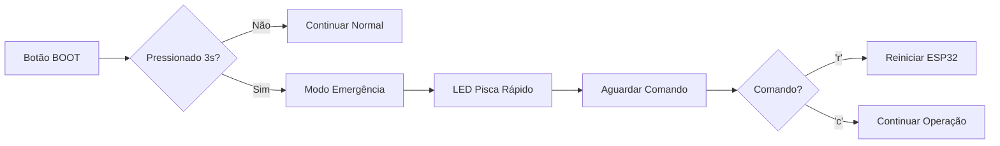

# 🚲 BPR Bici - Fluxo do Sistema v2.0

## 🎯 Visão Geral

Sistema de bicicleta melhorado com máquina de estados clara, comunicação BLE otimizada e gerenciamento inteligente de energia.

## 📊 Diagrama de Estados



## 🔄 Fluxo Detalhado por Estado

### 1️⃣ BOOT (main.cpp)


**Responsabilidades:**
- **main.cpp**: Orquestração geral e inicialização
- **config_manager.cpp**: Carrega configuração local
- **battery_monitor.cpp**: Verifica nível inicial
- **ble_client.cpp**: Scan por bases BLE

### 2️⃣ AT_BASE (at_base.cpp)


**Responsabilidades:**
- **at_base.cpp**: Lógica de sincronização com base
- **ble_client.cpp**: Comunicação BLE (status, config, dados)
- **config_manager.cpp**: Atualiza configurações recebidas
- **wifi_scanner.cpp**: Fornece dados coletados
- **power_manager.cpp**: Light sleep entre operações

### 3️⃣ SCANNING (scanning.cpp)


**Responsabilidades:**
- **scanning.cpp**: Coordena coleta de dados e busca por base
- **wifi_scanner.cpp**: Executa scans WiFi e gerencia buffer
- **power_manager.cpp**: Coordenação de rádio (WiFi → delay → BLE)
- **ble_client.cpp**: Procura bases disponíveis
- **battery_monitor.cpp**: Monitora condições para mudança de estado

### 4️⃣ LOW_POWER (low_power.cpp)


**Responsabilidades:**
- **low_power.cpp**: Gerencia modo de economia
- **power_manager.cpp**: Reduz frequência CPU e potência WiFi
- **wifi_scanner.cpp**: Scans com frequência reduzida (15min)
- **ble_client.cpp**: Continua procurando base
- **battery_monitor.cpp**: Monitora recuperação ou criticidade

### 5️⃣ DEEP_SLEEP (deep_sleep.cpp)


**Responsabilidades:**
- **deep_sleep.cpp**: Prepara e executa hibernação
- **wifi_scanner.cpp**: Salva buffer em LittleFS
- **config_manager.cpp**: Persiste configurações
- **power_manager.cpp**: Desabilita periféricos
- **ESP32**: Wake-up por timer (1h) ou botão

## 📡 Comunicação BLE

### Fluxo de Sincronização


### Estruturas de Dados BLE
```json
// Status da Bicicleta → Base
{
  "type": "bike_status",
  "bike_id": "bici_001",
  "battery_voltage": 3.82,
  "battery_percentage": 85,
  "records_count": 42,
  "timestamp": 1234567890,
  "heap": 174248
}

// Configuração Base → Bicicleta
{
  "bike_id": "bici_001",
  "base_ble_name": "BPR_Base_01",
  "version": 2,
  "scan_interval_sec": 300,
  "scan_interval_low_batt_sec": 900,
  "deep_sleep_sec": 3600,
  "min_battery_voltage": 3.45,
  "timestamp": 1234567890
}

// Dados WiFi Bicicleta → Base
{
  "scans": [
    {
      "ts": 1234567890,
      "bssid": "AA:BB:CC:DD:EE:FF",
      "rssi": -70,
      "ch": 6
    }
  ]
}
```

## ⚡ Coordenação de Rádio

### Problema ESP32-C3
- **WiFi e BLE compartilham o mesmo rádio**
- **Uso simultâneo pode causar interferência**
- **Perda de dados ou falhas de conexão**

### Solução Implementada


### Benefícios
- ✅ **Evita conflitos de RF**
- ✅ **Mantém ambas funcionalidades ativas**
- ✅ **Melhora confiabilidade da comunicação**
- ✅ **Reduz consumo energético**

## 🔋 Gerenciamento de Energia

### Consumo por Estado


### Otimizações Implementadas
- **CPU Frequency**: 80MHz (economia) / 160MHz (performance)
- **WiFi TX Power**: Reduzida em LOW_POWER (-1dBm vs 19.5dBm)
- **Sleep Modes**: Light sleep entre operações, deep sleep para hibernação
- **Peripheral Management**: Desabilita componentes desnecessários
- **Dynamic Scaling**: Ajuste automático baseado na bateria

## 🚨 Modo Emergência

### Ativação


### Utilidade
- **Debug em campo**: Acesso via serial sem reflash
- **Recuperação**: Reinício forçado se sistema travado
- **Manutenção**: Pausa operação para diagnóstico

## 📊 Monitoramento e Debug

### Logs Estruturados
```
🚲 bici_001 | Estado: SCANNING | Uptime: 1234s
🔋 3.82V (85%) ✅ | 📡 42 registros
🔵 BLE: Desconectado | ⏱️ Estado há: 120s
```

### Indicadores LED
- **BOOT**: 3 piscadas rápidas (inicialização)
- **AT_BASE**: LED fixo (conectado)
- **SCANNING**: Piscada por scan (ativo)
- **LOW_POWER**: Piscada lenta (economia)
- **DEEP_SLEEP**: LED off (hibernando)
- **EMERGÊNCIA**: Piscadas muito rápidas (debug)

## 🔄 Integração com Sistema BPR

### Fluxo Completo
```mermaid
graph TB
    subgraph "🚲 Bicicleta (ESP32-C3)"
        A[WiFi Scanner] --> B[Buffer Local]
        B --> C[BLE Client]
        C --> D[Base Detection]
    end
    
    subgraph "🏠 Base/Hub (ESP32)"
        E[BLE Server] --> F[Bike Manager]
        F --> G[Firebase Sync]
    end
    
    subgraph "🔥 Firebase"
        H[Realtime Database]
        I[/bikes/{id}/sessions]
        J[/bikes/{id}/status]
    end
    
    subgraph "🤖 Bot Telegram"
        K[Monitor Sessões]
        L[Geolocalização]
        M[Notificações]
    end
    
    %% Conexões
    D --> E
    G --> H
    H --> I
    H --> J
    I --> K
    K --> L
    L --> M
```

### Vantagens da Nova Arquitetura
1. **Estados Claros**: Cada estado tem responsabilidade específica
2. **Configuração Dinâmica**: Base controla parâmetros remotamente
3. **Comunicação Confiável**: Coordenação de rádio evita interferências
4. **Energia Otimizada**: Modos adaptativos baseados na situação
5. **Código Modular**: Fácil manutenção e extensão
6. **Debug Avançado**: Logs estruturados e modo emergência
7. **Persistência Robusta**: Dados salvos antes de hibernação
8. **Recuperação Automática**: Tratamento de falhas e reconexão

## 🚀 Próximos Passos

- [ ] **Integração com Hub**: Implementar servidor BLE na base
- [ ] **Testes de Campo**: Validar autonomia e confiabilidade
- [ ] **Otimização**: Reduzir ainda mais o consumo energético
- [ ] **Segurança**: Implementar autenticação BLE
- [ ] **OTA Updates**: Atualização remota via BLE
- [ ] **Compressão**: Otimizar tamanho dos dados WiFi
- [ ] **Watchdog**: Recuperação automática de travamentos
- [ ] **Métricas**: Coleta de dados de performance