# 🚲 BPR Bike System - Fluxo Completo

Sistema de firmware para bicicletas compartilhadas com comunicação BLE e coleta de dados WiFi.

## 🎯 Visão Geral

A bicicleta opera em **5 estados principais** com foco em **ultra baixo consumo** e **comunicação BLE** com a central.

## 📊 Máquina de Estados Principal

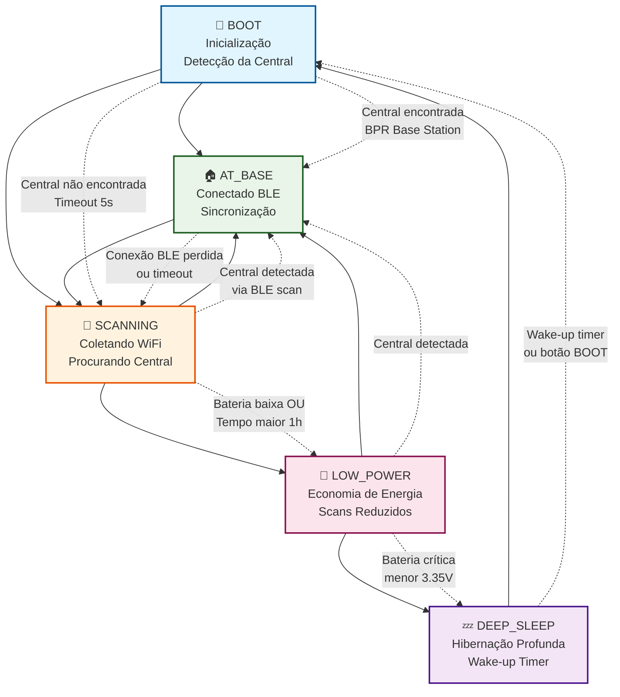

## 🔄 Fluxo Detalhado por Estado

### 1️⃣ Estado BOOT (Inicialização)

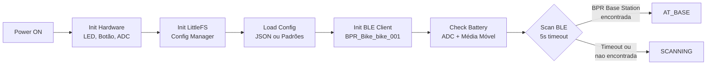

**Ações Específicas:**
- Inicializar hardware (LED pino 8, botão pino 9, ADC)
- Carregar configuração JSON ou usar padrões
- Configurar BLE como cliente `BPR_Bike_bike_001`
- Verificar nível de bateria com média móvel
- Scan BLE ativo por 5 segundos

### 2️⃣ Estado AT_BASE (Na Central)

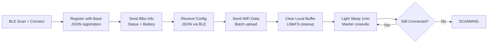

**Dados Enviados:**
```json
{
  "type": "status",
  "bike_id": "bike_001",
  "battery_voltage": 4.66,
  "records_count": 0,
  "timestamp": 123456,
  "heap": 174332
}
```

**Configuração Recebida:**
```json
{
  "scan_interval_sec": 300,
  "scan_interval_low_batt_sec": 900,
  "deep_sleep_sec": 3600,
  "min_battery_voltage": 3.45,
  "base_ble_name": "BPR Base Station"
}
```

### 3️⃣ Estado SCANNING (Coletando Dados)

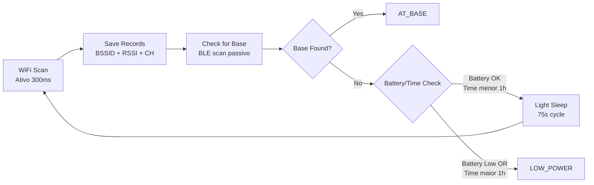

**Registro WiFi:**
```cpp
struct WifiRecord {
  uint32_t timestamp;
  uint8_t bssid[6];
  int8_t rssi;
  uint8_t channel;
};
```

**Sistema de Armazenamento:**
- **Buffer RAM**: 50 registros (flush automático)
- **Arquivos LittleFS**: 1000 registros por arquivo
- **Capacidade total**: ~20.000 registros (1MB flash)
- **Autonomia**: ~14 dias de coleta contínua
- **Estrutura**: `/wifi_0.json`, `/wifi_1.json`, etc.

**Otimizações:**
- CPU: 160MHz (para WiFi)
- WiFi TX Power: -1dBm (economia)
- Scan limitado a 20 redes mais fortes
- Flush automático RAM → Flash

### 4️⃣ Estado LOW_POWER (Economia)

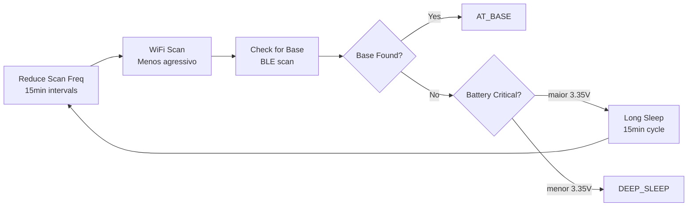

**Características:**
- Scans WiFi a cada 15 minutos
- CPU reduzida para 80MHz
- Light sleep longo entre operações
- Monitoramento contínuo de bateria

### 5️⃣ Estado DEEP_SLEEP (Hibernação)

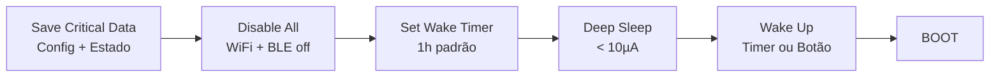

**Wake-up Sources:**
- Timer RTC (1 hora padrão)
- Botão BOOT (GPIO 9)
- Consumo: < 10µA

## 📡 Comunicação BLE com Central

### Fluxo de Conexão

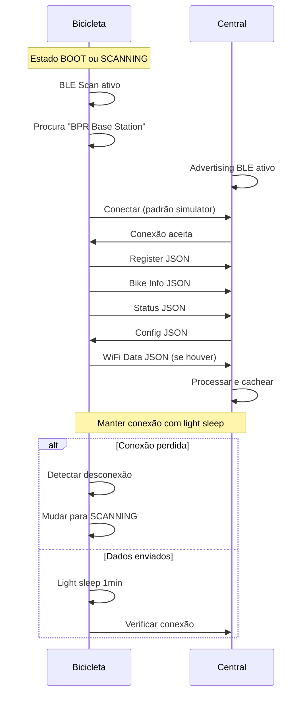

### Características BLE

| Parâmetro | Valor | Descrição |
|-----------|-------|-----------|
| **Service UUID** | `BAAD` | Serviço principal |
| **Config Char** | `F00D` | Central → Bike (configs) |
| **Status Char** | `BEEF` | Bike → Central (status) |
| **Data Char** | `CAFE` | Bike → Central (dados WiFi) |
| **Scan Interval** | 100ms | Intervalo de scan |
| **Scan Window** | 99ms | Janela ativa |
| **Scan Type** | Ativo | Para descoberta rápida |

## ⚡ Gerenciamento de Energia

### Consumo por Estado

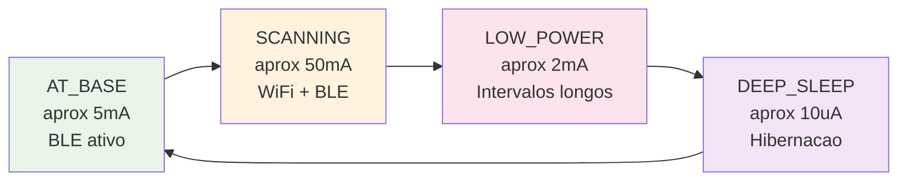

### Otimizações Implementadas

```cpp
// Configurações de energia
setCpuFrequencyMhz(80);           // BLE mode
setCpuFrequencyMhz(160);          // WiFi mode
WiFi.setTxPower(WIFI_POWER_7dBm); // Potência reduzida
btStop();                         // Bluetooth clássico off

// Sleep modes
powerManager.enterLightSleep(75); // Entre scans
powerManager.enterDeepSleep(3600); // Hibernação
```

## 🔧 Sistema de Configuração

### Configuração JSON Local

```json
{
  "bike_id": "bike_001",
  "base_ble_name": "BPR Base Station",
  "scan_interval_sec": 300,
  "scan_interval_low_batt_sec": 900,
  "deep_sleep_sec": 3600,
  "min_battery_voltage": 3.45,
  "max_wifi_records": 200,
  "ble_scan_timeout_sec": 5,
  "emergency_timeout_sec": 10,
  "status_report_interval_sec": 30,
  "led_enabled": true,
  "debug_enabled": true
}
```

### Atualização Dinâmica via BLE

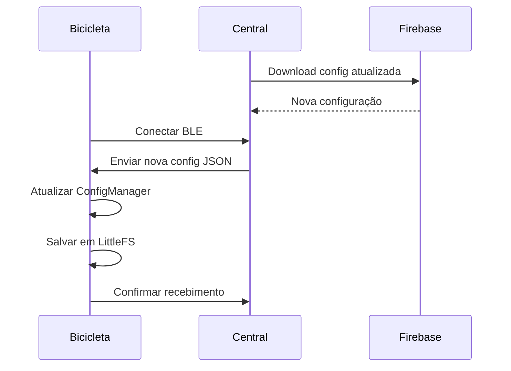

## 🚨 Sistema de Alertas e Emergência

### Modo Emergência (Botão BOOT)

```mermaid
flowchart TD
    A[Botão BOOT Pressionado] --> B[Interromper Estado Atual]
    B --> C[Mostrar Menu Serial]
    C --> D{Comando?}
    D -->|'r'| E[ESP.restart()]
    D -->|'c'| F[Continuar operação]
    D -->|Timeout 10s| F
```

### Alertas de Bateria

```cpp
// Níveis de bateria
if (voltage < 3.35) {
    // Crítico - Deep sleep forçado
    changeState(DEEP_SLEEP);
} else if (voltage < 3.45) {
    // Baixo - Modo economia
    changeState(LOW_POWER);
}
```

## 📊 Monitoramento e Debug

### Status Periódico (30s)

```
==================================================
🚲 bike_001 | Estado: SCANNING | Uptime: 1234s
🔋 3.82V (85%) ✅ | 📡 42 registros
🔵 BLE: Desconectado | ⏱️ Último scan: 120s atrás
==================================================
```

### Indicadores LED (Pino 8)

| Estado | Padrão LED | Descrição |
|--------|------------|-----------|
| **BOOT** | 3 piscadas rápidas | Inicializando |
| **AT_BASE** | LED fixo | Conectado na central |
| **SCANNING** | Piscada a cada scan | Coletando dados |
| **LOW_POWER** | Piscada lenta | Modo economia |
| **DEEP_SLEEP** | LED off | Hibernação |

## 🔄 Ciclo de Vida Típico

### Cenário: Bicicleta na Base

```mermaid
gantt
    title Ciclo de Vida - Bicicleta na Base
    dateFormat X
    axisFormat %M:%S
    
    section Estados
    BOOT           :0, 10
    AT_BASE        :10, 70
    Light Sleep    :70, 130
    AT_BASE        :130, 190
    Light Sleep    :190, 250
```

### Cenário: Bicicleta em Viagem

```mermaid
gantt
    title Ciclo de Vida - Bicicleta em Viagem
    dateFormat X
    axisFormat %H:%M
    
    section Estados
    BOOT           :0, 1
    SCANNING       :1, 60
    Light Sleep    :60, 65
    SCANNING       :65, 120
    LOW_POWER      :120, 180
    DEEP_SLEEP     :180, 240
```

## 🛠️ Troubleshooting

### Problemas Comuns

1. **Central não encontrada**
   - Verificar nome BLE: `"BPR Base Station"`
   - Verificar alcance BLE (< 10m)
   - Verificar se central está em modo BLE

2. **Conexão BLE instável**
   - Verificar interferências 2.4GHz
   - Verificar qualidade do sinal (RSSI)
   - Verificar se central não está em modo WiFi

3. **Bateria drena rápido**
   - Verificar se está entrando em sleep
   - Verificar configurações de intervalo
   - Verificar se WiFi está desligando

4. **Dados não são enviados**
   - Verificar UUIDs BLE
   - Verificar formato JSON
   - Verificar se central processa dados

### Comandos de Debug

```cpp
// Menu serial (pressionar 'm')
- Status completo do sistema
- Configurações atuais
- Estado da bateria
- Contagem de registros WiFi
- Status BLE
```

## 📈 Métricas de Performance

### Autonomia Estimada

| Cenário | Consumo Médio | Autonomia (3000mAh) |
|---------|---------------|---------------------|
| **Na Base** | 5mA | ~25 dias |
| **Viagem Normal** | 15mA | ~8 dias |
| **Viagem Economia** | 8mA | ~15 dias |
| **Deep Sleep** | 0.01mA | ~8 meses |

### Eficiência de Dados

- **Registro WiFi**: ~50 bytes (JSON)
- **Buffer RAM**: 50 registros (2.5KB)
- **Capacidade flash**: 20.000 registros (1MB)
- **Arquivos**: 1000 registros por arquivo JSON
- **Upload**: Export completo via BLE
- **Limpeza**: Automática após upload bem-sucedido

### Fluxo de Armazenamento

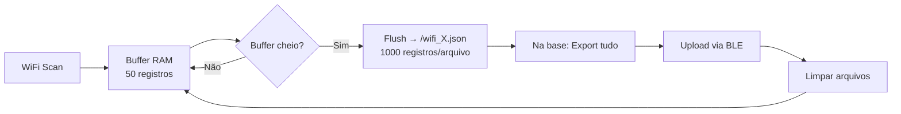

---

## 🎯 Resumo Executivo

O firmware da bicicleta BPR é um sistema **ultra-eficiente** que:

- ✅ **Opera 5 estados** com transições inteligentes
- ✅ **Comunica via BLE** com a central usando padrão testado
- ✅ **Coleta dados WiFi** para geolocalização offline
- ✅ **Gerencia energia** com múltiplos níveis de economia
- ✅ **Configura dinamicamente** via JSON da central
- ✅ **Monitora bateria** com alertas automáticos
- ✅ **Funciona offline** com buffer local robusto

**Autonomia**: 8-25 dias dependendo do uso  
**Alcance BLE**: ~10 metros da central  
**Dados coletados**: Até 20.000 registros WiFi persistentes  
**Consumo mínimo**: 10µA em deep sleep  

## 💾 Sistema de Armazenamento LittleFS

### Hardware Base
- **MCU**: Seeed Xiao ESP32C3 (4MB flash interno)
- **Partições**: Bootloader + App + OTA + **LittleFS (1MB)**
- **Capacidade**: ~20.000 registros WiFi
- **Autonomia**: ~14 dias de coleta contínua

### Estrutura de Arquivos
```
/wifi_index.txt     # Índice do arquivo atual
/wifi_0.json        # Primeiros 1000 registros  
/wifi_1.json        # Próximos 1000 registros
/wifi_N.json        # Até esgotar espaço
/config.json        # Configurações da bike
```

### Fluxo de Dados
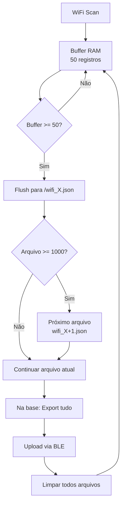

### Vantagens vs Buffer RAM
| Aspecto | Buffer RAM (antigo) | LittleFS (novo) |
|---------|---------------------|-----------------|
| **Capacidade** | 200 registros | 20.000 registros |
| **Persistência** | ❌ Perde na reinicialização | ✅ Mantém dados |
| **Autonomia** | ~2 horas | ~14 dias |
| **Memória RAM** | 3.2KB ocupados | 2.5KB ocupados |
| **Robustez** | ❌ Frágil | ✅ Robusto |
