# Fluxo da Lógica - WiFi Range Scanner ESP32-C3 v2.0

## Visão Geral do Sistema

Sistema de monitoramento de redes WiFi para bicicletas com **configurações online via Firebase** e **modos de operação inteligentes**.

### Modos de Operação v2.0:
- **Modo STARTUP**: Sincronização de configurações e NTP inicial
- **Modo BASE**: Operação na base com sincronizações e uploads
- **Modo VIAGEM**: Coleta ativa de dados WiFi
- **Modo EMERGÊNCIA**: Interface web para configuração manual (fallback)

---

## 🔄 Fluxograma Principal

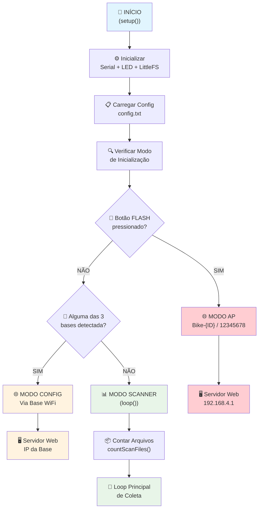

---

## 📋 Detalhamento do Setup()

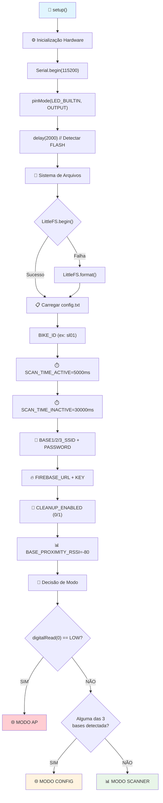

---

## 🔄 Loop Principal (Modo Scanner)

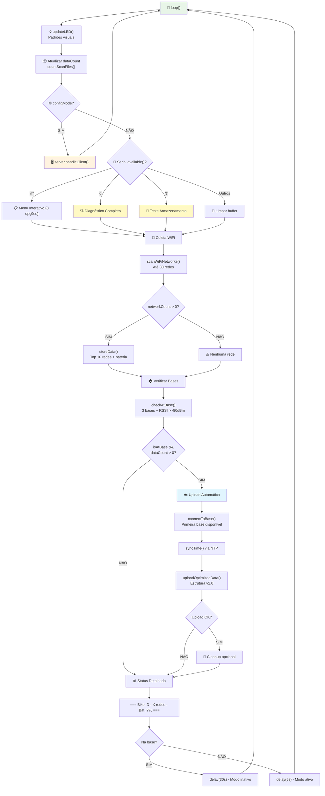

---

## 📡 Fluxo de Coleta de Dados

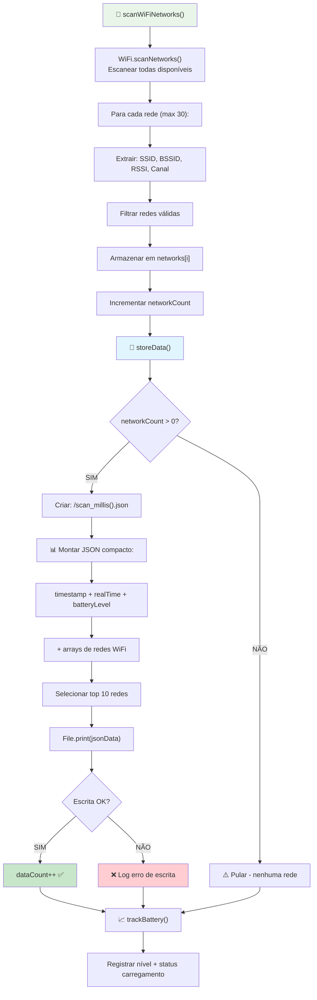

---

## 🏠 Detecção e Conexão com Base (Suporte a 3 Bases)

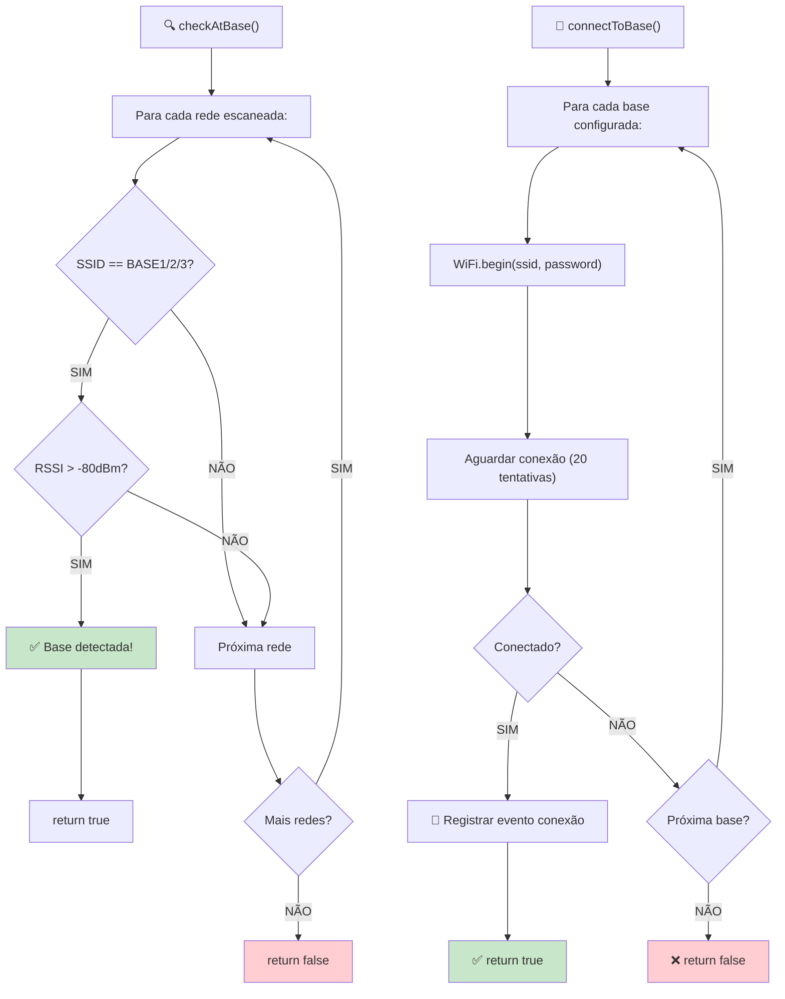

### Configuração das Bases:
- **BASE1**: WiFi-Estacao-Central / senha123
- **BASE2**: WiFi-Oficina / senha456  
- **BASE3**: WiFi-Deposito / senha789
- **Proximidade**: RSSI > -80dBm
- **Conexão**: Primeira base disponível

---

## ☁️ Fluxo de Upload Firebase (Estrutura Otimizada v2.0)

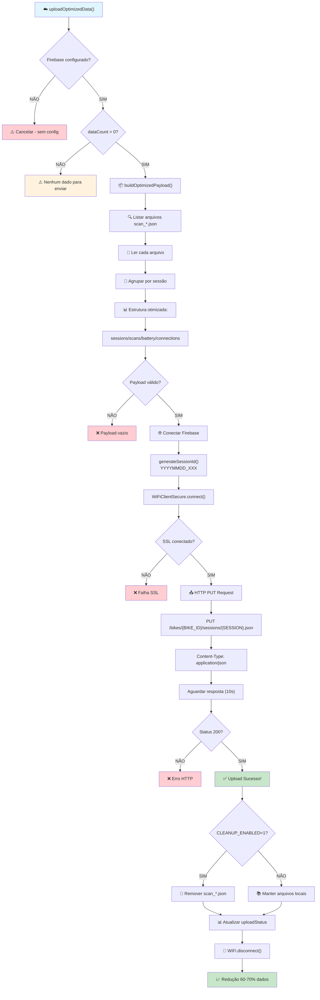

### Estrutura Firebase Otimizada:
```json
{
  "bikes": {
    "sl01": {
      "sessions": {
        "20241201_001": {
          "start": 1760209736,
          "end": 1760210131,
          "scans": [[timestamp, [["SSID","BSSID",rssi,ch]]]],
          "battery": [[timestamp, level]],
          "connections": [[timestamp, "event", "ssid", "ip"]]
        }
      },
      "networks": {
        "aa:bb:cc:dd:ee:ff": {"ssid": "VALENCA1", "first": 1760209736}
      }
    }
  }
}
```

---

## 🌐 Modo Configuração

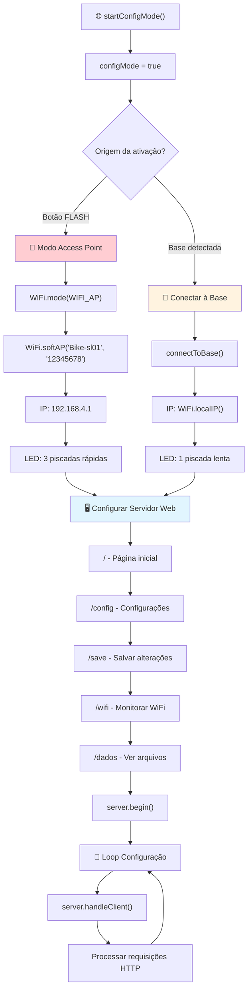

### Interface Web:
- **Página Inicial**: Links para todas as funcionalidades
- **Configurações**: Editar config.txt via formulário
- **Ver WiFi**: Redes detectadas em tempo real
- **Ver Dados**: Arquivos salvos + conteúdo
- **Segurança**: Alterações preservam dados coletados

---

## 💡 Padrões de LED

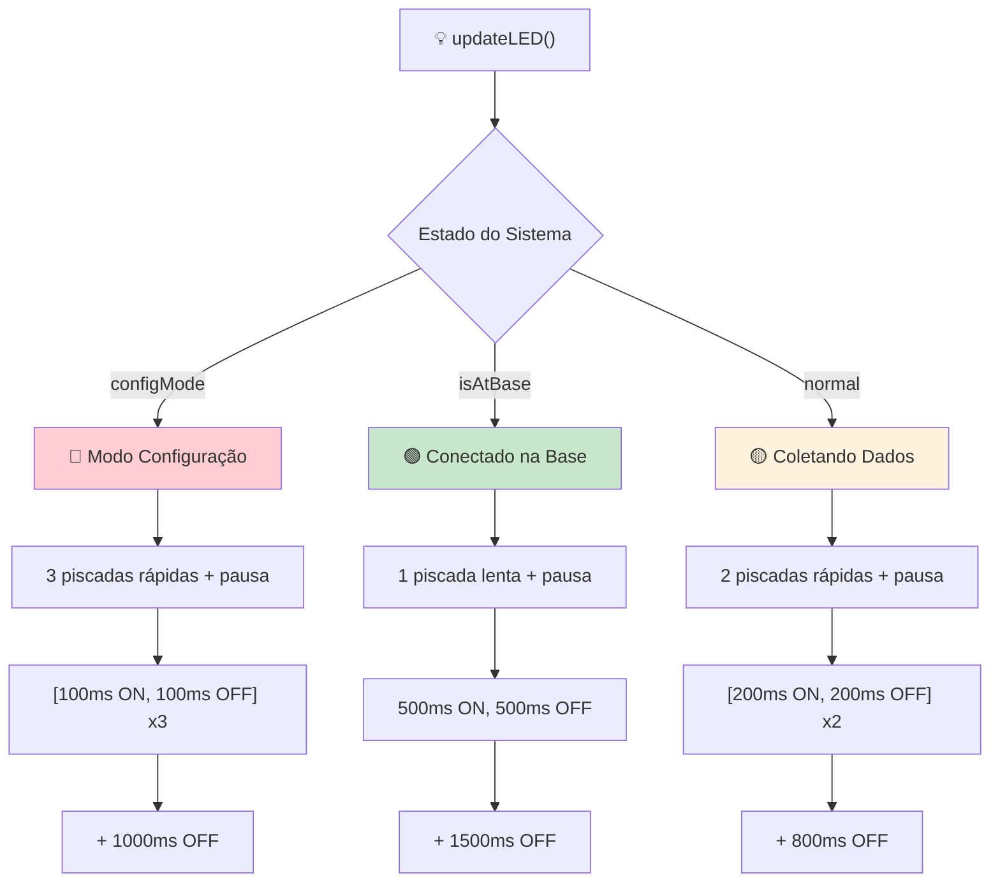

### Significado dos LEDs:
- 🔴 **3 piscadas**: Modo AP ou conectado à base para configuração
- 🟡 **2 piscadas**: Operação normal, coletando dados
- 🟢 **1 piscada**: Próximo da base, pronto para upload

### Estados Visuais:
- **Configuração**: Fácil identificação para setup inicial
- **Coleta**: Indica funcionamento normal
- **Base**: Confirma detecção e possibilidade de upload

---

## 📱 Menu Serial Interativo

```mermaid
flowchart TD
    A["📱 Serial Input"] --> B{"Comando?"}
    
    B -->|'m'| C["📋 Menu Principal"]
    B -->|'d'| D["🔍 Diagnóstico Completo"]
    B -->|'t'| E["🧪 Teste Armazenamento"]
    
    C --> C1["1️⃣ Monitorar redes WiFi"]
    C --> C2["2️⃣ Verificar conexão com base"]
    C --> C3["3️⃣ Testar conexão Firebase"]
    C --> C4["4️⃣ Mostrar configurações"]
    C --> C5["5️⃣ Ver dados salvos"]
    C --> C6["6️⃣ Transferir dados (backup)"]
    C --> C7["7️⃣ Ativar modo AP"]
    C --> C8["q️⃣ Sair do menu"]
    
    D --> D1["📁 LittleFS info + arquivos"]
    D --> D2["⚙️ Todas as configurações"]
    D --> D3["📶 Status WiFi atual"]
    D --> D4["🔍 Teste scan completo"]
    D --> D5["💾 Teste escrita/leitura"]
    D --> D6["🔢 Variáveis globais"]
    D --> D7["🔋 Status bateria"]
    
    E --> E1["📡 Executar scan real"]
    E --> E2["💾 Chamar storeData()"]
    E --> E3["📂 Listar arquivos criados"]
    E --> E4["📝 Mostrar conteúdo JSON"]
    E --> E5["✅ Validar integridade"]
    
    style D fill:#fff9c4
    style E fill:#fff9c4
```

### Comandos Rápidos:
- **m**: Menu completo com 8 opções
- **d**: Diagnóstico detalhado do sistema
- **t**: Teste de funcionalidade de armazenamento

### Funcionalidades do Menu:
1. **Monitoramento**: Scan contínuo em tempo real
2. **Conectividade**: Teste das 3 bases configuradas
3. **Firebase**: Validação de upload
4. **Configuração**: Visualizar config.txt
5. **Dados**: Listar e examinar arquivos
6. **Backup**: Exportar dados entre INICIO/FIM
7. **AP Mode**: Forçar modo configuração
8. **Sair**: Retornar ao loop normal

---

## 🔧 Estados do Sistema

### Estado 1: Inicialização 🚀
- **Hardware**: Serial, LED, LittleFS
- **Configuração**: Carregar config.txt (BIKE_ID, bases, Firebase)
- **Decisão**: Botão FLASH → AP | Base detectada → Config | Normal → Scanner
- **Validação**: Verificar integridade das configurações

### Estado 2: Modo Scanner 📊
- **Coleta**: Scan WiFi a cada 5s (ativo) ou 30s (base)
- **Armazenamento**: Top 10 redes + bateria em JSON compacto
- **Detecção**: 3 bases simultâneas (RSSI > -80dBm)
- **Upload**: Automático quando próximo + dados disponíveis
- **LED**: 2 piscadas (normal) ou 1 piscada (base)

### Estado 3: Modo Configuração 🌐
- **AP Mode**: Bike-{ID} / 12345678 (192.168.4.1)
- **Base Mode**: Conectado à base WiFi (IP dinâmico)
- **Interface**: 5 páginas web (config, wifi, dados, etc.)
- **Segurança**: Alterações preservam dados coletados
- **LED**: 3 piscadas rápidas

### Estado 4: Upload Otimizado ☁️
- **Estrutura v2.0**: 60-70% redução de dados
- **Sessões**: Agrupamento temporal inteligente
- **Normalização**: Redes únicas + referências
- **Cleanup**: Opcional após upload bem-sucedido
- **Histórico**: Manter últimos uploads (configurável)

### Estado 5: Diagnóstico 🔍
- **Menu Serial**: 8 opções interativas
- **Testes**: Armazenamento, conectividade, Firebase
- **Backup**: Exportação manual de dados
- **Monitoramento**: Status em tempo real

---

## 📈 Melhorias Implementadas

### 🚀 Estrutura Otimizada (v2.0)
- **Redução**: 60-70% no tamanho dos dados Firebase
- **Capacidade**: 10 redes WiFi por scan (antes: 5)
- **Agrupamento**: Sessões por período de coleta
- **Compactação**: Arrays eliminam redundâncias
- **Normalização**: Histórico de redes descobertas

### 🔧 Funcionalidades Avançadas
- **3 Bases**: Suporte simultâneo com fallback automático
- **Bateria**: Monitoramento + status de carregamento
- **Diagnóstico**: Menu interativo completo
- **Backup**: Exportação manual segura
- **Interface**: Web responsiva para configuração

### 📊 Benefícios Operacionais
- **Performance**: Uploads mais rápidos e econômicos
- **Análise**: Consultas Firebase otimizadas
- **Mobilidade**: Melhor detecção de padrões
- **Manutenção**: Diagnóstico integrado
- **Flexibilidade**: Configuração sem perda de dadoso)
- Conexão automática com qualquer das 3 bases WiFi
- Sincronização de horário via NTP
- Agrupamento de dados em sessões temporais
- Upload compacto para Firebase (60-70% redução)
- Limpeza condicional (CLEANUP_ENABLED)
- Manutenção de histórico (MAX_UPLOADS_HISTORY)

---

## 🔄 Ciclo de Vida dos Dados (Otimizado v2.0)

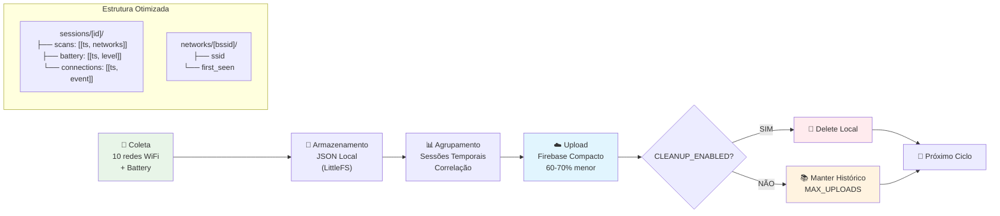

---

## 🔧 Comandos de Debug Rápido

| Comando | Função | Quando Usar |
|---------|--------|-------------|
| `d` | Diagnóstico completo | Verificar status geral |
| `t` | Teste armazenamento | Problemas com dados |
| `m` | Menu interativo | Configurações avançadas |

---

## ⚡ Pontos Críticos

1. **Detecção de Base**: RSSI > BASE_PROXIMITY_RSSI (-80dBm) para ativar modo base
2. **Múltiplas Bases**: Suporte a até 3 bases WiFi configuradas
3. **Buffer Otimizado**: 10 redes WiFi por scan (antes: 5)
4. **Timeout de Conexão**: 20 tentativas x 500ms = 10s máximo
5. **Estrutura Compacta**: Sessões agrupadas, 60-70% redução no Firebase
6. **Limpeza Inteligente**: Configurável via CLEANUP_ENABLED
7. **Histórico Controlado**: MAX_UPLOADS_HISTORY limita dados mantidos
8. **Fallback Seguro**: Configurações padrão se arquivos não existirem

---

## 🛠️ Fluxo de Configuração

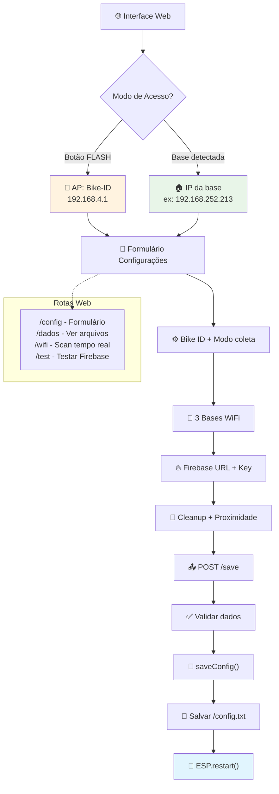

## 🛠️ Ferramentas de Diagnóstico

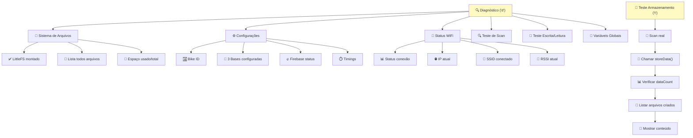

## 📈 Melhorias v2.0 + Correções

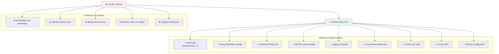

## 🎯 Fluxo de Resolução de Problemas

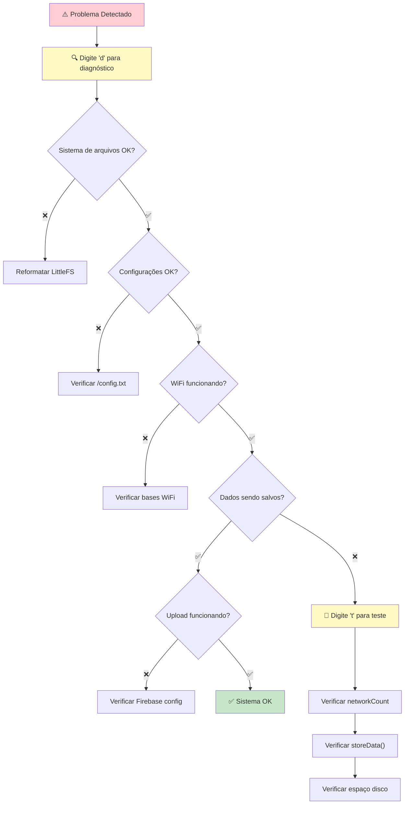

## 🏆 Resumo do Sistema

Este fluxograma mostra como o sistema opera de forma autônoma e robusta:

### 🔄 **Operação Normal:**
- Coleta contínua de dados WiFi (10 redes por scan)
- Detecção automática de proximidade (3 bases WiFi)
- Upload otimizado para Firebase (60-70% redução)
- Limpeza configurável de dados locais

### 🛠️ **Ferramentas de Debug:**
- **`d`** - Diagnóstico completo do sistema
- **`t`** - Teste específico de armazenamento
- **`m`** - Menu interativo completo

### 🌐 **Interface de Configuração:**
- Acessível por botão FLASH ou proximidade de base
- Configuração via web browser
- Visualização de dados coletados
- Teste de conectividade Firebase

### ✅ **Robustez:**
- Verificações de integridade em cada etapa
- Logging detalhado para troubleshooting
- Fallbacks seguros para configurações
- Recuperação automática de erros

O sistema está preparado para operação autônoma em bicicletas, com capacidade de diagnóstico e manutenção remota via interface web.