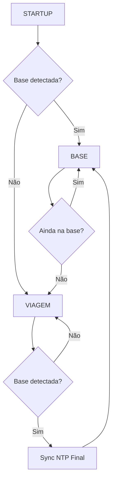

# Novo Fluxo de Operação v2.0 - XIAO ESP32-C3

## Visão Geral

O sistema agora opera com **configurações online via Firebase** e **modos de operação inteligentes** que detectam automaticamente se o dispositivo está na base ou em viagem.

## 🔄 Fluxo Principal

### 1. Inicialização (Setup)
```
🚀 BOOT
├── 📱 Inicialização hardware (CPU 40MHz, WiFi baixa potência)
├── 💾 Montar LittleFS
├── 📋 Carregar configuração local básica
├── 🕰️ Carregar estado NTP salvo
├── 🔘 Verificar botão FLASH (modo emergência)
└── ⚡ Inicializar sistema de modos
```

### 2. Sistema de Modos de Operação

#### **Modo STARTUP** ⚡
- **Objetivo**: Configurar sistema e detectar modo operacional
- **Ações**:
  1. 🔧 Conectar no Firebase e sincronizar configurações
  2. 🕰️ Sincronizar NTP inicial
  3. 📍 Detectar se está na base ou em viagem
  4. 🔄 Mudar para modo apropriado

#### **Modo BASE** 🏠
- **Quando**: RSSI de base > -80dBm (configurável)
- **Ações**:
  1. 🔌 Conectar na base WiFi
  2. 🕰️ Sincronizar NTP (se necessário)
  3. 📍 Check-in na base
  4. 🚨 Verificar alertas de bateria
  5. 📈 Enviar status programado
  6. ⬆️ Upload de dados coletados
  7. 😴 Dormir por `scanTimeInactive` (30s padrão)

#### **Modo VIAGEM** 🚴
- **Quando**: Nenhuma base detectada
- **Ações**:
  1. 📡 Escanear redes WiFi
  2. 💾 Armazenar dados localmente
  3. 🔋 Monitorar bateria
  4. 🔄 Verificar se chegou na base
  5. ⏱️ Aguardar `scanTimeActive` (5s padrão)

## 📡 Configurações Online

### Estrutura no Firebase
```json
{
  "bikes": {
    "teste4": {
      "config": {
        "collectMode": "normal",
        "scanTimeActive": 5000,
        "scanTimeInactive": 30000,
        "bases": {
          "base1": {"ssid": "WiFi-Base1", "password": "senha123"},
          "base2": {"ssid": "WiFi-Base2", "password": "senha456"},
          "base3": {"ssid": "WiFi-Base3", "password": "senha789"}
        },
        "baseProximityRssi": -80,
        "wifiTxPower": 15,
        "cleanupEnabled": true,
        "batteryLowThreshold": 15.0,
        "statusUpdateIntervalMinutes": 60
      }
    }
  }
}
```

### Sincronização de Configurações
1. **Ao ligar**: Tenta conectar em uma base e baixar configurações
2. **Status enviado**: Confirma sincronização bem-sucedida
3. **Fallback**: Se falhar, usa configurações locais
4. **Aplicação**: Ajusta potência WiFi, timings, thresholds

## 🔧 Configurações Suportadas

| Parâmetro | Descrição | Exemplo |
|-----------|-----------|---------|
| `collectMode` | Modo de coleta (normal, economico, intensivo) | `"normal"` |
| `scanTimeActive` | Tempo entre scans em viagem (ms) | `5000` |
| `scanTimeInactive` | Tempo entre scans na base (ms) | `30000` |
| `baseProximityRssi` | RSSI mínimo para detectar base | `-80` |
| `wifiTxPower` | Potência do sinal WiFi (dBm) | `15` |
| `batteryLowThreshold` | Threshold bateria baixa (%) | `15.0` |
| `cleanupEnabled` | Limpar dados após upload | `true` |

## 🕰️ Sincronização NTP

### NTP Inicial
- **Quando**: No modo STARTUP
- **Objetivo**: Obter horário correto para timestamps
- **Fallback**: Usa horário aproximado salvo

### NTP Final
- **Quando**: Ao chegar na base (transição VIAGEM → BASE)
- **Objetivo**: Corrigir drift de horário durante viagem
- **Benefício**: Timestamps precisos nos dados

## 🔋 Otimizações de Energia

### Hardware
- **CPU**: 40MHz (reduzido de 240MHz)
- **WiFi**: Potência configurável via Firebase
- **Bluetooth**: Desabilitado
- **Brownout**: Desabilitado

### Software
- **Modo BASE**: Intervalos longos (30s)
- **Modo VIAGEM**: Intervalos curtos (5s)
- **Sleep**: Entre operações
- **Yield**: Durante delays

## 🚨 Modo Emergência

### Ativação
- **Botão FLASH** pressionado durante boot
- **Fallback** quando configurações online falham

### Funcionalidade
- Cria AP: `Bike-{ID}` / senha: `12345678`
- Interface web: `http://192.168.4.1`
- Configuração manual das bases
- Timeout: 10 minutos

## 📊 Indicadores LED

| Padrão | Significado |
|--------|-------------|
| 🔴 3 piscadas | Modo Inicialização |
| 🟡 2 piscadas | Modo Viagem |
| 🟢 1 piscada | Modo Base |

## 🔍 Detecção de Base

### Critérios
1. **SSID**: Deve corresponder a uma das 3 bases configuradas
2. **RSSI**: Deve ser maior que `baseProximityRssi` (-80dBm)
3. **Confirmação**: 2 detecções consecutivas para entrar no modo BASE
4. **Saída**: 1 detecção para sair do modo BASE

### Prioridade
- Base 1 → Base 2 → Base 3
- Conecta na primeira base disponível

## 📈 Uploads e Sincronizações

### Na Base
- **Check-in**: Sempre ao conectar
- **Dados**: Se houver arquivos coletados
- **Status**: Conforme intervalo configurado
- **Alertas**: Bateria baixa/crítica
- **NTP**: Se necessário

### Estrutura de Dados
- **Sessões**: Agrupadas por período
- **Scans**: Formato otimizado
- **Bateria**: Histórico de níveis
- **Conexões**: Log de eventos

## 🛠️ Comandos Serial

| Comando | Função |
|---------|--------|
| `m` | Menu interativo |
| Durante operação | Interrompe ciclo atual |
| No modo emergência | Menu de configuração |

## 🔄 Transições de Modo



## 🚀 Benefícios do Novo Fluxo

1. **Configuração Centralizada**: Todas as bikes configuradas via Firebase
2. **Operação Inteligente**: Detecta automaticamente contexto (base/viagem)
3. **NTP Robusto**: Sincronização no início e fim para timestamps precisos
4. **Economia de Energia**: Modos otimizados para cada situação
5. **Potência WiFi Configurável**: Ajuste remoto da intensidade do sinal
6. **Fallback Robusto**: Modo emergência sempre disponível
7. **Monitoramento Avançado**: Status detalhado de configuração e operação

## 📋 Checklist de Implementação

- ✅ Sistema de modos de operação
- ✅ Configurações online via Firebase
- ✅ NTP inicial e final
- ✅ Detecção inteligente de base
- ✅ Potência WiFi configurável
- ✅ Modo emergência (fallback)
- ✅ Otimizações de energia
- ✅ Indicadores LED
- ✅ Menu serial interativo
- ✅ Estrutura de dados otimizada