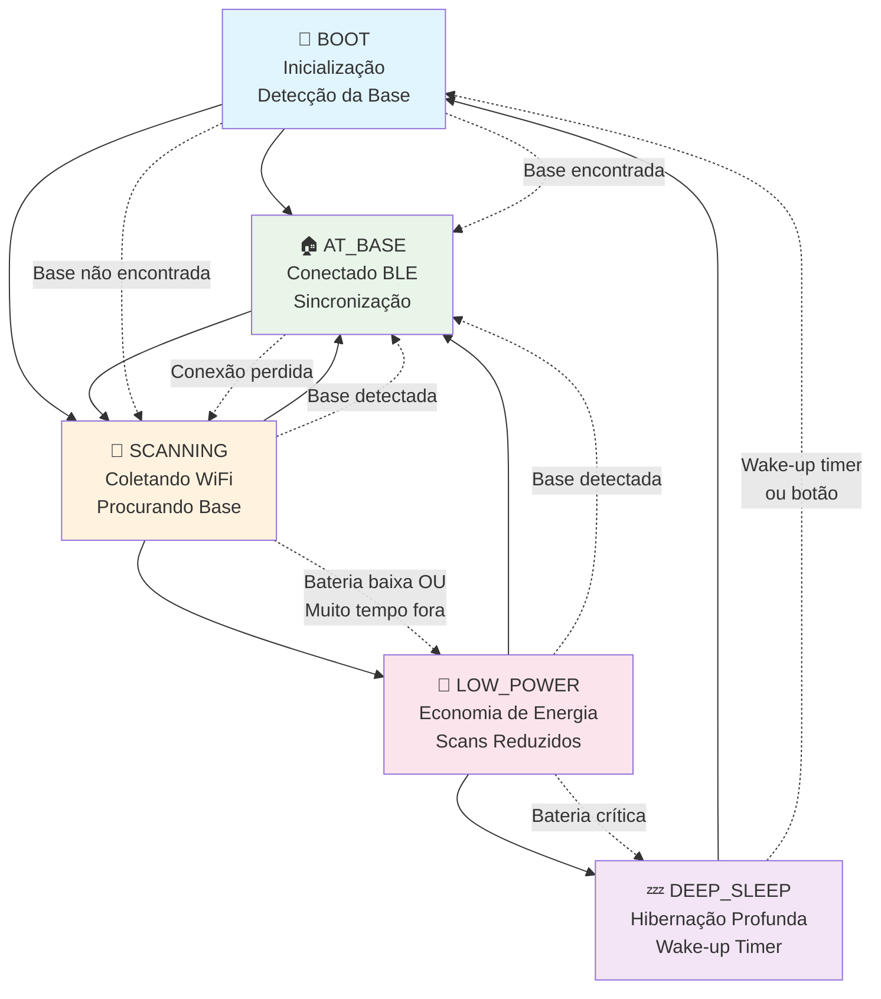
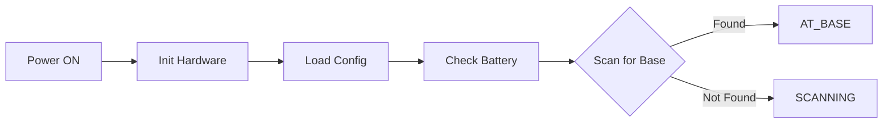
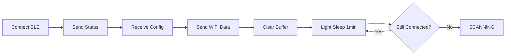
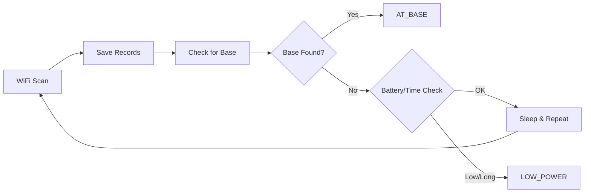
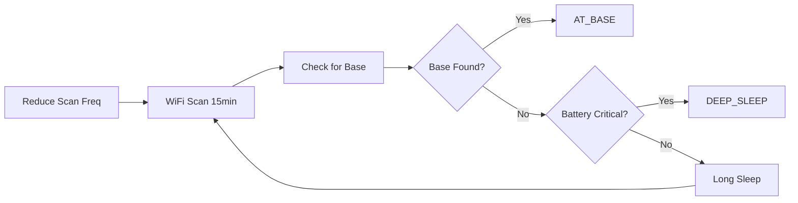
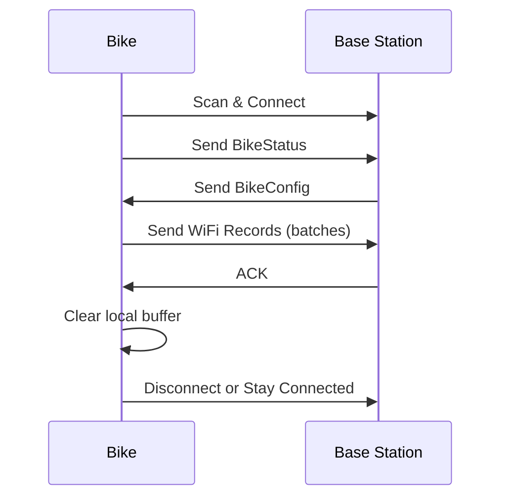
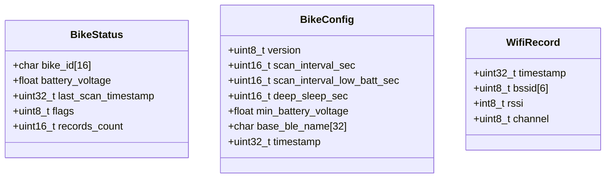
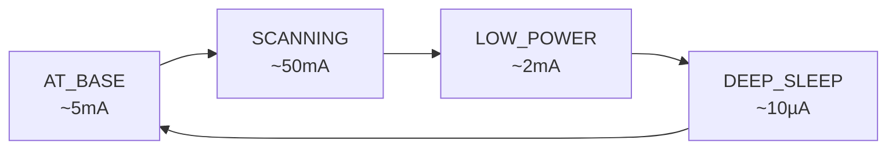

# BPR Bike System - Fluxo de Funcionamento

## 🎯 Visão Geral

Sistema de bicicleta compartilhada com comunicação BLE e coleta de dados WiFi para geolocalização offline.

## 📊 Diagrama de Estados



## 🔄 Fluxo Detalhado por Estado

### 1️⃣ BOOT (Inicialização)


**Ações:**
- Inicializar hardware (LED, botão, ADC)
- Carregar configuração local
- Verificar nível de bateria
- Scan BLE por "BPR Base Station"

### 2️⃣ AT_BASE (Na Base)


**Ações:**
- Conectar BLE à base
- Enviar status (bateria, registros)
- Receber configurações atualizadas
- Transmitir dados WiFi coletados
- Light sleep periódico (1 minuto)

### 3️⃣ SCANNING (Coletando Dados)


**Ações:**
- Scan WiFi periódico (5min padrão)
- Salvar registros (BSSID, RSSI, timestamp)
- Procurar base a cada ciclo
- Light sleep entre scans

### 4️⃣ LOW_POWER (Economia)


**Ações:**
- Scans menos frequentes (15min)
- Procurar base continuamente
- Long light sleep entre operações

### 5️⃣ DEEP_SLEEP (Hibernação)


**Ações:**
- Salvar dados críticos
- Desabilitar WiFi/BLE
- Configurar wake-up timer (1h padrão)
- Entrar em deep sleep (<10µA)

## 📡 Comunicação BLE

### Fluxo de Sincronização


### Estruturas de Dados


## ⚡ Gerenciamento de Energia

### Consumo por Estado


### Otimizações
- **CPU Frequency**: 80MHz (BLE) / 160MHz (WiFi)
- **WiFi TX Power**: Reduzida para -1dBm
- **BLE Parameters**: Intervalo otimizado (12ms)
- **Sleep Modes**: Light sleep entre operações, deep sleep para hibernação

## 🔧 Configurações Dinâmicas

Todas as configurações são recebidas da Base via BLE:

| Parâmetro | Padrão | Descrição |
|-----------|--------|-----------|
| `scan_interval_sec` | 300s | Intervalo normal de scan |
| `scan_interval_low_batt_sec` | 900s | Intervalo em economia |
| `deep_sleep_sec` | 3600s | Duração do deep sleep |
| `min_battery_voltage` | 3.45V | Threshold bateria baixa |
| `base_ble_name` | "BPR Base Station" | Nome da base BLE |

## 🚨 Tratamento de Erros

### Modo Emergência
- **Trigger**: Botão BOOT pressionado
- **Ações**: Pausa operação, menu serial
- **Opções**: Restart ('r') ou Continue ('c')

### Recuperação Automática
- **BLE Fail**: Volta para SCANNING
- **WiFi Fail**: Retry com delay
- **Battery Critical**: DEEP_SLEEP forçado
- **Memory Full**: Sobrescreve registros antigos

## 📊 Monitoramento

### Status Periódico (30s)
```
==================================================
🚲 bike_001 | Estado: SCANNING | Uptime: 1234s
🔋 3.82V (85%) ✅ | 📡 42 registros
🔵 BLE: Desconectado | ⏱️ Último scan: 120s atrás
==================================================
```

### Indicadores LED
- **Boot**: 3 piscadas rápidas
- **AT_BASE**: LED fixo
- **SCANNING**: Piscada a cada scan
- **LOW_POWER**: Piscada lenta
- **DEEP_SLEEP**: LED off