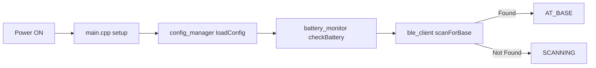
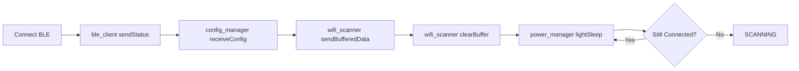
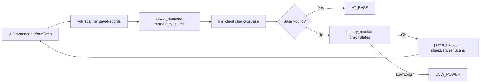
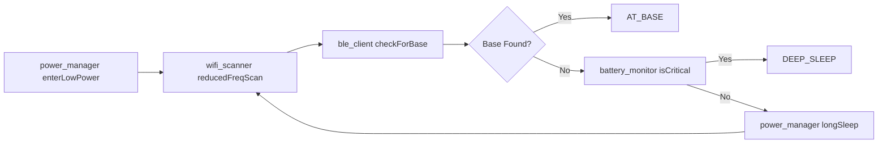
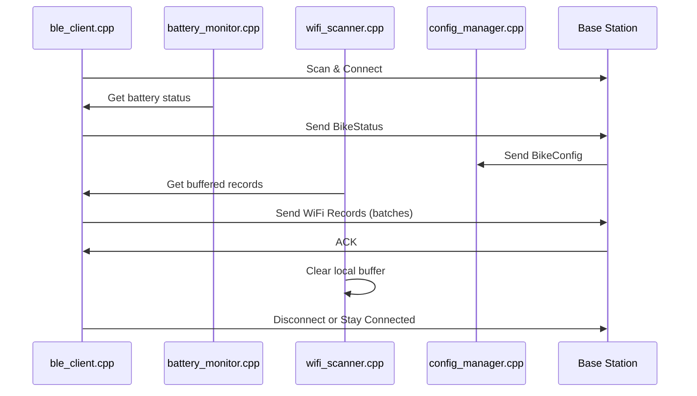
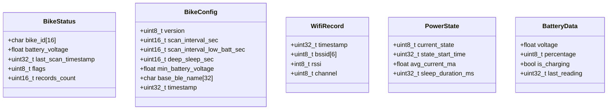

# BPR Bike System - Fluxo de Funcionamento

## 🎯 Visão Geral

Sistema de bicicleta compartilhada com comunicação BLE e coleta de dados WiFi para geolocalização offline.

## 🗂️ Arquitetura de Arquivos

### 📁 Estrutura Modular
```
firmware/bike/src/
├── main.cpp              # 🚀 Loop principal e máquina de estados
├── wifi_scanner.cpp/.h   # 📡 Scanner WiFi com cache local
├── ble_client.cpp/.h     # 🔵 Cliente BLE para comunicação
├── battery_monitor.cpp/.h # 🔋 Monitor de bateria e alertas
├── power_manager.cpp/.h  # ⚡ Gerenciamento de energia/sleep
└── config_manager.cpp/.h # ⚙️ Configurações dinâmicas
```

## 📊 Diagrama de Estados


## 🔄 Fluxo Detalhado por Estado

### 1️⃣ BOOT (main.cpp)


**Arquivos Envolvidos:**
- **main.cpp**: Inicialização geral e setup do hardware
- **config_manager.cpp**: Carrega configuração local ou padrão
- **battery_monitor.cpp**: Verifica nível de bateria inicial
- **ble_client.cpp**: Scan BLE por "BPR Base Station"

### 2️⃣ AT_BASE (ble_client.cpp)


**Arquivos Envolvidos:**
- **ble_client.cpp**: Gerencia conexão e comunicação BLE
- **battery_monitor.cpp**: Coleta dados de bateria para envio
- **config_manager.cpp**: Recebe e aplica configurações da base
- **wifi_scanner.cpp**: Envia dados coletados e limpa buffer
- **power_manager.cpp**: Light sleep entre operações

### 3️⃣ SCANNING (wifi_scanner.cpp)


**Arquivos Envolvidos:**
- **wifi_scanner.cpp**: Executa scans WiFi e gerencia buffer local
- **power_manager.cpp**: Delay 200-300ms entre WiFi/BLE para evitar conflito de rádio
- **ble_client.cpp**: Verifica disponibilidade da base após delay
- **battery_monitor.cpp**: Monitora bateria para decidir modo de operação

### 4️⃣ LOW_POWER (power_manager.cpp)


**Arquivos Envolvidos:**
- **power_manager.cpp**: Controla modo de baixo consumo
- **wifi_scanner.cpp**: Scans com frequência reduzida (15min)
- **ble_client.cpp**: Continua procurando base
- **battery_monitor.cpp**: Monitora nível crítico de bateria

### 5️⃣ DEEP_SLEEP (power_manager.cpp)


**Arquivos Envolvidos:**
- **power_manager.cpp**: Gerencia entrada e saída do deep sleep
- **wifi_scanner.cpp**: Salva buffer de dados antes de hibernar
- **config_manager.cpp**: Salva estado atual do sistema
- **main.cpp**: Reinicialização após wake-up

## 📡 Comunicação BLE (ble_client.cpp)

### Fluxo de Sincronização


### Estruturas de Dados


## ⚡ Gerenciamento de Energia (power_manager.cpp)

### Consumo por Estado

```mermaid
graph LR
    A[AT_BASE ~5mA power_manager] --> B[SCANNING ~50mA wifi_scanner]
    B --> C[LOW_POWER ~2mA power_manager]
    C --> D[DEEP_SLEEP ~10µA power_manager]
    D --> A
```


### Otimizações (power_manager.cpp)
- **CPU Frequency**: 80MHz (BLE) / 160MHz (WiFi)
- **WiFi TX Power**: Reduzida para -1dBm
- **BLE Parameters**: Intervalo otimizado (12ms)
- **Radio Coordination**: Delay 200-300ms entre WiFi scan e BLE scan
- **Sleep Modes**: Light sleep entre operações, deep sleep para hibernação
- **Dynamic Scaling**: Ajuste automático baseado na bateria

## 🔧 Configurações Dinâmicas (config_manager.cpp)

Todas as configurações são recebidas da Base via BLE e gerenciadas pelo config_manager.cpp:

| Parâmetro | Padrão | Descrição |
|-----------|--------|-----------|
| `scan_interval_sec` | 300s | Intervalo normal de scan |
| `scan_interval_low_batt_sec` | 900s | Intervalo em economia |
| `deep_sleep_sec` | 3600s | Duração do deep sleep |
| `min_battery_voltage` | 3.45V | Threshold bateria baixa |
| `base_ble_name` | "BPR Base Station" | Nome da base BLE |

## 🚨 Tratamento de Erros

### Modo Emergência (main.cpp)
- **Trigger**: Botão BOOT pressionado
- **Ações**: Pausa operação, menu serial
- **Opções**: Restart ('r') ou Continue ('c')

### Recuperação Automática
- **BLE Fail** (ble_client.cpp): Volta para SCANNING
- **WiFi Fail** (wifi_scanner.cpp): Retry com delay
- **Battery Critical** (battery_monitor.cpp): DEEP_SLEEP forçado
- **Memory Full** (wifi_scanner.cpp): Sobrescreve registros antigos

## 📊 Monitoramento (main.cpp)

### Status Periódico (30s)
```
==================================================
🚲 bike_001 | Estado: SCANNING | Uptime: 1234s
🔋 3.82V (85%) ✅ | 📡 42 registros
🔵 BLE: Desconectado | ⏱️ Último scan: 120s atrás
==================================================
```

### Dados Coletados por Módulo
- **battery_monitor.cpp**: Tensão, percentual, status de carregamento
- **wifi_scanner.cpp**: Redes detectadas, RSSI, timestamps
- **ble_client.cpp**: Status de conexão, última sincronização
- **power_manager.cpp**: Estado atual, tempo em cada modo
- **config_manager.cpp**: Versão da configuração, última atualização

### Indicadores LED (main.cpp)
- **Boot**: 3 piscadas rápidas
- **AT_BASE**: LED fixo
- **SCANNING**: Piscada a cada scan
- **LOW_POWER**: Piscada lenta
- **DEEP_SLEEP**: LED off

## 🔄 Integração entre Módulos

### Fluxo de Dados entre Arquivos

```mermaid
graph TD
    A[main.cpp Loop Principal] --> B[wifi_scanner.cpp Coleta WiFi]
    A --> C[ble_client.cpp Comunicação]
    A --> D[battery_monitor.cpp Monitor Bateria]
    A --> E[power_manager.cpp Gerência Energia]
    A --> F[config_manager.cpp Configurações]
    
    B --> E
    E --> C
    D --> E
    F --> B
    F --> C
    F --> E
    
    C --> G[Base Station]
    G --> C
```


### ⚡ Coordenação de Rádio (ESP32-C3)
**Consideração Técnica Importante:**
- **WiFi + BLE simultâneo**: Pode causar interferência no ESP32-C3
- **Solução implementada**: Delay de 200-300ms entre WiFi scan e BLE scan
- **Gerenciado por**: power_manager.cpp coordena o uso sequencial dos rádios
- **Benefício**: Evita conflitos de RF mantendo ambas funcionalidades ativas

### Dependências entre Módulos
- **main.cpp**: Orquestra todos os outros módulos
- **config_manager.cpp**: Fornece configurações para todos
- **battery_monitor.cpp**: Informa power_manager.cpp sobre estado da bateria
- **wifi_scanner.cpp**: Usa configurações e coordena com power_manager para timing
- **ble_client.cpp**: Aguarda sinal do power_manager após WiFi scan
- **power_manager.cpp**: Controla energia E coordenação de rádio entre WiFi/BLE