# WiFi Range Scanner - Fluxos do Sistema

## 1. Fluxo Principal de Inicialização

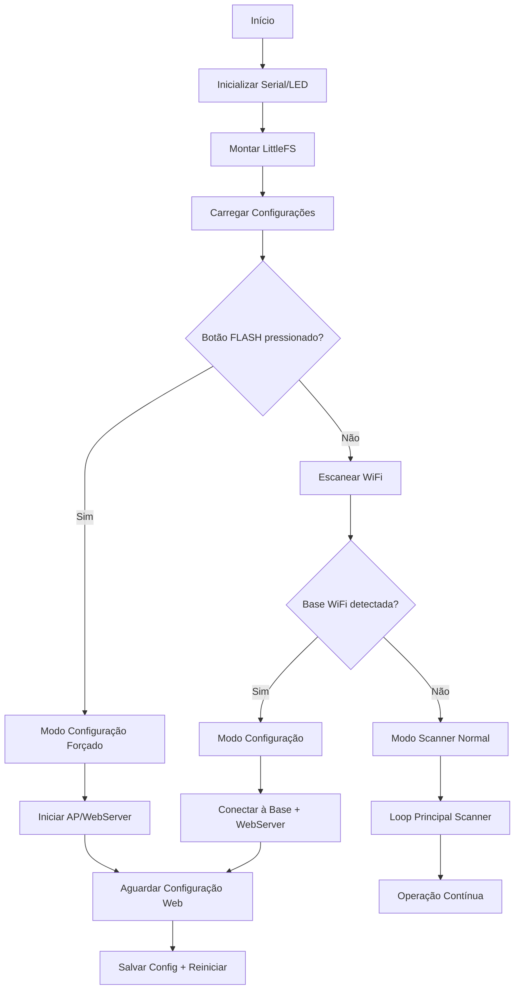

## 2. Loop Principal de Operação

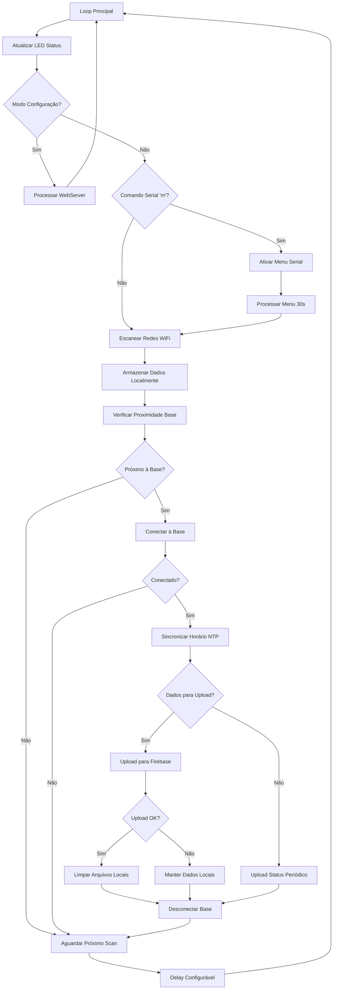

## 3. Sistema de Configuração

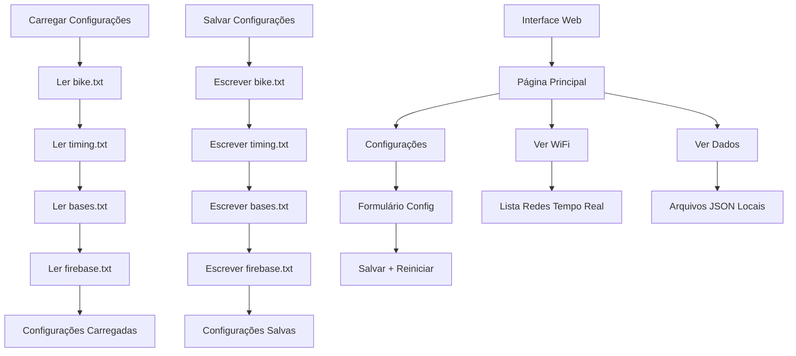

## 4. Detecção e Conexão com Bases

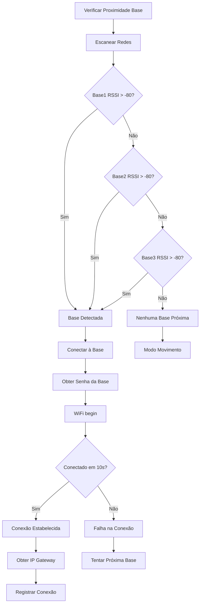

## 5. Coleta e Armazenamento de Dados

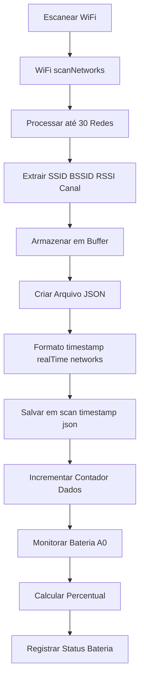

## 6. Upload para Firebase

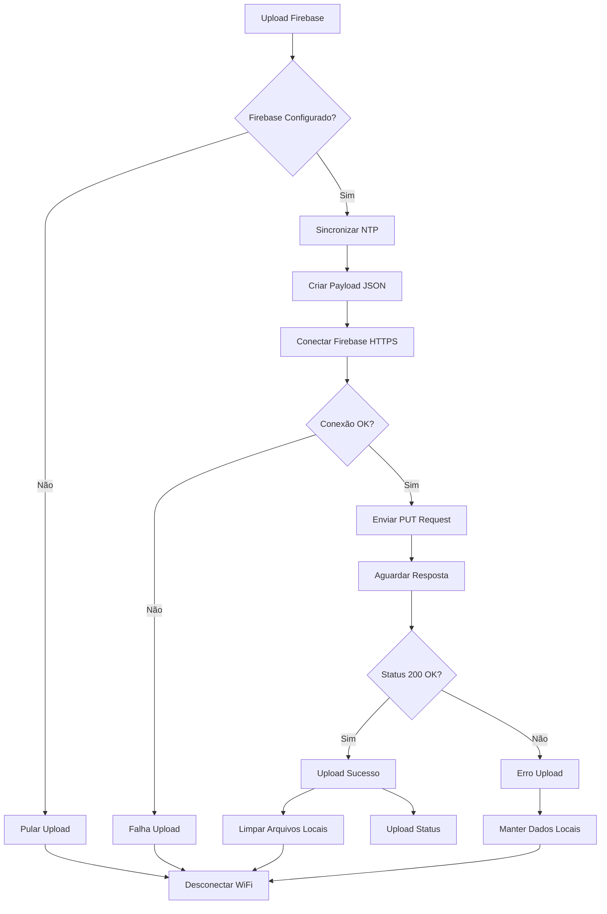

## 7. Sistema de Status LED

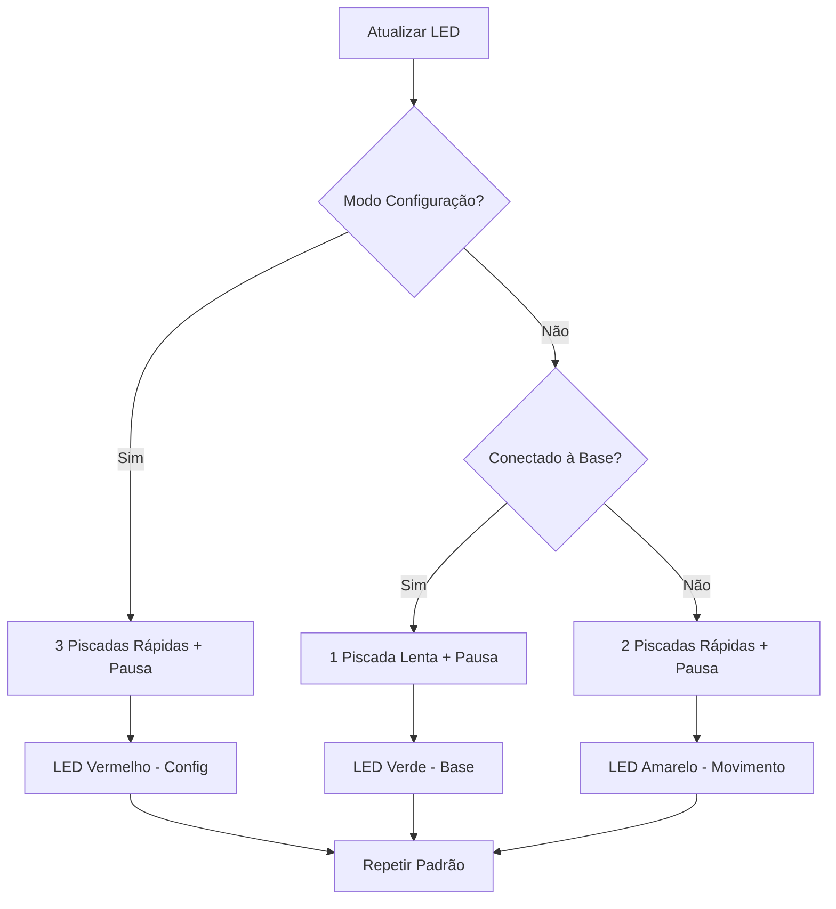

## 8. Menu Serial Interativo

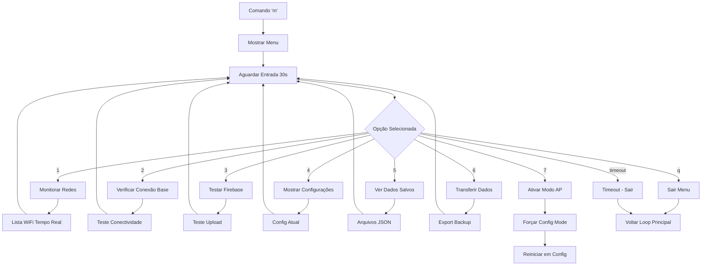

## 9. Estrutura de Dados

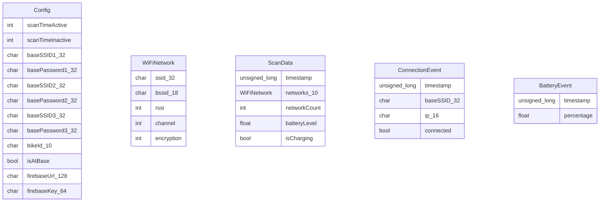

## 10. Arquivos do Sistema

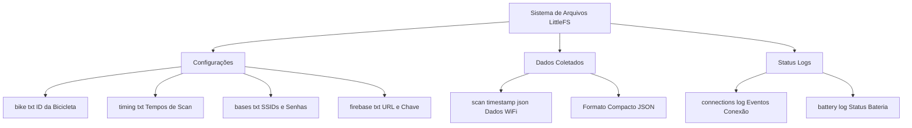

## 11. Estados do Sistema

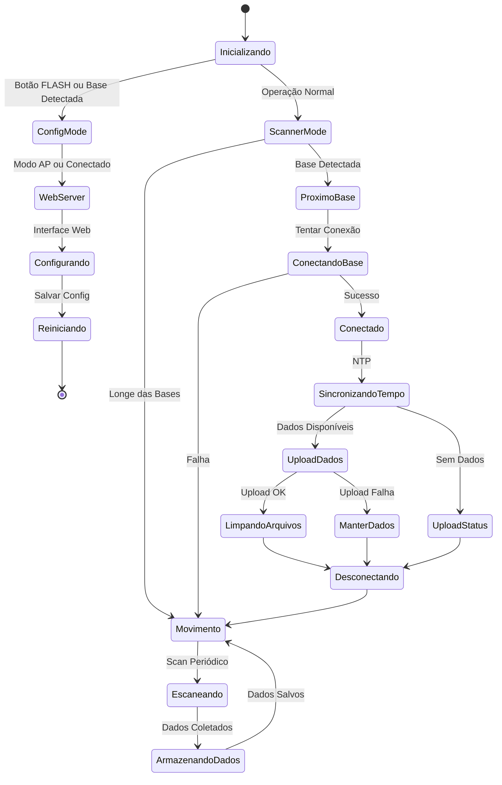

## 12. Fluxo de Dados Firebase

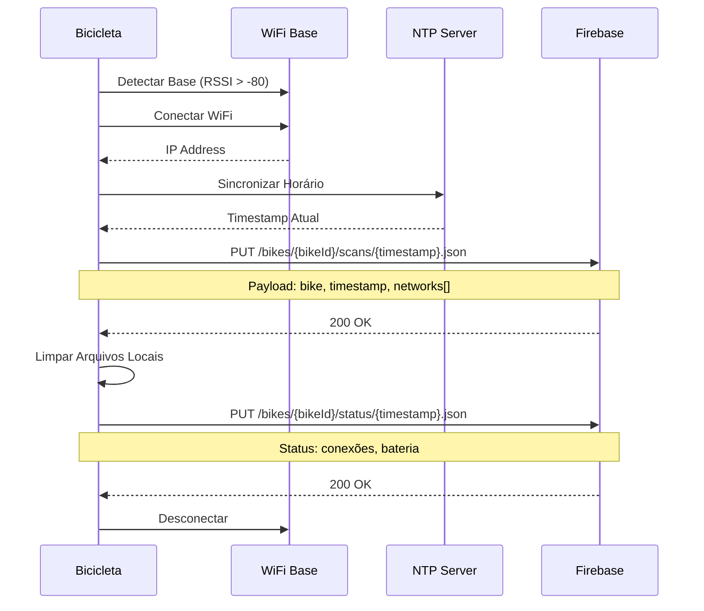

## 13. Monitoramento de Bateria

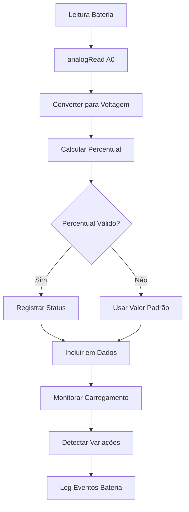

## Resumo dos Componentes

- **Configuração**: Arquivos TXT para parâmetros do sistema
- **Scanner WiFi**: Coleta periódica de redes disponíveis
- **Detecção de Base**: Proximidade por RSSI para 3 bases configuradas
- **Armazenamento Local**: JSON compacto em LittleFS
- **Upload Automático**: Sincronização com Firebase quando na base
- **Interface Web**: Configuração via AP ou base conectada
- **Menu Serial**: Controle e debug via porta serial
- **Status LED**: Indicação visual do estado do sistema
- **Monitoramento**: Bateria, conexões e status operacional