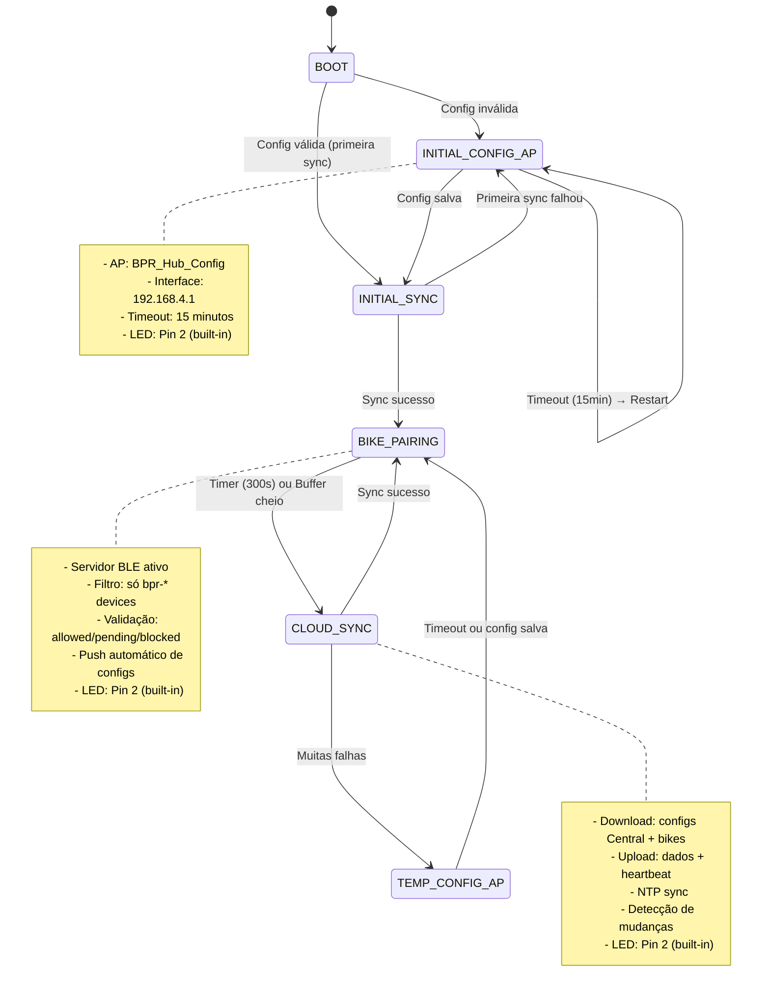
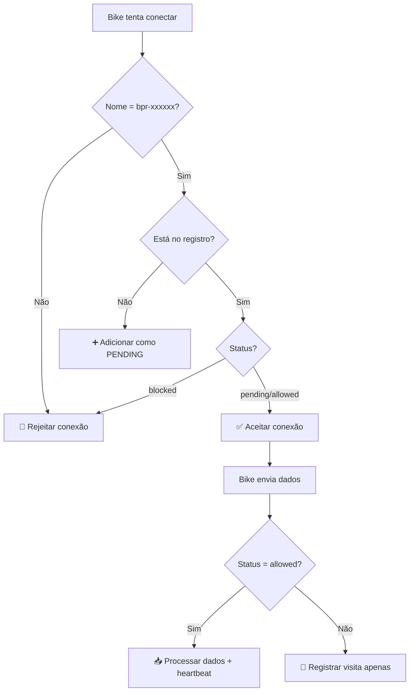

# BPR Central v2.0 - Central para Seeed XIAO ESP32C3

Sistema central redesenhado com arquitetura modular baseada em estados, gerenciamento inteligente de bikes e configuração dinâmica via Firebase. **Hardware alvo: Seeed XIAO ESP32C3**.

## 🎯 Características Principais

- **Arquitetura por Estados**: Máquina de estados bem definida (6 estados)
- **Gerenciamento de Bikes**: Sistema completo de registro, validação e heartbeat
- **Configuração Dinâmica**: Configs por bike baixadas do Firebase
- **Push Automático**: Configs enviadas automaticamente via BLE
- **Validação Rigorosa**: Só bikes autorizadas podem enviar dados
- **Timestamps Precisos**: Central adiciona timestamp de recebimento
- **Self-Check**: Diagnóstico automático de hardware
- **Buffer Dinâmico**: Gerenciamento inteligente de memória baseado no heap
- **Formato Binário**: Estruturas otimizadas para ESP32C3

## 📁 Estrutura de Arquivos

```
central/
├── src/
│   ├── main.cpp                    # 🚀 Entry point + máquina de estados
│   ├── config_manager.cpp          # ⚙️ Configurações da central (binário)
│   ├── config_ap.cpp               # 📱 Estado: Configuração via AP
│   ├── ble_server.cpp              # 🔵 Estado: Servidor BLE + filtros
│   ├── cloud_sync.cpp              # 📡 Estado: Sincronização completa
│   ├── buffer_manager.cpp          # 📦 Buffer dinâmico de dados
│   ├── led_controller.cpp          # 💡 Padrões de LED (Pin 8)
│   ├── bike_manager.cpp            # 🚲 Registro e validação de bikes
│   ├── bike_pairing.cpp            # 🔗 Pareamento e comunicação BLE
│   ├── config_credentials.cpp      # 🔑 Gerenciamento de credenciais
│   ├── sync_monitor.cpp            # 📊 Monitor de sincronização
│   ├── time_sync.cpp               # ⏰ Sincronização de tempo NTP
│   ├── upload_queue.cpp            # 📤 Fila de upload para Firebase
│   ├── self_check.cpp              # 🔧 Diagnóstico de hardware
│   ├── endpoints.cpp               # 🌐 URLs do Firebase
│   ├── bpr_json_helper.cpp         # 🔧 Helpers para JSON
│   └── bpr_string_helper.cpp       # 🔧 Helpers para strings
├── include/
│   ├── binary_structs.h            # 📦 Estruturas binárias otimizadas
│   ├── constants.h                 # 🔧 Constantes e enums
│   └── [outros headers...]
├── platformio.ini                  # ⚙️ Configuração PlatformIO
├── partitions.csv                  # 💾 Partições de memória
└── LICENSE                         # 📄 AGPL-3.0
```

## 🔄 Máquina de Estados



## 🚲 Sistema de Gerenciamento de Bikes

### **Estados das Bikes:**
- **`allowed`**: Pode conectar e enviar dados
- **`pending`**: Pode conectar, dados ignorados (só registra visitas)
- **`blocked`**: Não consegue conectar

### **Fluxo de Validação:**


### **Estrutura no Firebase:**
```json
/bases/{base_id}/bikes = {
  "bpr-a1b2c3": {
    "status": "allowed",
    "first_seen": 1733459200,
    "last_heartbeat": {
      "timestamp": 1733459800,
      "timestamp_human": "2024-12-06 10:30:00 UTC-3",
      "battery": 85,
      "heap": 45000
    }
  },
  "bpr-x7y9z1": {
    "status": "pending", 
    "first_seen": 1733459300,
    "last_visit": 1733459800,
    "visit_count": 3
  }
}
```

## ⚙️ Sistema de Configuração Dinâmica

### **Configs por Bike:**
```json
/bike_configs/{bike_id} = {
  "version": 2,
  "bike_name": "Bike Centro 01",
  "dev_mode": false,
  "wifi": {
    "scan_interval_sec": 300,
    "scan_timeout_ms": 5000
  },
  "ble": {
    "base_name": "BPR Central",
    "scan_time_sec": 5
  },
  "power": {
    "deep_sleep_duration_sec": 3600
  },
  "battery": {
    "critical_voltage": 3.2,
    "low_voltage": 3.45
  }
}
```

### **Push Automático:**
1. **WiFi Sync**: Central baixa configs e detecta mudanças por `version`
2. **Bike conecta**: Central verifica se tem config nova
3. **Push automático**: Envia via BLE NOTIFY se `version` mudou
4. **Bike aplica**: Recebe e aplica nova config silenciosamente

## 📊 Estrutura de Dados Completa

### **Configuração da central:**
```json
/bases/{base_id}/configs = {
  "base_id": "base01",
  "sync_interval_sec": 300,
  "wifi_timeout_sec": 30,
  "led_pin": 2,
  "firebase_batch_size": 8000,
  "ntp_server": "pool.ntp.org",
  "timezone_offset": -10800,
  "led": {
    "boot_ms": 100,
    "ble_ready_ms": 2000,
    "wifi_sync_ms": 500,
    "bike_arrived_ms": 150,
    "bike_left_ms": 800,
    "count_ms": 300,
    "count_pause_ms": 2000,
    "error_ms": 50
  },
  "limits": {
    "max_bikes": 10,
    "batch_size": 8000
  },
  "fallback": {
    "max_failures": 5,
    "timeout_min": 30
  }
}
```

### **Dados das Bikes (com timestamp da central):**
```json
{
  "bike_id": "bpr-a1b2c3",
  "session_start_millis": 45000,
  "scans": [
    [47000, [["NET_5G", "AA:BB:CC:11:22:33", -70, 6]]],
    [52000, [["CLARO_WIFI", "CC:DD:EE:44:55:66", -82, 11]]]
  ],
  "battery": [[47000, 85], [52000, 84]],
  "hub_receive_timestamp": 1733459800,
  "hub_receive_timestamp_human": "2024-12-06 10:30:00 UTC-3"
}
```

### **Heartbeat da central:**
```json
/bases/{base_id}/last_heartbeat = {
  "timestamp": 1733459800,
  "timestamp_human": "2024-12-06 10:30:00 UTC-3", 
  "bikes_connected": 3,
  "heap": 45000,
  "uptime": 7200
}
```

## 💡 Sistema de LED Inteligente (Pin 8 - Seeed XIAO ESP32C3)

| Padrão | Intervalo | Significado |
|--------|-----------|-------------|
| **Boot** | 100ms | Inicializando sistema |
| **Config AP** | 200ms | Modo configuração ativo |
| **BLE Ready** | 2000ms | Aguardando bikes |
| **Bike Arrived** | 3x 150ms | Nova bike conectou |
| **Bike Left** | 1x 800ms | Bike desconectou |
| **Count** | N piscadas | N bikes conectadas (a cada 30s) |
| **Sync** | 500ms | Sincronizando com Firebase |
| **Error** | 50ms | Erro crítico |

## 🔧 Configuração e Deploy

### **Setup Inicial:**
```bash
cd firmware/central

# 1. Instalar dependências
pio lib install

# 2. Upload filesystem (LittleFS)
pio run --target uploadfs

# 3. Upload firmware
pio run --target upload

# 4. Monitor serial
pio device monitor
```

### **Hardware Requerido:**
- **Seeed XIAO ESP32C3** (target principal)
- LED conectado ao **Pin 8** (ou usar LED built-in se disponível)
- Alimentação via USB-C

### **Primeira Execução:**
1. **Central inicia** → Modo INITIAL_CONFIG_AP (credenciais inválidas)
2. **Conectar WiFi**: `BPR Central` (senha: `botaprarodar`)
3. **Acessar**: http://192.168.4.1
4. **Configurar**: Base ID, WiFi, Firebase URL, API Key
5. **Salvar** → Central reinicia → INITIAL_SYNC obrigatório
6. **Sync sucesso** → Modo BIKE_PAIRING ativo

### **Interface de Configuração:**
- **Formulário tradicional**: Campos individuais
- **JSON avançado**: Cole configuração completa
- **Auto-restart**: Reinicia automaticamente após salvar
- **Validação**: Verifica campos obrigatórios

### **Funcionamento Normal:**
```
BIKE_PAIRING (90s padrão) → CLOUD_SYNC → BIKE_PAIRING → ...
```

### **Estados da Máquina:**
- **STATE_BOOT**: Inicialização e self-check
- **STATE_INITIAL_CONFIG_AP**: Config obrigatório (sem timeout)
- **STATE_TEMP_CONFIG_AP**: Config temporário (após falhas)
- **STATE_INITIAL_SYNC**: Primeira sincronização obrigatória
- **STATE_BIKE_PAIRING**: Operação normal com bikes
- **STATE_CLOUD_SYNC**: Sincronização com Firebase

## 🛡️ Validação e Segurança

### **Filtros BLE:**
- ✅ **Nome obrigatório**: `bpr-xxxxxx` (10 caracteres)
- ✅ **Registro obrigatório**: Bike deve estar no Firebase
- ✅ **Status válido**: `blocked` não consegue conectar

### **Validação de Dados:**
- ✅ **JSON válido**: Dados devem ter `bike_id`
- ✅ **Bike autorizada**: Só `allowed` pode enviar dados
- ✅ **Timestamp**: Central adiciona timestamp de recebimento

### **Recuperação de Erros:**
- ✅ **Config inválida**: Volta para CONFIG_AP
- ✅ **Sync falha**: Retry automático com backoff
- ✅ **Primeira sync falha**: Volta para CONFIG_AP (crítico)
- ✅ **Self-check**: Diagnóstico de hardware no boot

## 📈 Monitoramento e Debug

### **Logs Estruturados:**
```
🏢 base01 | Estado: BLE_ONLY | Uptime: 7200s
🚲 Bikes conectadas: 3 | 💾 Heap: 45000 bytes
🔄 Próxima sync em: 180s
⏱️ Estado há: 120s
```

### **Self-Check Automático:**
- **Memória**: Verifica heap livre (min 50KB)
- **LittleFS**: Teste de escrita/leitura
- **LED**: Teste de piscar
- **WiFi**: Capacidade de inicialização
- **BLE**: Capacidade de inicialização

### **Métricas Firebase:**
- **Heartbeat**: Status da central a cada minuto
- **Bike registry**: Registro de todas as tentativas
- **Config logs**: Histórico de configurações enviadas

## 🎯 Vantagens da Arquitetura v2.0

- ✅ **Modular**: Cada arquivo tem responsabilidade única
- ✅ **Configurável**: Zero hardcoding, tudo via Firebase
- ✅ **Inteligente**: Push automático de configs
- ✅ **Seguro**: Validação rigorosa de bikes
- ✅ **Robusto**: Self-check e recuperação de erros
- ✅ **Eficiente**: Buffer dinâmico e sync otimizada
- ✅ **Escalável**: Fácil adicionar novas funcionalidades
- ✅ **Observável**: Logs estruturados e métricas
- ✅ **Otimizado**: Estruturas binárias para ESP32C3
- ✅ **Resiliente**: Sistema de fallback e retry automático

## 🔧 Especificações Técnicas

### **Hardware:**
- **MCU**: ESP32C3 (RISC-V, 160MHz)
- **RAM**: ~400KB disponível
- **Flash**: Particionado (app0/app1 para OTA)
- **Filesystem**: LittleFS
- **LED**: Pin 8 (configurável)

### **Conectividade:**
- **WiFi**: 802.11 b/g/n (2.4GHz)
- **BLE**: NimBLE stack
- **Protocolo**: BPR Protocol (comum com bikes)

### **Armazenamento:**
- **Configurações**: Formato binário otimizado
- **Buffer**: Dinâmico baseado no heap disponível
- **Backup**: Automático com retenção configurável
- **Partições**: OTA ready (app0/app1/spiffs)

### **Limites:**
- **Max bikes**: 10 simultâneas
- **Buffer size**: Dinâmico (baseado no heap)
- **Sync interval**: 90s (configurável)
- **Config timeout**: 15min (configurável)

## 🔮 Roadmap

### **Próximas Melhorias:**
- [ ] **OTA Updates**: Atualização de firmware via Firebase
- [ ] **Mesh Network**: Comunicação entre hubs
- [ ] **Edge Analytics**: Processamento local de dados
- [ ] **Backup Config**: Múltiplas fontes de configuração
- [ ] **Advanced Filtering**: Filtros mais sofisticados para bikes