# BPR Central System - Fluxo de Funcionamento

## 🎯 Visão Geral

Sistema central (ESP32C3 SuperMini) que atua como ponte entre bicicletas BLE e Firebase, com descoberta automática, configuração dinâmica e sincronização inteligente.

## 📊 Diagrama de Estados

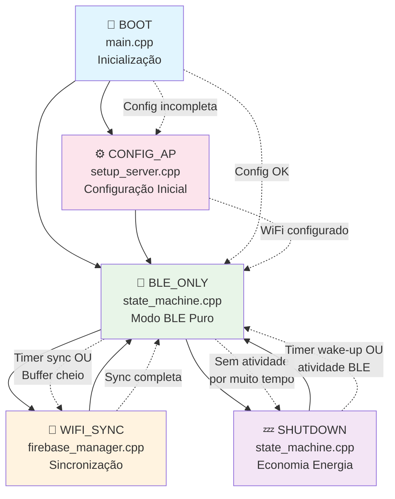

## 🗂️ Arquitetura de Arquivos

### 📁 Estrutura Modular
```
firmware/central/src/
├── main.cpp                  # 🚀 Ponto de entrada e loop principal
├── state_machine.cpp/.h      # 🔄 Máquina de estados do sistema
├── config_manager.cpp/.h     # ⚙️ Gerenciamento de configurações
├── config_loader.cpp/.h      # 📥 Carregamento de configs do Firebase
├── central_config.cpp/.h     # 🏢 Configurações específicas da central
├── ble_simple.cpp/.h         # 🔵 Servidor BLE simplificado
├── bike_manager.cpp/.h       # 🚲 Gerenciamento de bikes conectadas
├── bike_discovery.cpp/.h     # 🔍 Descoberta automática de bikes
├── firebase_manager.cpp/.h   # 🔥 Interface principal Firebase
├── firebase_client.h         # 🔗 Cliente HTTP Firebase
├── firebase_sync.h           # 🔄 Sincronização de dados
├── wifi_manager.cpp/.h       # 📶 Gerenciamento WiFi
├── ntp_manager.cpp/.h        # ⏰ Sincronização de horário
├── led_controller.cpp/.h     # 💡 Controle de LED com padrões
├── buffer_manager.cpp/.h     # 📦 Gerenciamento de buffer local
├── event_handler.cpp/.h      # 🎯 Tratamento de eventos
├── self_check.cpp/.h         # 🔧 Auto-diagnóstico do sistema
└── setup_server.cpp/.h       # 🌐 Servidor AP para configuração
```

## 🔄 Fluxo Detalhado por Estado

### 1️⃣ BOOT (main.cpp)
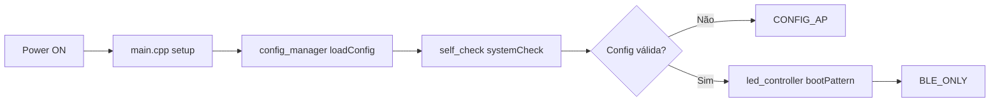

**Arquivos Envolvidos:**
- **main.cpp**: Inicialização geral e setup do hardware
- **config_manager.cpp**: Carrega configuração local ou padrão
- **self_check.cpp**: Verifica integridade do sistema
- **led_controller.cpp**: Indica status de boot

### 2️⃣ CONFIG_AP (setup_server.cpp)
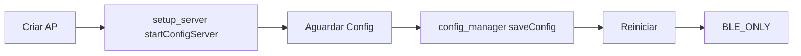

**Arquivos Envolvidos:**
- **setup_server.cpp**: Servidor web para configuração inicial
- **config_manager.cpp**: Salva configurações recebidas
- **wifi_manager.cpp**: Gerencia ponto de acesso

### 3️⃣ BLE_ONLY (Modo Principal)
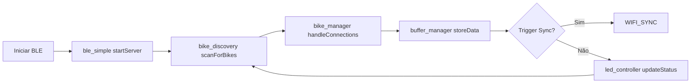

**Arquivos Envolvidos:**
- **ble_simple.cpp**: Servidor BLE para comunicação com bikes
- **bike_discovery.cpp**: Descoberta automática de novas bikes
- **bike_manager.cpp**: Gerencia conexões e dados das bikes
- **buffer_manager.cpp**: Cache local de dados
- **led_controller.cpp**: Feedback visual do status
- **event_handler.cpp**: Processa eventos BLE

### 4️⃣ WIFI_SYNC (firebase_manager.cpp)
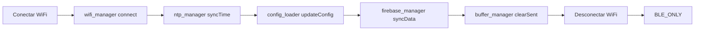

**Arquivos Envolvidos:**
- **wifi_manager.cpp**: Conexão e gerenciamento WiFi
- **ntp_manager.cpp**: Sincronização de horário via NTP
- **config_loader.cpp**: Download de configurações atualizadas
- **firebase_manager.cpp**: Sincronização principal com Firebase
- **firebase_client.h**: Cliente HTTP para Firebase
- **firebase_sync.h**: Lógica de sincronização
- **buffer_manager.cpp**: Gerencia dados a serem enviados

### 5️⃣ SHUTDOWN (state_machine.cpp)
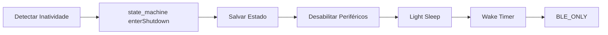

**Arquivos Envolvidos:**
- **state_machine.cpp**: Controla transições e economia de energia
- **config_manager.cpp**: Salva estado atual
- **led_controller.cpp**: LED off durante shutdown

## 🔵 Sistema BLE (ble_simple.cpp)

### Fluxo de Comunicação
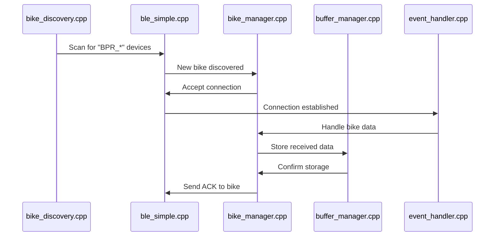

### Características BLE
- **Service UUID**: Custom BPR service
- **Características**: Status, Config, Data Transfer
- **Descoberta**: Automática por prefixo "BPR_*"
- **Aprovação**: Via dashboard ou automática

## 🔥 Sistema Firebase (firebase_manager.cpp)

### Fluxo de Sincronização
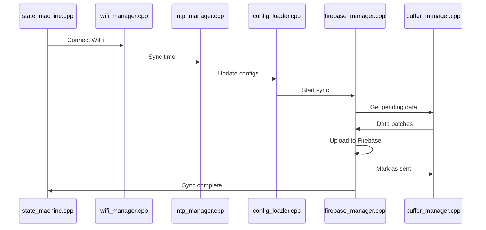

### Endpoints Firebase
- **Configurações**: `/central_configs/{base_id}.json`
- **Dados das Bikes**: `/bikes/{bike_id}/sessions/{session_id}`
- **Heartbeat**: `/bases/{base_id}/last_heartbeat`
- **Status**: `/bases/{base_id}/status`

## 💡 Sistema LED (led_controller.cpp)

### Padrões de LED
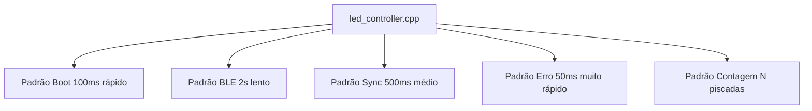

### Estados Visuais
- **Inicializando**: Piscar rápido (100ms) - `bootPattern()`
- **BLE Ativo**: Piscar lento (2s) - `bleReadyPattern()`
- **Bike Chegou**: 3 piscadas rápidas - `bikeArrivedPattern()`
- **Bike Saiu**: 1 piscada longa - `bikeLeftPattern()`
- **Contagem**: N piscadas = N bikes - `countPattern(n)`
- **Sincronizando**: Piscar médio (500ms) - `syncPattern()`
- **Erro**: Piscar muito rápido (50ms) - `errorPattern()`

## ⚙️ Sistema de Configuração

### Fluxo de Configuração
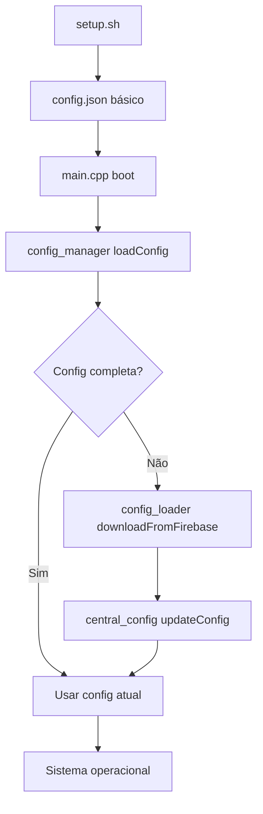

### Hierarquia de Configuração
1. **config_manager.cpp**: Interface principal de configuração
2. **config_loader.cpp**: Download de configurações do Firebase
3. **central_config.cpp**: Configurações específicas da central
4. **setup_server.cpp**: Configuração inicial via web

## 🔧 Monitoramento e Diagnóstico

### Auto-Diagnóstico (self_check.cpp)
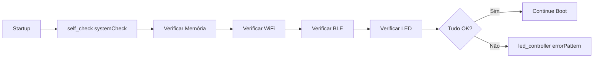

### Heartbeat Automático
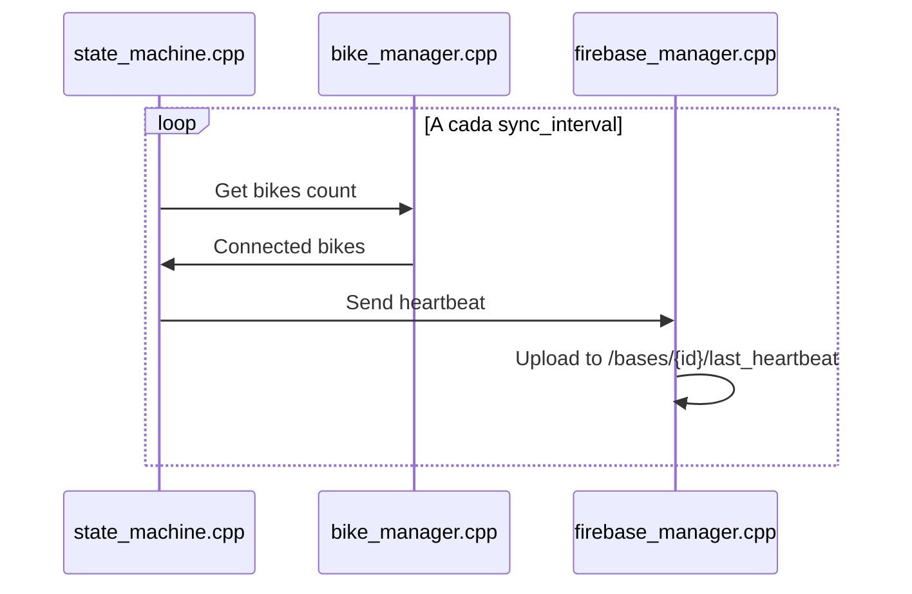

## 📊 Estrutura de Dados

### Configuração Central (central_config.cpp)
```cpp
struct CentralConfig {
    char base_id[32];
    uint16_t sync_interval_sec;
    uint16_t wifi_timeout_sec;
    uint8_t led_pin;
    uint16_t firebase_batch_size;
    char ntp_server[64];
    int32_t timezone_offset;
    LEDConfig led;
};
```

### Buffer de Dados (buffer_manager.cpp)
```cpp
struct DataBuffer {
    BikeData bikes[MAX_BIKES];
    uint16_t pending_count;
    uint32_t last_sync;
    bool sync_in_progress;
};
```

## 🚨 Tratamento de Erros

### Recuperação Automática (event_handler.cpp)
- **WiFi Fail**: Retry com timeout configurável
- **Firebase Fail**: Buffer local até próxima tentativa
- **BLE Fail**: Restart do servidor BLE
- **Config Fail**: Usar configurações padrão
- **Memory Full**: Sobrescrever dados mais antigos

### Logs e Debug
- **Serial Output**: Status detalhado a cada 30s
- **LED Patterns**: Feedback visual imediato
- **Firebase Logs**: Erros enviados para `/logs/{base_id}`

## 🔄 Integração com Ecosystem

### Comunicação com Bot Telegram
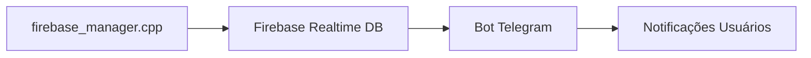

### Comunicação com Dashboard Web
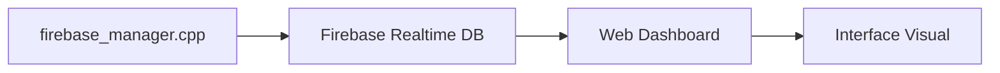

### Fluxo Completo do Sistema
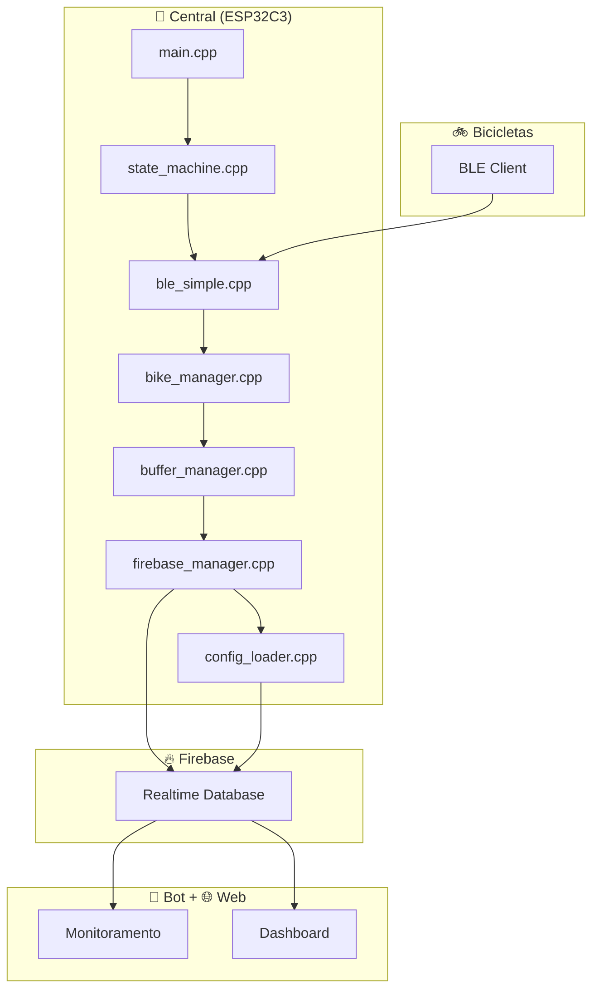