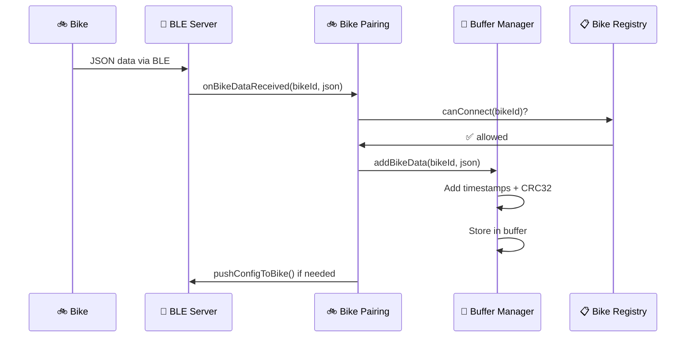

# 🏗️ Arquitetura do Firmware Central

## 📁 Estrutura de Arquivos e Dependências

```
firmware/hub/
├── 🚀 main.cpp                    # Ponto de entrada e orquestrador
│   ├── 📋 constants.h             # Estados e configurações
│   ├── ⚙️ config_manager.h        # Gerenciamento de configurações
│   ├── 💾 buffer_manager.h        # Buffer de dados
│   ├── 💡 led_controller.h        # Controle de LED
│   ├── 🔍 self_check.h           # Verificações do sistema
│   ├── 📊 sync_monitor.h         # Monitor de sincronização
│   └── Estados:
│       ├── 🔧 config_ap.h         # Modo configuração AP
│       ├── 🚲 bike_pairing.h      # Pareamento com bikes
│       └── ☁️ cloud_sync.h        # Sincronização nuvem
│
├── Estados (Máquina Principal)
│   ├── 🔧 CONFIG_AP              # config_ap.cpp
│   │   ├── 🌐 WebServer          # Interface de configuração
│   │   ├── 📝 Form Handler       # Processamento de dados
│   │   └── 🔄 WiFi Test          # Teste de conectividade
│   │
│   ├── 🚲 BIKE_PAIRING           # bike_pairing.cpp (ORQUESTRADOR)
│   │   ├── 🔵 ble_server.cpp     # Comunicação BLE pura
│   │   ├── 📥 Data Processing    # Via buffer_manager.addBikeData()
│   │   ├── 📤 Config Management  # Via bike_config_manager
│   │   ├── 🔍 Bike Validation    # Via bike_registry
│   │   └── 💡 LED Feedback       # Via led_controller
│   │
│   └── ☁️ CLOUD_SYNC             # cloud_sync.cpp
│       ├── 📶 WiFi Connection    # Conexão WiFi
│       ├── ⏰ NTP Sync           # Sincronização de tempo
│       ├── ⬇️ Download Configs   # Baixar configurações
│       ├── ⬆️ Upload Data        # Enviar dados coletados
│       └── 💓 Heartbeat          # Status da central
│
├── Serviços de Apoio
│   ├── ⚙️ config_manager.cpp     # Persistência de configurações
│   │   ├── 📄 LittleFS           # Sistema de arquivos
│   │   ├── 🔥 Firebase URLs      # Construção de URLs
│   │   └── ✅ Validation         # Validação de configs
│   │
│   ├── 💾 buffer_manager.cpp     # Gerenciamento + processamento de dados
│   │   ├── 📦 addBikeData()      # Processa JSON + timestamps
│   │   ├── 📦 addData()          # Armazenamento local
│   │   ├── 🗜️ Compression        # Compressão (TODO)
│   │   ├── 🔒 CRC32             # Integridade
│   │   └── 💾 Backup System     # Sistema de backup
│   │
│   ├── 🔵 ble_server.cpp         # Comunicação BLE pura
│   │   ├── 📡 BLE Advertising    # Descoberta de dispositivos
│   │   ├── 🔗 Connection Mgmt    # Gerenciamento de conexões
│   │   ├── 📥 Data Callbacks     # Recepção de dados
│   │   ├── ⚙️ Config Callbacks   # Troca de configurações
│   │   └── 📤 Push Notifications # Envio de configs
│   │
│   ├── 🚲 bike_registry.cpp      # Registro de bicicletas
│   │   ├── ✅ Permissions        # allowed/pending/blocked
│   │   ├── 💓 Heartbeat         # Status de vida
│   │   └── 📝 Visit Logs        # Logs de visitas
│   │
│   ├── ⚙️ bike_config_manager.cpp # Configurações de bikes
│   │   ├── 📋 Config Cache       # Cache local
│   │   ├── 🔄 Version Control    # Controle de versão
│   │   └── 📤 Push System       # Sistema de envio
│   │
│   ├── 💡 led_controller.cpp     # Controle de LED
│   │   ├── 🔄 Patterns          # Padrões de piscar
│   │   ├── ⏱️ Timing            # Controle de tempo
│   │   └── 🎯 Status Indication # Indicação de status
│   │
│   ├── 🔍 self_check.cpp         # Verificações do sistema
│   │   ├── 💾 Storage Check     # Verificação de armazenamento
│   │   ├── 🔧 Hardware Check    # Verificação de hardware
│   │   └── ⚙️ Config Check      # Verificação de configuração
│   │
│   └── 📊 sync_monitor.cpp       # Monitor de sincronização
│       ├── 📈 Failure Tracking  # Rastreamento de falhas
│       ├── ⏰ Timeout Control   # Controle de timeout
│       └── 🚨 Fallback Logic    # Lógica de fallback
│
└── 📋 constants.h                # Constantes globais
    ├── 🎯 System States          # Estados do sistema
    ├── ⏱️ Timing Constants       # Constantes de tempo
    ├── 🔵 BLE Configuration      # Configuração BLE
    ├── 📶 WiFi Configuration     # Configuração WiFi
    └── 📁 File Paths            # Caminhos de arquivos
```

## 🔄 Fluxo de Dependências

### 🚀 main.cpp (Orquestrador)
```cpp
main.cpp
├── Inclui TODOS os headers de estado
├── Gerencia transições entre estados
├── Coordena módulos globais
└── Trata eventos do sistema
```

### 🔧 CONFIG_AP (Estado)
```cpp
config_ap.cpp
├── config_manager.h    # Salvar/carregar configs
├── led_controller.h    # Indicação visual
├── constants.h         # Timeouts e configurações
└── WebServer          # Interface de configuração
```

### 🚲 BIKE_PAIRING (Estado Orquestrador)
```cpp
bike_pairing.cpp
├── ble_server.h            # Comunicação BLE delegada
├── bike_registry.h         # Validação de permissões
├── bike_config_manager.h   # Configs pendentes
├── buffer_manager.h        # Processamento + armazenamento
└── led_controller.h        # Indicação de conexões

🎯 Funcionalidades Principais:
├── 📱 Config na Conexão     # Envia config imediatamente se pendente
├── 💓 Heartbeat Inteligente # Status baseado em sleep intervals
├── 🛡️ Validação de Bikes   # Sistema allowed/pending/blocked
├── 📊 Status Monitoring     # connected/sleeping/expected_soon/overdue
└── 🔄 Event-Driven         # Sem timers desnecessários
```

### ☁️ CLOUD_SYNC (Estado)
```cpp
cloud_sync.cpp
├── config_manager.h    # URLs e credenciais
├── buffer_manager.h    # Dados para upload
├── bike_registry.h     # Registry para sync
├── led_controller.h    # Indicação de sync
└── HTTPClient         # Comunicação HTTP
```

## 🎯 Hierarquia de Responsabilidades

### 🏛️ Nível 1: Orquestração
- **main.cpp** - Controla tudo, decide transições

### 🎭 Nível 2: Estados
- **config_ap.cpp** - Interface de configuração
- **bike_pairing.cpp** - Comunicação com bikes
- **cloud_sync.cpp** - Comunicação com nuvem

### 🔧 Nível 3: Serviços
- **config_manager.cpp** - Persistência de configurações
- **buffer_manager.cpp** - Processamento + gerenciamento de dados
- **ble_server.cpp** - Comunicação BLE pura
- **bike_registry.cpp** - Registro de bikes
- **bike_config_manager.cpp** - Configurações de bikes
- **led_controller.cpp** - Feedback visual

### 📋 Nível 4: Utilitários
- **self_check.cpp** - Verificações
- **sync_monitor.cpp** - Monitoramento
- **constants.h** - Definições globais

### 🎯 **Próximos Passos:**
- [ ] Implementar métodos do `BikeConfigManager`
- [ ] Adicionar testes unitários para cada módulo
- [ ] Documentar APIs dos serviços
- [ ] Otimizar performance do BLE Server

## 🔗 Regras de Dependência

### ✅ Permitido
- Estados podem usar Serviços
- Serviços podem usar Utilitários
- main.cpp pode usar tudo

### ❌ Proibido
- Serviços NÃO podem usar Estados
- Estados NÃO podem usar outros Estados diretamente
- Dependências circulares

### 🎯 Comunicação Entre Estados
- Apenas via **main.cpp** usando `changeState()`
- Estados são **isolados** e **independentes**
- Dados compartilhados via **Serviços globais**

## 🔄 Refatoração Implementada

### ✅ **Antes vs Depois:**

#### ❌ **Antes (bike_pairing.cpp monolítico - 250+ linhas):**
```cpp
bike_pairing.cpp
├── 150 linhas de código BLE (ServerCallbacks, DataCallbacks, etc.)
├── 50 linhas de processamento JSON
├── 30 linhas de validação
├── 20 linhas de orquestração
└── Responsabilidades misturadas
```

#### ✅ **Depois (separado e focado):**
```cpp
bike_pairing.cpp (90 linhas - ORQUESTRADOR)
├── Coordena serviços
├── Implementa callbacks de negócio
├── Config imediata na conexão
├── Heartbeat inteligente com sleep tracking
└── Event-driven (sem timers desnecessários)

ble_server.cpp (150 linhas - BLE PURO)
├── Gerencia conexões BLE
├── Callbacks de protocolo
├── Advertising e descoberta
└── Push de configurações

buffer_manager.cpp (MELHORADO)
├── addBikeData() - processa JSON + timestamps
├── addData() - armazenamento original
├── Integridade e backup
└── Compressão (TODO)
```

### 🎯 **Benefícios Alcançados:**

#### 📦 **Separação de Responsabilidades**
- **BLE Server**: Só comunicação, sem lógica de negócio
- **Bike Pairing**: Só orquestração, sem detalhes técnicos
- **Buffer Manager**: Processamento + armazenamento unificado

#### 🧪 **Testabilidade**
- Cada módulo pode ser testado isoladamente
- Mocks mais fáceis de criar
- Bugs isolados por responsabilidade

#### 🔄 **Reutilização**
- `ble_server.cpp` pode ser usado em outros projetos
- `buffer_manager.addBikeData()` pode processar dados de outras fontes
- Módulos independentes de contexto

#### 📚 **Manutenibilidade**
- Arquivos menores e focados
- Mudanças de protocolo BLE isoladas
- Lógica de negócio separada da tecnologia

### 🔗 **Fluxo de Dados Refatorado:**

