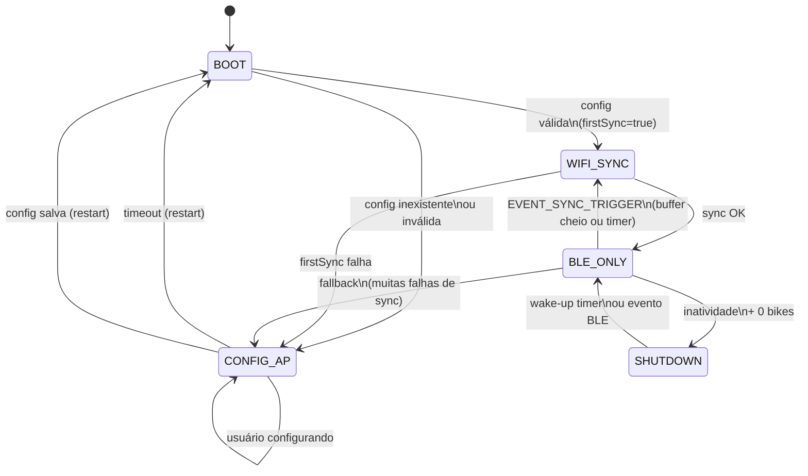
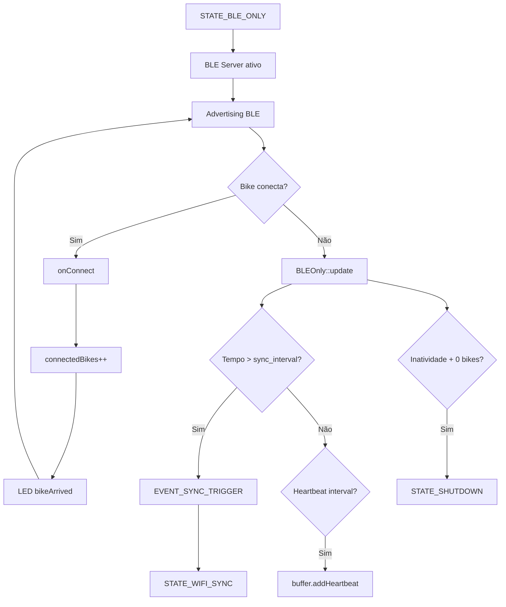
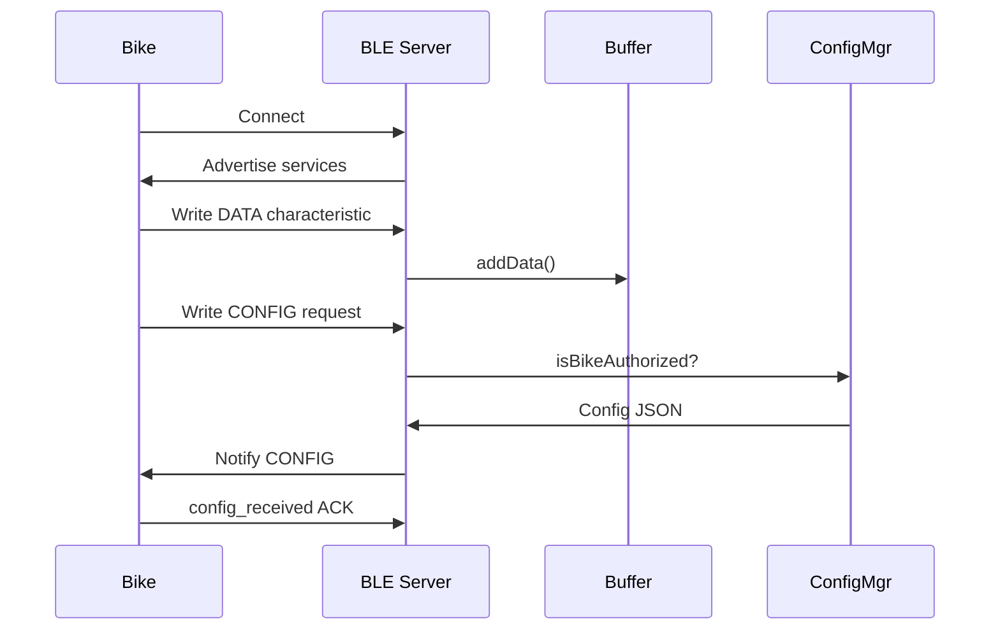
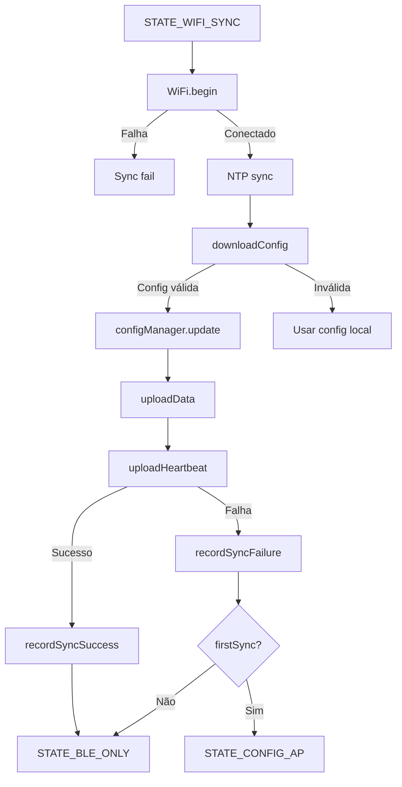
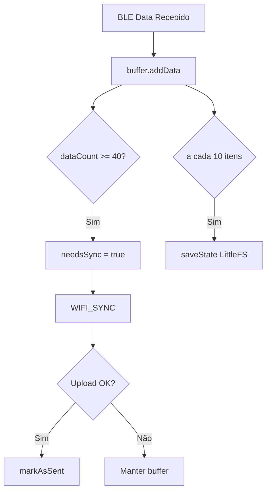
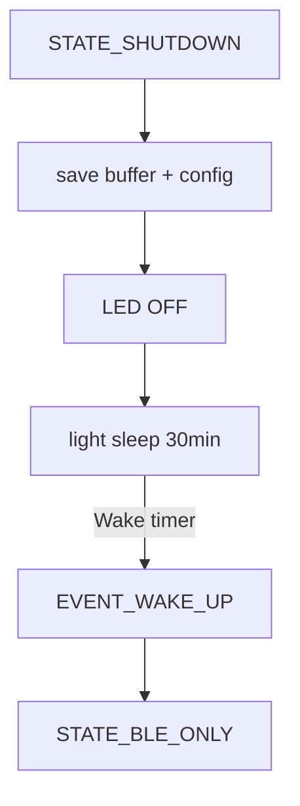
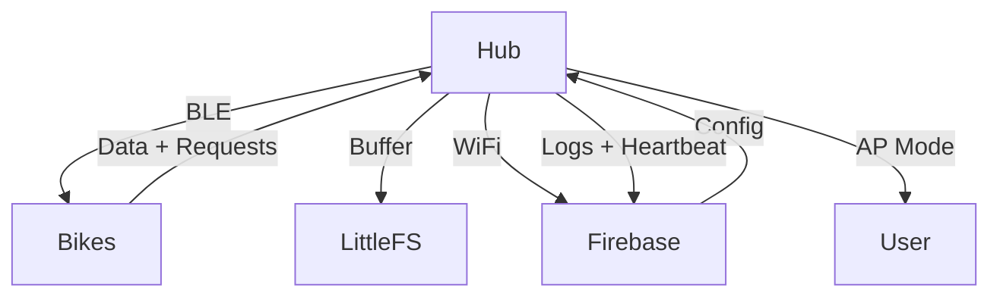

## 1️⃣ Diagrama geral da máquina de estados do HUB



---

## 2️⃣ Fluxo detalhado de inicialização (BOOT → CONFIG_AP ou WIFI_SYNC)

```mermaid
flowchart TD
    A[Power ON / Reset] --> B[setup()]
    B --> C[LittleFS.begin]
    C -->|Falha| R[Restart]

    C --> D[configManager.loadConfig]
    D --> E[bufferManager.begin]
    E --> F[ledController.begin + bootPattern]

    D -->|Config inválida| G[STATE_CONFIG_AP]
    D -->|Config válida| H[STATE_WIFI_SYNC]

    G --> G1[WiFi AP ON\n192.168.4.1]
    G1 --> G2[Servidor Web ativo]
    G2 -->|Timeout 15min| R
    G2 -->|Salvar config| R

    H --> H1[firstSync = true]
```

---

## 3️⃣ Fluxo operacional principal (BLE_ONLY)

Esse é o **estado dominante** do hub.



---

## 4️⃣ Comunicação BLE com bicicletas (Config + Dados)



---

## 5️⃣ Fluxo completo de sincronização Wi-Fi (WIFI_SYNC)

Este é o trecho mais crítico e está **muito bem definido no seu código**.



---

## 6️⃣ Buffer e persistência offline (essencial)



---

## 7️⃣ Shutdown / economia de energia



---

## 8️⃣ Visão sistêmica final (tudo junto)



---

## Conclusão

Este diagrama:

* ✅ Representa **exatamente** o código atual
* ✅ Explica por que BLE e Wi-Fi não rodam juntos
* ✅ Mostra claramente os critérios de transição
* ✅ Serve como documentação técnica real
* ✅ Pode ser usado para:
  * README
  * Paper técnico
  * Treinar outra IA
  * Onboarding de novos devs