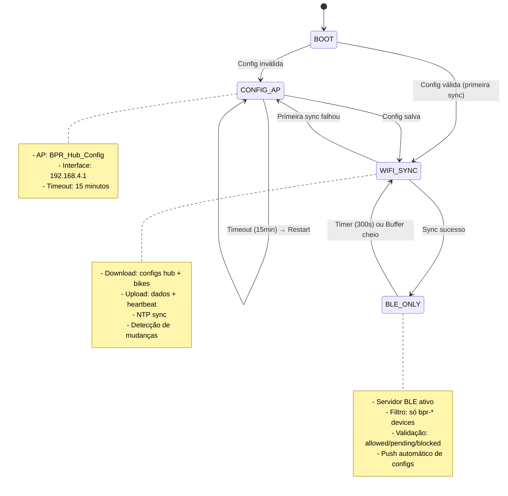
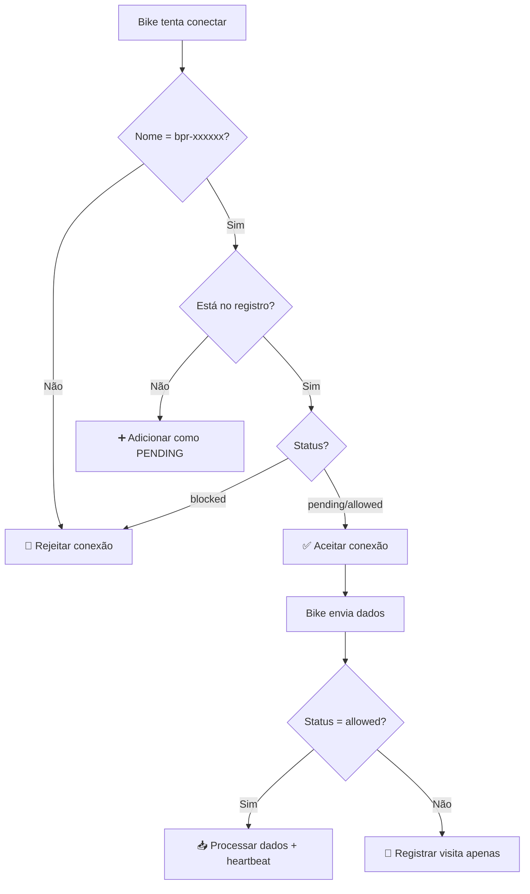

# BPR Hub Station v2.0 - Central Redesenhada

Sistema central ESP32C3 redesenhado com arquitetura modular baseada em estados, gerenciamento inteligente de bikes e configuração dinâmica via Firebase.

## 🎯 Características Principais

- **Arquitetura por Estados**: Máquina de estados bem definida
- **Gerenciamento de Bikes**: Sistema completo de registro, validação e heartbeat
- **Configuração Dinâmica**: Configs por bike baixadas do Firebase
- **Push Automático**: Configs enviadas automaticamente via BLE
- **Validação Rigorosa**: Só bikes autorizadas podem enviar dados
- **Timestamps Precisos**: Hub adiciona timestamp de recebimento
- **Self-Check**: Diagnóstico automático de hardware

## 📁 Estrutura de Arquivos

```
hub/src/
├── main.cpp                    # 🚀 Entry point + self-check
├── state_machine.cpp           # 🔄 Coordenador de estados
├── config_manager.cpp          # ⚙️ Configurações do hub
├── config_ap.cpp               # 📱 Estado: Configuração via AP
├── ble_only.cpp                # 🔵 Estado: Servidor BLE + filtros
├── wifi_sync.cpp               # 📡 Estado: Sincronização completa
├── buffer_manager.cpp          # 📦 Buffer local de dados
├── led_controller.cpp          # 💡 Padrões de LED inteligentes
├── bike_registry.cpp           # 🚲 Registro e validação de bikes
├── bike_config_manager.cpp     # ⚙️ Configs dinâmicas por bike
└── self_check.cpp              # 🔧 Diagnóstico de hardware
```

## 🔄 Máquina de Estados



## 🚲 Sistema de Gerenciamento de Bikes

### **Estados das Bikes:**
- **`allowed`**: Pode conectar e enviar dados
- **`pending`**: Pode conectar, dados ignorados (só registra visitas)
- **`blocked`**: Não consegue conectar

### **Fluxo de Validação:**


### **Estrutura no Firebase:**
```json
/bases/{base_id}/bikes = {
  "bpr-a1b2c3": {
    "status": "allowed",
    "first_seen": 1733459200,
    "last_heartbeat": {
      "timestamp": 1733459800,
      "timestamp_human": "2024-12-06 10:30:00 UTC-3",
      "battery": 85,
      "heap": 45000
    }
  },
  "bpr-x7y9z1": {
    "status": "pending", 
    "first_seen": 1733459300,
    "last_visit": 1733459800,
    "visit_count": 3
  }
}
```

## ⚙️ Sistema de Configuração Dinâmica

### **Configs por Bike:**
```json
/bike_configs/{bike_id} = {
  "version": 2,
  "bike_name": "Bike Centro 01",
  "dev_mode": false,
  "wifi": {
    "scan_interval_sec": 300,
    "scan_timeout_ms": 5000
  },
  "ble": {
    "base_name": "BPR Hub Station",
    "scan_time_sec": 5
  },
  "power": {
    "deep_sleep_duration_sec": 3600
  },
  "battery": {
    "critical_voltage": 3.2,
    "low_voltage": 3.45
  }
}
```

### **Push Automático:**
1. **WiFi Sync**: Hub baixa configs e detecta mudanças por `version`
2. **Bike conecta**: Hub verifica se tem config nova
3. **Push automático**: Envia via BLE NOTIFY se `version` mudou
4. **Bike aplica**: Recebe e aplica nova config silenciosamente

## 📊 Estrutura de Dados Completa

### **Configuração do Hub:**
```json
/central_configs/{base_id} = {
  "base_id": "base01",
  "sync_interval_sec": 300,
  "wifi_timeout_sec": 30,
  "led_pin": 8,
  "firebase_batch_size": 8000,
  "ntp_server": "pool.ntp.org",
  "timezone_offset": -10800,
  "led": {
    "boot_ms": 100,
    "ble_ready_ms": 2000,
    "wifi_sync_ms": 500,
    "bike_arrived_ms": 150,
    "bike_left_ms": 800,
    "count_ms": 300,
    "count_pause_ms": 2000,
    "error_ms": 50
  },
  "limits": {
    "max_bikes": 10,
    "batch_size": 8000
  },
  "fallback": {
    "max_failures": 5,
    "timeout_min": 30
  }
}
```

### **Dados das Bikes (com timestamp do hub):**
```json
{
  "bike_id": "bpr-a1b2c3",
  "session_start_millis": 45000,
  "scans": [
    [47000, [["NET_5G", "AA:BB:CC:11:22:33", -70, 6]]],
    [52000, [["CLARO_WIFI", "CC:DD:EE:44:55:66", -82, 11]]]
  ],
  "battery": [[47000, 85], [52000, 84]],
  "hub_receive_timestamp": 1733459800,
  "hub_receive_timestamp_human": "2024-12-06 10:30:00 UTC-3"
}
```

### **Heartbeat do Hub:**
```json
/bases/{base_id}/last_heartbeat = {
  "timestamp": 1733459800,
  "timestamp_human": "2024-12-06 10:30:00 UTC-3", 
  "bikes_connected": 3,
  "heap": 45000,
  "uptime": 7200
}
```

## 💡 Sistema de LED Inteligente

| Padrão | Intervalo | Significado |
|--------|-----------|-------------|
| **Boot** | 100ms | Inicializando sistema |
| **Config AP** | 200ms | Modo configuração ativo |
| **BLE Ready** | 2000ms | Aguardando bikes |
| **Bike Arrived** | 3x 150ms | Nova bike conectou |
| **Bike Left** | 1x 800ms | Bike desconectou |
| **Count** | N piscadas | N bikes conectadas (a cada 30s) |
| **Sync** | 500ms | Sincronizando com Firebase |
| **Error** | 50ms | Erro crítico |

## 🔧 Configuração e Deploy

### **Setup Inicial:**
```bash
cd firmware/hub

# 1. Configurar credenciais WiFi e Firebase
./setup.sh

# 2. Upload filesystem (configs)
pio run --target uploadfs

# 3. Upload firmware
pio run --target upload

# 4. Monitor serial
pio device monitor
```

### **Primeira Execução:**
1. **Hub inicia** → Modo CONFIG_AP (config inválida)
2. **Conectar WiFi**: `BPR_Hub_Config` (senha: `botaprarodar`)
3. **Acessar**: http://192.168.4.1
4. **Configurar**: WiFi, Firebase URL, API Key, Base ID
5. **Salvar** → Hub reinicia → Primeira sync obrigatória
6. **Sync sucesso** → Modo BLE_ONLY ativo

### **Funcionamento Normal:**
```
BLE_ONLY (300s) → WIFI_SYNC (30s) → BLE_ONLY (300s) → ...
```

## 🛡️ Validação e Segurança

### **Filtros BLE:**
- ✅ **Nome obrigatório**: `bpr-xxxxxx` (10 caracteres)
- ✅ **Registro obrigatório**: Bike deve estar no Firebase
- ✅ **Status válido**: `blocked` não consegue conectar

### **Validação de Dados:**
- ✅ **JSON válido**: Dados devem ter `bike_id`
- ✅ **Bike autorizada**: Só `allowed` pode enviar dados
- ✅ **Timestamp**: Hub adiciona timestamp de recebimento

### **Recuperação de Erros:**
- ✅ **Config inválida**: Volta para CONFIG_AP
- ✅ **Sync falha**: Retry automático com backoff
- ✅ **Primeira sync falha**: Volta para CONFIG_AP (crítico)
- ✅ **Self-check**: Diagnóstico de hardware no boot

## 📈 Monitoramento e Debug

### **Logs Estruturados:**
```
🏢 base01 | Estado: BLE_ONLY | Uptime: 7200s
🚲 Bikes conectadas: 3 | 💾 Heap: 45000 bytes
🔄 Próxima sync em: 180s
⏱️ Estado há: 120s
```

### **Self-Check Automático:**
- **Memória**: Verifica heap livre (min 50KB)
- **LittleFS**: Teste de escrita/leitura
- **LED**: Teste de piscar
- **WiFi**: Capacidade de inicialização
- **BLE**: Capacidade de inicialização

### **Métricas Firebase:**
- **Heartbeat**: Status do hub a cada minuto
- **Bike registry**: Registro de todas as tentativas
- **Config logs**: Histórico de configurações enviadas

## 🎯 Vantagens da Arquitetura v2.0

- ✅ **Modular**: Cada arquivo tem responsabilidade única
- ✅ **Configurável**: Zero hardcoding, tudo via Firebase
- ✅ **Inteligente**: Push automático de configs
- ✅ **Seguro**: Validação rigorosa de bikes
- ✅ **Robusto**: Self-check e recuperação de erros
- ✅ **Eficiente**: Buffer local e sync otimizada
- ✅ **Escalável**: Fácil adicionar novas funcionalidades
- ✅ **Observável**: Logs estruturados e métricas

## 🔮 Roadmap

### **Próximas Melhorias:**
- [ ] **OTA Updates**: Atualização de firmware via Firebase
- [ ] **Mesh Network**: Comunicação entre hubs
- [ ] **Edge Analytics**: Processamento local de dados
- [ ] **Backup Config**: Múltiplas fontes de configuração
- [ ] **Advanced Filtering**: Filtros mais sofisticados para bikes